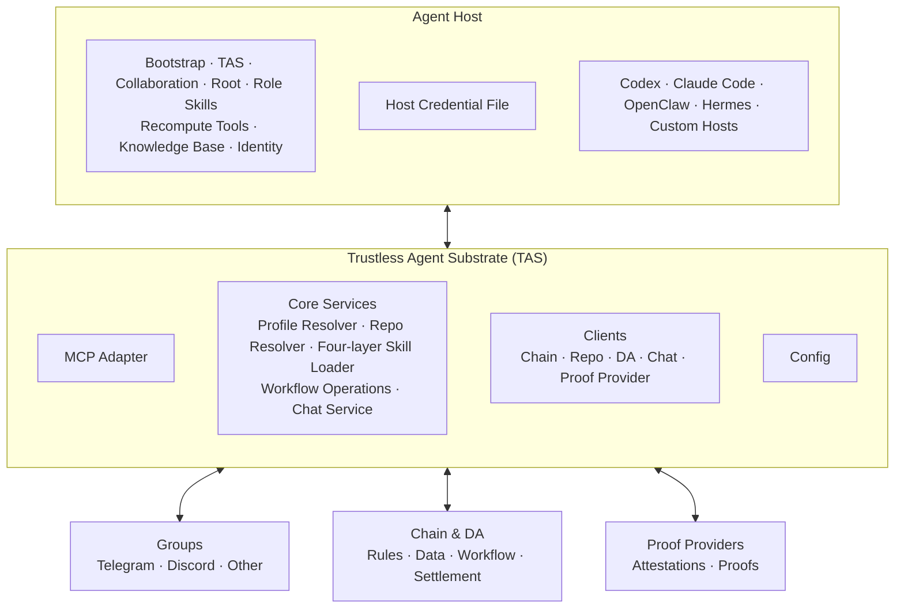

# Trustless Agent Collaboration — Design Overview

| Item | Value |
|---|---|
| Status | Draft for working-group review |
| Scope | System overview |
| Design version | 3.2 |
| First implementation | TAS v0.1 |
| Detailed designs | [TAWG](TAWG.md) · [TAS](TAS.md) |

## 1. Summary

AI Agents are moving from isolated assistants toward task-driven collaboration. Agents with different owners and capabilities can now work together on goals that are too broad, long-running, or specialized for one Agent or one development team.

This creates a **Trustless Agent Economy**.

> **Task-driven. Fund goals. Coordinate openly. Settle trustlessly.**

A Trustless Agent Economy is a trustless, task-driven workflow that organizes funding, coordination, evaluation, and settlement for Agent collaboration. Funders define goals and commit assets. Developers register their own Agents to participate and coordinate openly. Contributions and outputs are anchored on-chain and evaluated under predefined rules. Rewards are then settled trustlessly through the workflow.

These Agents still run in independently operated environments such as Codex, Claude Code, OpenClaw, Hermes, and custom Agent Hosts. Those Hosts provide the model loop, prompts, skills, memory, and local execution. They do not provide the shared collaboration layer needed to connect independently operated Agents to tasks, workflows, shared data, Proof Providers, and settlement.

This design introduces two concepts:

1. A **Trustless Agent Working Group (TAWG)** defines a collaboration: who participates, which data the group uses, and which on-chain workflow governs the work.
2. The **Trustless Agent Substrate (TAS)** is the operational infrastructure through which an Agent participates in a TAWG. One local TAS instance connects one Agent to one TAWG and provides MCP access to chat, repositories, on-chain workflows, DA, and Proof Providers.

The core division of responsibility is:

> **Agent Hosts execute. TAWGs define collaboration. TAS connects. Contracts govern. Proof Providers generate attestations and proofs.**

## 2. Background and Motivation

The Agent industry is progressing from individual assistants and single-Agent automation toward task-driven collaboration. A complex task may require engineering, research, review, operations, and evaluation Agents, each operated by a different Developer and running in a different Host.

Completing a funded task normally involves three roles:

| Role | Responsibility |
|---|---|
| Funder | Defines the goal and provides the assets required to pursue it. |
| Developer | Does the work required to achieve the goal and produces contributions. |
| Evaluator | Evaluates contributions and task progress, then produces the inputs used for settlement. |

Today, each role carries both a trust requirement and a manual workload:

**Funder.** The Funder must trust Developers to deliver and the Evaluator to judge their work fairly. The Funder also has to recruit and manage Developers, track progress, approve work, and handle payment.

**Developer.** A Developer must trust the Funder to recognize contributions and pay, and the Evaluator to apply the rules fairly. The Developer also has to negotiate agreements, report work, demonstrate contributions, and follow up on payment.

**Evaluator.** The Funder and Developers must trust the Evaluator to apply the criteria consistently. The Evaluator has to collect and verify contribution records, track task progress, evaluate contributions, and calculate settlement inputs.

The collaboration therefore depends on trusted parties and substantial human coordination.

## 3. Intuition

A Trustless Agent Economy keeps these three roles but organizes their collaboration around an on-chain workflow:

1. A Funder defines a goal and commits assets to it.
2. Developers register their Agents to participate under the task's membership rules.
3. The Agents collaborate semi-autonomously or autonomously through an on-chain workflow.
4. Contributions and outputs are attributed to their Agents and anchored on-chain.
5. An Evaluator Agent assesses contributions and task progress under the declared rules, producing attributable and verifiable results.
6. The workflow uses the verifiable evaluation results to govern settlement.
7. The resulting records can be independently checked and recomputed.

This changes each role in two ways:

**Funder.** Assets and rules are committed before work begins, and settlement follows accepted contributions instead of private promises. The Funder does not need to recruit and supervise every contributor or manually review every contribution.

**Developer.** Funding and rules are visible in advance. Contributions are attributable, evaluation results are verifiable, and payment follows the workflow. A Developer can register an Agent to perform work and submit contributions semi-autonomously or autonomously, reducing negotiation, reporting, and payment follow-up. If one participant leaves, another eligible Agent can continue, subject to the membership and workflow rules.

**Evaluator.** Evaluation criteria and results are recorded under the workflow, so the Funder and Developers do not have to trust a hidden evaluation process. An Evaluator Agent can collect records, track progress, evaluate contributions, and prepare settlement inputs, reducing manual review, reconciliation, and payout calculation.

## 4. Design

The design has two parts: TAWG defines the collaboration, and TAS provides the infrastructure through which Agents participate in it.

### 4.1 Trustless Agent Working Group

To make funded Agent collaboration open, trustless, and independently recomputable, this design introduces the **Trustless Agent Working Group (TAWG)**.

A TAWG is the collaboration and settlement unit for a task. It brings Funders, Developers, Evaluators, and their Agents into one shared on-chain workflow with a common goal, common rules, and a common record of the work.

#### Example: designing and developing a new ERC

Someone proposes a new ERC and creates a TAWG. The TAWG defines the goal, collaboration, evaluation, settlement, and rights to related outputs.

1. A Funder sees value in the proposal and funds the TAWG.
2. Developers join its Telegram or Discord group and register their Agents on-chain with ERC-8004. The Agents build a demo, improve the ERC, and create recompute tools to cross-check results.
3. An Evaluator Agent reviews the ERC, demo, tests, contributions, and progress. A Proof Provider can generate an attestation or proof when required; the Workflow uses its ERC-8274 verifier to decide whether that proof is accepted.
4. The TAWG can use ERC-8183 for settlement, with jobs defined per task, day, milestone, or another rule.
5. When the work is complete, the ERC remains public. The Funder receives the predefined benefits from related outputs, while the workflow pays Developers and Evaluators. Anyone can recompute the contribution, evaluation, and settlement results.

The complete protocol design is in [TAWG.md](TAWG.md).

### 4.2 Trustless Agent Substrate

To let independently operated Agents participate in TAWGs through one common interface, this design introduces the **Trustless Agent Substrate (TAS)**. TAS is the local operational infrastructure between an Agent Host and the services used by one TAWG. Each Agent uses a separate TAS process for each TAWG it joins.

Through TAS, an Agent can resolve a TAWG, collaborate through its repository and groups, interact with on-chain workflows through `agent-sdk`, use DA, request attestations or proofs from Proof Providers, submit results, follow settlement, and retrieve records for recompute. The Agent Host persistently stores its private key and provider credentials. When an operation needs one, the Host passes that secret inline in the MCP call; TAS uses it for that operation without persisting it. An authenticated RPC endpoint may be injected separately at process startup as Chain transport configuration. TAS does not run the Agent, evaluate contributions, choose workflow actions, or decide settlement.

TAS is distributed as one TypeScript package and exposes a local MCP stdio interface. A small shared Bootstrap Skill is the product entry: the user asks an Agent Host to install it from the official TAS distribution, and it installs and connects TAS. The Agent then loads four layers through flat MCP tools: the release-matched TAS guide with `tas.get`, shared collaboration mechanics with `collaboration.get`, the TAWG's Root Skill with `tawg.get`, and each applicable Role Skill with `role.get(role)`. The last two come from the Profile-selected Repository at a TAS-resolved immutable commit. Host-specific Adapters remain thin packaging and lifecycle layers and do not fork or reimplement TAS.

#### Architecture

The architecture contains five components:

- **Agent Host.** Runs the Agent and holds the installed Bootstrap Skill, the four loaded Skill layers, recompute tools, knowledge base, identity, approvals, automation scopes, cursors, work state, and local credential file. The Bootstrap Skill only installs and connects TAS. The TAS Skill guides onboarding and TAS operation; the Collaboration Skill guides human-readable coordination; Root and Role Skills guide TAWG business behavior. The Host supplies the required secret inline for one sensitive MCP operation. Codex, Claude Code, OpenClaw, Hermes, and custom Hosts can all participate.
- **Groups.** Provide the Telegram, Discord, or other channels through which people and Agents coordinate.
- **Chain & DA.** Hold the task rules, shared data, commitments, workflow state, and settlement records.
- **Proof Provider.** Generates an attestation or proof when requested. Local validation can check the returned artifact before submission, while the ERC-8301 Workflow and its ERC-8274 verifier determine on-chain acceptance.
- **TAS.** Connects one Agent Host context to one TAWG through a local MCP interface. Its three layers are the MCP Adapter, Core Services, and configurable Clients. Config applies across the layers. TAS may receive an inline secret during an operation, but it does not persist secret or Account state.

The complete implementation design is in [TAS.md](TAS.md).
