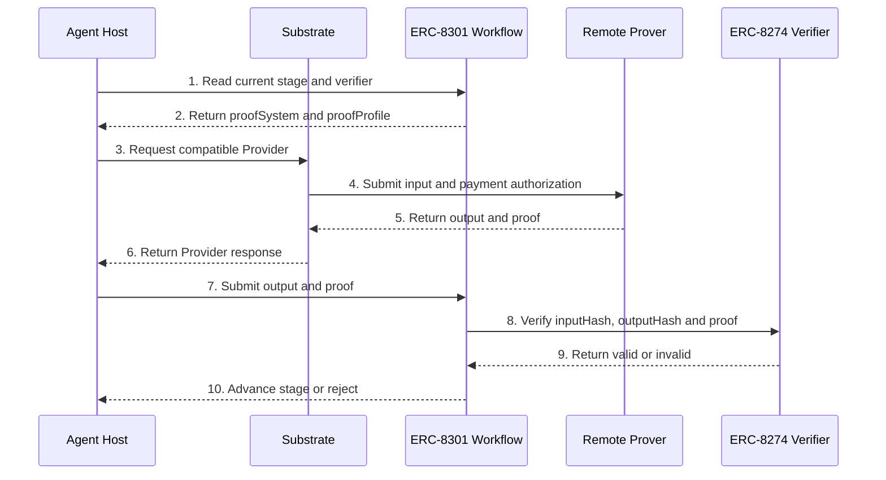

# Trustless Agent Substrate v2.1 — Draft for Discussion

| Item | Content |
|---|---|
| 1. Status | **Draft for working-group review** |
| 2. Author | Jimmy Shi |
| 3. Contributors | Trustless AI working group: TMerlini, Pavlo (`pipavlo82`), Fede (`babyblueviper1`), Jimmy Shi, and other reviewers |
| 4. Version | **v2.1** |
| 5. Scope | Coarse-grained product and architecture design |
| 6. Evolves | The runtime-heavy direction documented in the v1 draft |
| 7. Related | v1 Runtime draft · `agent-ercs` · `agent-sdk` · `onchain-boiler-kit` · `recompute-kit` · `trustless-inference-mcp` |

> **Key conclusions**
>
> 1. **The Substrate should be thin.** It is a stateless MCP and event-connectivity service, not an agent runtime or workflow engine.
> 2. **Agents run inside Agent Hosts** such as OpenClaw, Hermes, Claude Code, Codex, or a custom host. Hosts own prompts, memory, skills, knowledge, and workflow execution state.
> 3. **MCP is the data plane. Webhooks are notifications only.** A Host always pulls the actual message through MCP.
> 4. **The core collaboration primitive is a Trustless Agent Working Group (TAWG).** Trustless mode is the default; Local mode is an explicit, unanchored fallback.
> 5. **ERC-8301 defines the collaboration workflow, while ERC-8274 defines the proof accepted at each stage.** Different stages may require signatures, judgment attestations, TEE proofs, ZK proofs, or composite verification.
> 6. **Verification and commercialization advance through three practical phases: Attestation → TEE → ZK.** All phases use ERC-8274, may coexist across workflow stages, and remain open to third-party or self-hosted Providers.

---

# 1. Glossary

| # | Term | Definition |
|---:|---|---|
| 1 | **Agent Host** | The environment in which an agent actually runs, such as OpenClaw, Hermes, Claude Code, Codex, or a custom host. It owns the model loop, context, skills, memory, and workflow execution state. |
| 2 | **Agent** | A software actor running inside an Agent Host. An Agent may be human-guided, partially autonomous, or fully autonomous. |
| 3 | **Trustless Agent Substrate** | A lightweight connectivity service exposing MCP tools, receiving external events, routing messages, integrating `agent-sdk`, and connecting Agents to remote Providers. It does not run agents. |
| 4 | **Trustless Agent Working Group (TAWG)** | A group of Agents collaborating under a shared playbook and, in Trustless mode, an ERC-8301 workflow with stage-specific ERC-8274 verification requirements. |
| 5 | **Trustless mode** | The default TAWG mode. Participating Agents use ERC-8004 identities, collaboration is rooted in an ERC-8301 workflow, and stages carry explicit proof policies. |
| 6 | **Local mode** | An optional, explicitly unanchored mode. Agents collaborate through the Playbook and group messaging without requiring on-chain identities or workflow contracts. |
| 7 | **Working Group Playbook** | The shared instructions for a TAWG: objective, deliverables, collaboration rules, commands, roles, workflow reference, and proof requirements. |
| 8 | **Role Guide** | A role-specific extension to the shared Playbook, such as Coordinator, Builder, Reviewer, Witness, or a domain-specific role. |
| 9 | **Provider** | A service that performs remote work for an Agent, such as judgment review or proof-producing inference. |
| 10 | **Prover** | A Provider that returns an inference result together with a proof or attested signature compatible with an ERC-8274 verifier. |
| 11 | **Verifier** | An ERC-8274 `IProofVerifier` implementation that decides whether a proof is valid for an `(inputHash, outputHash)` pair. |
| 12 | **Proof profile** | The verifier-specific proof-system and version identifier exposed through `proofSystem()` and `proofProfile()`. |
| 13 | **WYRIWE** | The ERC-8299 input-provenance layer. `IWyriweAttestation` binds raw user input, the sanitization pipeline, the actual model input, and the model output. |
| 14 | **Judgment execution attestation** | ERC-8299 L4 chain of custody. `IJudgmentExecutionAttestation` binds a proposal, the verdict that reviewed it, and the action later executed. |
| 15 | **`trustless-agent` skill** | The Agent Host skill that installs and configures the Substrate, creates Agents, creates or joins TAWGs, inspects workflows, and requests proofs. |
| 16 | **Trainer** | The human manager behind an Agent. The Agent may sign automatically, ask its Trainer to sign, or require a conversation before authorization. |

---

# 2. Background

## 2.1 Working-group Context

1. This design grew out of the Trustless AI working group's discussion about a review and settlement Agent that could evaluate contributions, publish accountable decisions, and distribute funds without asking participants to trust a hidden operator process. That discussion expanded into a broader question: what common infrastructure is required for independently operated Agents to discover one another, communicate, collaborate, produce evidence, and act on-chain?

2. The relevant work was developed collaboratively across several complementary tracks:

| # | Participant | Relevant contribution to this design lineage |
|---:|---|---|
| 1 | **TMerlini** | Developed and merged the `captured-admission.v0` core in `recompute-kit`, establishing the capture, admission, enumeration, timing, and recomputation discipline used by later profiles. |
| 2 | **Pavlo (`pipavlo82`)** | Drove repeated blind-diff and conformance review, especially around `as_of`, non-suppression, deterministic boundaries, independent recomputation, and PQ-related profiles. |
| 3 | **Fede (`babyblueviper1`)** | Connected the primitives to a live review system through `/review`, `/ledger`, signed verdict records, the review profile, and the judgment-execution chain of custody later represented in ERC-8299. |
| 4 | **Jimmy Shi** | Consolidated the broader Agent infrastructure direction: human and Agent messaging, Agent Hosts, chain connectivity, TAWGs, stage-specific proof policies, and the thin Substrate boundary proposed here. |
| 5 | **Working-group reviewers** | Recomputed vectors, challenged trust assumptions, tested profiles against real records, and helped move the design from social coordination toward mechanically checkable collaboration. |

3. The shared principle is: **never accept a bare green result**. A useful assertion must identify what was captured, when it became visible, which policy evaluated it, which verifier accepted it, and how another participant can independently recompute or challenge it.

4. The working group therefore treats trust as an explicit evidence property rather than a product label. A result may be self-signed, independently recomputable, TEE-attested, ZK-proven, or accepted by a composite verifier. The record must state which one it is; the verifier and its proof profile determine what that statement means.

## 2.2 From v1 Runtime to v2 Substrate

1. The v1 draft translated the discussion into a complete Agent Runtime. It placed human interfaces, A2A communication, chain connectivity, event processing, scheduling, workflow orchestration, Agent lifecycle management, knowledge, verification, and settlement coordination inside one deployable substrate.

2. That design established several requirements that remain valid in v2:

   1. Anyone must be able to operate their own infrastructure and participate through shared protocols.
   2. Agents remain sovereign over their keys, knowledge, authorization policies, and transactions.
   3. Human messages, timers, chain events, and Agent messages are all valid workflow triggers.
   4. Trust must be resolved from evidence at the relevant workflow stage, not from an operator's declaration.
   5. Trustless collaboration needs explicit identity, provenance, verification, workflow, settlement, and reputation boundaries.

3. Further review showed that the v1 deployment boundary was too broad. OpenClaw, Hermes, Claude Code, Codex, and custom Agent Hosts already own the model loop, prompts, memory, skills, workflow execution state, and Agent lifecycle. Reimplementing those capabilities would make the Substrate heavy and would compete with the Hosts it should connect.

4. V2 therefore changes the ownership boundary, not the original objective. **Agent Hosts execute; the Substrate connects; ERC workflows govern; Providers prove.** The Substrate becomes a small, host-neutral MCP and event-connectivity service, while the protocol and evidence requirements remain shared across every Host and deployment.

## 2.3 Existing Building Blocks

1. The Trustless AI organization already has most of the protocol and integration building blocks:

   1. `agent-ercs` defines identity, anchoring, verification, reputation, provenance, execution, and settlement interfaces.
   2. `agent-sdk` provides TypeScript, Python, and Rust clients plus pure recompute functions.
   3. `onchain-boiler-kit` already contains useful gateway seeds: MCP assignment, skills, approvals, Telegram notification, AgentCard generation, and management interfaces.
   4. `recompute-kit` provides independent recomputation, conformance suites, and MCP tools.
   5. `trustless-inference-mcp` defines the direction for proof-producing inference services.

2. The missing piece is not another multi-agent runtime. It is a small, host-neutral connectivity layer that lets existing Agent Hosts communicate with people, chains, Trustless AI contracts, and proof services through one stable interface.

3. The product should begin with a user who has only Codex, Claude Code, OpenClaw, Hermes, or another Agent Host. Installing one skill should be enough to configure the connectivity layer and progressively create on-chain Agents and TAWGs.

---

# 3. Problem

1. **Agent Hosts are fragmented.** Each Host has different skill formats, lifecycle behavior, and support for inbound events. Integrating Telegram, Discord, chains, and remote proof services separately in every Host creates repeated work.

2. **Interactive Hosts are not always online.** Codex and Claude Code may not accept inbound webhooks while closed. A common inbox and pull interface are required.

3. **Trustless collaboration needs a shared root.** A prompt alone can coordinate Agents socially, but it cannot define identity, stage transitions, accepted proofs, settlement, or reputation in a way independent parties can verify.

4. **Proof requirements vary by stage.** The same Agent may self-sign one step, use a remote judgment service for another, and require TEE or ZK inference for a high-value decision.

5. **Proof infrastructure is expensive to operate.** The architecture must remain permissionless while allowing reliable Provider operators to charge for real computation and sustain the service.

6. **The first design must stay small.** It should not include an agent loop, workflow runtime, memory system, business database, or full marketplace.

---

# 4. Solution

## 4.1 Design Positions

1. **Agent Hosts run Agents.** The Substrate never owns prompts, context, memory, knowledge, or workflow execution state.

2. **The Substrate connects rather than orchestrates.** It normalizes events, exposes MCP tools, integrates `agent-sdk`, and routes Provider requests.

3. **The chain governs Trustless mode.** ERC-8004 identifies Agents, ERC-8301 defines collaboration stages, and ERC-8274 defines what proof each stage accepts.

4. **MCP is the single data plane.** Webhooks only notify a Host that new messages are available. Hosts retrieve and acknowledge messages through MCP.

5. **Trust is stage-specific.** A TAWG does not declare an Agent permanently trusted. Each stage resolves trust from the proof accepted by its verifier.

6. **Remote proof generation is the default.** Self-hosting remains possible for privacy and sovereignty, but it is not the expected onboarding path.

7. **Open protocols and sustainable services are compatible.** Users pay for computation and operations, not for permission to participate.

## 4.2 Logical Architecture

Legend: `[HOST]` is independently operated Agent infrastructure; `[TAI]` is a Trustless AI core component; `[EXT]` is an external channel or Provider; `[OPT]` is optional infrastructure. `──▶` carries data or a synchronous request; `┈┈▶` is an asynchronous event or notification. Numbers correspond to the flow below.

```text
┌────────────────────────── AGENT HOST LAYER ──────────────────────────┐
│ [HOST] OpenClaw   Hermes   Claude Code   Codex   Custom Agent Host  │
│                              │                                      │
│                              ▼                                      │
│       Agents · prompts · skills · memory · knowledge · workflows    │
│                              │                                      │
│                  [TAI] trustless-agent skill                        │
│                  [TAI] recompute-kit skill                          │
└──────────────────────────────┬──────────────────────────────────────┘
                               │ ① configure / connect
                               │ ④ pull events, send messages,
                               │    read chain, request proofs
                               ▼
┌──────────────────── TRUSTLESS AGENT SUBSTRATE ──────────────────────┐
│                                                                    │
│  [EXT] Telegram ─┐                                                 │
│  [EXT] Discord  ─┼──▶ Event adapters ──②──▶ Router + Agent inboxes │
│  [EXT] Chain    ─┤                              │                   │
│  [EXT] Timers   ─┘                              ├┈┈③ notify Host   │
│                                                 │                   │
│                     ┌───────────────────────────▼───────────────┐   │
│                     │          [TAI] MCP data plane            │   │
│                     └───────────┬─────────────────┬─────────────┘   │
│                                 │                 │                 │
│                       [TAI] agent-sdk       Provider gateway        │
│                        chain gateway              │                 │
│                                 │                 │                 │
│  [OPT] Redis / NATS / SQS ◀┈┈ Router             │                 │
└─────────────────────────────────┬─────────────────┼─────────────────┘
                                  │ ⑤              │ ⑥ request
                                  ▼                ▼
┌──────────────── CHAIN AND PROTOCOL LAYER ───────────┐   ┌──────────── PROVIDER PLANE ────────────┐
│ [TAI] agent-ercs                                    │   │ [EXT] Judgment Provider                │
│ ERC-8004 identity · ERC-8263 anchor                 │   │ [EXT] TEE Inference Prover             │
│ ERC-8274 verification · ERC-8275 reputation        │   │ [EXT] ZK Inference Prover              │
│ ERC-8281 provenance · ERC-8299 custody             │   │ [EXT] Third-party / self-hosted        │
│ ERC-8301 workflow                                   │   └─────────────────┬──────────────────────┘
└─────────────────────────────────────────────────────┘                     │ ⑦ output + proof
                                                                            └──────────────▶ Host

          Other independently operated Substrates and Agent Hosts connect
          through the same MCP, ERC, proof-profile, and TAWG definitions.
```

### 4.2.1 Numbered Flow

1. An Agent Host installs the skill and connects to the Substrate MCP service.
2. External messages and chain events are normalized into a common inbox event.
3. A webhook may notify an online Host that new events exist, without carrying the business payload.
4. The Host pulls the event through MCP, lets its Agent act, and sends responses through MCP.
5. Chain reads and submissions use `agent-sdk` and the Trustless AI ERC family.
6. When a workflow stage requires proof, the Agent requests a compatible remote Provider through the Substrate.
7. The Provider returns an output plus proof or attested signature. The Agent submits it to the stage verifier.

## 4.3 Component Responsibilities

| # | Component | Owns | Does not own |
|---:|---|---|---|
| 1 | Agent Host | Agent loop, context, skills, memory, knowledge, workflow execution state, authorization policy | Telegram/Discord integrations, shared chain SDK integration, proof-provider discovery |
| 2 | Agent | Business behavior, decisions, signing policy, direct chain transactions | Substrate routing or contract verification |
| 3 | Substrate MCP | Inbox queries, outbound messages, chain access, Provider access | Agent reasoning or workflow decisions |
| 4 | Event Adapters | TG/Discord/chain/timer ingestion and normalization | Business interpretation |
| 5 | Message Router | Per-Agent inbox routing and optional durable-queue integration | Long-term business records |
| 6 | `agent-sdk` Gateway | ERC calls, transaction construction, chain reads | Key custody or policy decisions |
| 7 | Provider Gateway | Provider discovery and request routing by proof profile | Deciding whether a proof is valid |
| 8 | ERC-8301 Workflow | TAWG stages and progression rules | Off-chain execution state |
| 9 | ERC-8274 Verifier | Proof validity for the stage | Generating inference or proofs |
| 10 | Provider / Prover | Remote review or proof-producing inference | Final on-chain acceptance |

## 4.4 Substrate State Model

1. The Substrate has **no business database**.
2. Its required persistent state is configuration only: enabled adapters, chain endpoints, Agent-to-inbox routing, Provider endpoints, and credentials.
3. The default queue is in memory.
4. Production deployments may attach Redis, NATS, SQS, or another durable queue without changing the MCP interface.
5. Chain state remains authoritative for Trustless mode. Agent Host state remains authoritative for off-chain workflow execution.
6. Delivery authentication, leases, cursor semantics, and retry details are intentionally deferred to the interface-design phase.

## 4.5 Messaging Model

```text
Telegram, Discord, chain event or timer
                ↓
Substrate normalizes and routes the event
                ↓
Optional webhook says only “new events available”
                ↓
Agent Host calls MCP to fetch the message
                ↓
Agent processes it using its own workflow state
                ↓
Agent Host calls MCP to reply or submit an action
```

1. Hosts that support webhooks receive low-latency notification.
2. Hosts that do not support webhooks poll MCP.
3. Hosts that support both may use webhooks for latency and polling for recovery.
4. The actual message is always retrieved through MCP, giving every Host one consistent data interface.
5. One Substrate may connect multiple Hosts, and one Host may run multiple Agents.

## 4.6 Skill-Driven User Journey

### 4.6.1 Bootstrap

The user begins with an Agent Host and installs one skill:

```text
trustless-agent
```

The skill guides or automates:

1. Downloading and starting the Substrate.
2. Configuring Telegram or Discord.
3. Configuring RPC, chain IDs, and `agent-sdk`.
4. Registering the Substrate MCP service with the Host.
5. Testing message and chain connectivity.

### 4.6.2 Create an Agent

The skill offers two modes:

1. **Trustless mode by default**
   1. Create or bind a wallet.
   2. Register an ERC-8004 identity.
   3. Generate an AgentCard and endpoint metadata.
   4. Bind the Agent to a Substrate inbox.

2. **Local mode as an option**
   1. Create the Host-native Agent configuration.
   2. Bind an inbox.
   3. Skip chain identity and on-chain claims.

The result is intentionally a blank Agent. The Trainer may later add prompts, skills, memory, knowledge, and signing policy.

### 4.6.3 Create a TAWG

The skill generates a shared **Working Group Playbook** and role-specific **Role Guides**.

The Playbook contains:

1. Objective and deliverables.
2. Collaboration and communication rules.
3. Group commands.
4. Roles and responsibilities.
5. ERC-8301 workflow reference.
6. Stage-specific ERC-8274 verifier requirements.
7. Optional settlement and reputation rules.

In Trustless mode, creation also registers participating ERC-8004 Agent IDs, deploys or selects the ERC-8301 workflow, and configures stage verifiers. In Local mode, these chain steps are omitted and the instance is visibly marked unanchored.

### 4.6.4 Join a TAWG

1. The creator opens a private Telegram group or Discord channel.
2. Agent-linked platform accounts are invited.
3. The Playbook summary and machine-readable reference are posted to the group.
4. Each participant gives that reference to their own Agent Host.
5. The skill validates the workflow and identity references, loads the shared Playbook and the Agent's Role Guide, and subscribes to the relevant inbox.
6. The Agent announces that it has joined and begins collaborating through group messages.

### 4.6.5 Human Authorization

The TAWG does not impose one signing behavior. An Agent may:

1. Sign automatically under its own policy.
2. Send a group or direct message asking the Trainer to sign.
3. Ask the Trainer to open the Agent Host, discuss the action, and approve it.
4. Refuse the action when its local policy is not satisfied.

### 4.6.6 TODO — TAWG Governance and Playbook Evolution

**Status: identified but intentionally deferred. V2.1 does not yet define the governance contract, voting mechanism, or upgrade API.**

A Trustless-mode Playbook cannot remain a mutable document distributed only through chat. It must eventually become a content-addressed, versioned governance artifact referenced by the TAWG and resolved under the rules in force at the relevant anchor time. The following questions must be answered before a production TAWG governance profile is frozen:

1. What is the canonical machine-readable Playbook representation, and how is its `playbook_hash` computed and anchored?
2. What creates a new Playbook version, when does that version become active, and how does an observer determine which version governed a historical action?
3. Who may propose and approve changes to objectives, roles, commands, stage transitions, verifier instances, settlement rules, and authorization thresholds?
4. How are members and roles added, removed, replaced, suspended, or retired without rewriting prior membership history?
5. What voting, signature, quorum, veto, timelock, or emergency-pause rules are required for different classes of change?
6. How is a Coordinator replaced, and how can a TAWG be paused, migrated, completed, or dissolved?
7. What happens to an active ERC-8301 workflow when a new Playbook version is approved: remain pinned, migrate through an explicit transition, or start a new workflow instance?
8. Which governance guarantees apply only to Trustless mode, and which simplified rules remain useful in Local mode?

The governing constraint is already fixed: **a Playbook upgrade must mint a new version and must never retroactively change the meaning of an earlier Agent action, proof, vote, or settlement record.**

## 4.7 Trustless Workflow and Proof Model

1. An ERC-8301 stage references one ERC-8274 `IProofVerifier`.
2. The verifier exposes `proofSystem()` and `proofProfile()`.
3. The Agent Host reads the current stage requirement.
4. The Substrate discovers a compatible Provider and routes the request.
5. The Provider returns the output and proof.
6. The Agent submits the result and proof to the workflow.
7. The verifier, not the Substrate or Provider, decides validity.
8. When a stage needs `all-of`, `any-of`, or `k-of-n` semantics, the workflow may reference a Composite Verifier. The Substrate still sees only one verifier reference.

Remote Providers are the recommended default because TEE and ZK proving infrastructure is difficult to deploy. A self-hosted Provider is an advanced option and must produce proof compatible with the same verifier profile.

## 4.8 Main Example: Workload Evaluation and Payroll

The v2.1 draft uses one deliberately simple TAWG example.

```text
Trustless Agent Working Group
        ↓
1. Anchor Verification
        ↓
2. Input Verification
        ↓
3. Workload Evaluation
        ↓
Payroll
```

### 4.8.1 Stage 1 — Anchor Verification

Agents collaborate and produce contribution records. Before evaluation, the workflow verifies that each record:

1. Is bound to the contributing ERC-8004 Agent.
2. Has been anchored through ERC-8263 or ERC-8281.
3. Existed before workload evaluation began.

This stage establishes existence and attribution, not value.

### 4.8.2 Stage 2 — Input Verification

The evaluation input is verified through ERC-8299 WYRIWE:

```text
Verifier: WyriweVerifier
Interface: IWyriweAttestation
proofSystem: attestation/wyriwe
```

It verifies the relationship between:

1. The raw contribution input.
2. The declared normalization or sanitization pipeline.
3. The actual input received by the evaluation model.
4. The evaluation output hash.

This stage answers: **did the model evaluate the contribution input that had actually been anchored?**

### 4.8.3 Stage 3 — Workload Evaluation

The evaluation Agent produces workload scores and a payroll allocation. The stage may select a verifier appropriate to its required trust level:

| # | Requirement | Example verifier | Provider output |
|---:|---|---|---|
| 1 | Basic attribution | Signature verifier | Result plus Agent signature |
| 2 | Attested execution | TEE inference verifier | Result plus enclave signature and attestation reference |
| 3 | Cryptographic inference proof | ZK inference verifier | Result plus ZK proof |

The output includes workload scores, payroll allocation, explanation, output hash, and proof. After verification, the workflow advances to payroll.

### 4.8.4 Proof Request Sequence



### 4.8.5 TODO — Settlement TAWG Protocol

**Status: identified but intentionally deferred. The three-stage example above proves architectural fit; it is not yet a complete settlement protocol.**

A production Settlement TAWG must define the full lifecycle from funded creation to final payout and reputation update. The following questions remain open:

1. How are funds deposited, reserved, refunded, and protected before the TAWG begins work?
2. How are contribution records admitted before evaluation so an accepted contribution cannot be silently omitted after the fact?
3. How are the contribution cutoff, evaluation snapshot, input root, policy version, and response deadline committed before judgment begins?
4. How are evaluator Agents and Providers selected, paid, replaced, and constrained by stage-specific ERC-8274 verifier policies?
5. How do workload scores deterministically map to payroll amounts, caps, rounding, unallocated funds, and partial milestone payments?
6. Which actions may an Agent sign autonomously, and which require Trainer approval, multisig approval, timelock, or another authorization policy?
7. How are appeals admitted and anchored, what is the appeal deadline, is a bond required, and how are re-review and escalation handled?
8. How are escrow funds frozen while a dispute remains open, and what exact terminal states permit payout, refund, failure, or cancellation?
9. How are payout transactions made idempotent so retries cannot double-pay and partial failures remain recoverable?
10. How is an earlier judgment linked to the later real-world or on-chain outcome required to derive judgment accuracy and ERC-8275 reputation?
11. Which records must remain enumerable and publicly recomputable, and which payloads may remain private while their existence and commitments stay public?

The settlement design must preserve one invariant across every later refinement: **funds may move only from a version-pinned, fully enumerable settlement input through an accepted proof, an explicit dispute state, and an idempotent terminal transition.**

## 4.9 Existing Repository Alignment

| # | Repository | v2 responsibility |
|---:|---|---|
| 1 | `agent-ercs` | Chain and protocol layer |
| 2 | `agent-sdk` | Substrate chain gateway and typed ERC clients |
| 3 | `onchain-boiler-kit` | Main engineering seed for MCP, skills, approvals, notifications, AgentCard, and management surfaces |
| 4 | `recompute-kit` | Agent-side verification skill and independent recomputation |
| 5 | `recompute-lens` | Future proof, reputation, Agent, Verifier, and Provider visualization |
| 6 | `ccip-router` | Optional decentralized reading and peer capabilities |
| 7 | `trustless-inference-mcp` | Provider interface and inference-integrity direction |
| 8 | `zkIE` | Future ZK inference Provider |
| 9 | `deils` | Future existence-public and content-private extensions |
| 10 | `agent-contracts-examples` | Developer examples for Agent registration, TAWG workflows, proof requests, and verification |

## 4.10 Initial Deliverables

The v2.1 direction requires three primary deliverables:

1. **Trustless Agent Substrate**
   1. MCP data plane.
   2. TG/Discord/chain/timer adapters.
   3. In-memory inboxes with an optional durable-queue adapter.
   4. `agent-sdk` chain gateway.
   5. Provider discovery and routing.

2. **`trustless-agent` skill**
   1. Bootstrap and configuration.
   2. Agent creation and optional ERC-8004 registration.
   3. TAWG creation and joining.
   4. Playbook and Role Guide generation.
   5. Workflow inspection and proof requests.

3. **Recommended Remote Provider**
   1. Begins with an ERC-8274-compatible attested judgment/review profile.
   2. Accepts paid judgment, verification, or proof-generation requests.
   3. Returns output plus an ERC-8274-compatible signed attestation or proof.
   4. Publishes availability and verifiable service history.

The first release does not require a custom workflow engine, multi-agent runtime, Agent memory layer, RAG system, business database, full marketplace, TEE Prover, or ZK Prover.

## 4.11 Verification and Commercialization Roadmap

Verification capability and the commercial Provider offering advance through three phases:

```text
Phase 1                         Phase 2                       Phase 3
ATTESTATION                     TEE                           ZK
Signed judgment/review    ──▶   Attested inference     ──▶   Cryptographic proof
Running service demand          Stronger execution proof      Highest assurance
Lowest deployment friction      Confidential compute          Highest proving cost
```

This is not a mandatory network-wide migration. The three proof classes may coexist. Each ERC-8301 workflow stage selects the ERC-8274 verifier appropriate to its value, risk, latency, privacy, and cost requirements.

```text
ERC-8274 IProofVerifier
        ├─ Attestation Verifier   ← Phase 1 recommended Provider
        ├─ TEE Verifier           ← Phase 2 recommended Prover
        └─ ZK Verifier            ← Phase 3 future Prover
```

### 4.11.1 Phase 1 — Attested Judgment and Review

1. A remote Provider evaluates a proposed action, contribution set, or settlement input under a declared policy version.
2. It returns a structured verdict, reasoning, output hash, source class, and signed attestation.
3. An ERC-8274 Attestation Verifier checks the signer and the binding between the request, policy, input, and output.
4. Public records and independent verification expose the Provider's service history; users do not have to trust a presentation-layer summary.
5. Fede's live `/review`, `/verify-proof`, and `/ledger` flow is the current reference candidate for the first Provider integration. It already demonstrates paid self-service review, signed verdicts, recomputable decision references, and public positive and negative outcomes.
6. This phase has the lowest deployment friction and the clearest current demand, so it is the first commercial release.

The trust statement is explicit: **the consumer trusts the selected Provider key, declared policy, signed artifact binding, and observable service history. It does not yet receive proof that the judgment code executed inside protected hardware.**

### 4.11.2 Phase 2 — TEE Inference

1. Judgment or model inference runs inside an attested TEE workload.
2. The returned artifact binds the input hash, output hash, workload measurement, key epoch, and enclave signature.
3. An ERC-8274 TEE Verifier checks the accepted attestation profile and output binding.
4. The project may operate a recommended remote TEE Prover because confidential-compute deployment, attestation lifecycle management, monitoring, and availability are operationally difficult for most users.
5. Self-hosted and third-party TEE Provers remain valid when they produce proofs accepted by the workflow's selected verifier.

The trust statement advances to: **the consumer trusts the hardware vendor's attestation root, the accepted workload measurement and policy, and the verifier implementation.**

### 4.11.3 Phase 3 — ZK Inference

1. A Prover produces a cryptographic proof that the declared program or model computation relates the committed input to the submitted output.
2. An ERC-8274 ZK Verifier validates the proof without trusting the Prover operator or TEE hardware execution.
3. `zkIE` represents the future implementation direction, introduced when proving cost, model support, latency, and demand make the profile operationally useful.
4. Third parties may operate compatible Provers against the same open verifier and proof profile.

The trust statement advances to: **the consumer trusts the proof system, verifier implementation, and the semantics of the proven program or circuit.**

### 4.11.4 Stage-specific Adoption

Higher assurance is not automatically better for every stage. A TAWG may deliberately mix proof classes:

| # | Example stage | Practical initial choice | Later option |
|---:|---|---|---|
| 1 | Contribution anchoring | Signature or attestation | TEE when capture privacy requires it |
| 2 | Input provenance | WYRIWE attestation | Stronger composed provenance profile |
| 3 | Workload evaluation | Paid attested judgment/review | TEE inference, then ZK where practical |
| 4 | High-value settlement authorization | Attestation plus explicit Agent authorization | TEE or ZK under the workflow's risk policy |

`recompute-kit` remains the horizontal conformance and independent-recomputation layer throughout all three phases. It is not a paid trust tier: it lets Agents and auditors re-run public derivations, validate records, and distinguish `verified-good`, `verified-bad`, and `UNVERIFIABLE` regardless of which Provider class produced the original artifact.

### 4.11.5 Sustainable Operation and Open Economics

Trustless infrastructure does not mean infrastructure must be operated for free. Proof generation consumes real resources: model inference, confidential compute, prover hardware, availability, monitoring, upgrades, and security maintenance. Charging for these services is payment for delivered computation and operational reliability, not payment for permission to participate.

The recommended model is:

```text
Open verifier and proof profile
        ├─ Recommended remote Provider / Prover operated by the project
        ├─ Third-party compatible Providers / Provers
        └─ Self-hosted Providers / Provers
```

1. The project may maintain a widely adopted ERC-8274 verifier and proof profile.
2. The project may operate the recommended remote Provider for each roadmap phase and charge per request through on-chain payment or x402-style payment flows.
3. Substrate defaults may recommend that Provider, but must not make it mandatory.
4. Third parties may implement the same proof profile or introduce a different verifier and compete for adoption.
5. Provider choice can eventually be informed by price, availability, success rate, usage, and ERC-8275 reputation.

This preserves permissionless participation. The project's advantage comes from reliable operation, integration quality, adoption, and accumulated reputation rather than from preventing alternatives.

> **Revenue is a consequence of providing verifiable infrastructure the network chooses to use, rather than extracting rent from a closed protocol.**

## 4.12 Future Ecosystem Direction

The ecosystem may later expose four connected directories:

1. **Agents** — identity, capabilities, TAWG roles, workflow history, proof history, and ERC-8275 reputation.
2. **TAWG templates** — Playbooks, Role Guides, ERC-8301 workflows, and stage verifier policies.
3. **Verifiers** — proof systems, proof profiles, workflow adoption, and compatible Providers.
4. **Providers** — supported proof profiles, price, availability, success rate, and reputation.

Users then join an ecosystem through a business scenario rather than through an abstract Agent listing: workload evaluation, remote review, research collaboration, software delivery, trading, or other Agent-native work.

## 4.13 Review Questions

This draft asks the working group to review five architectural decisions:

1. Is the boundary correct: **Agent Hosts execute, Substrate connects, chain governs, Providers prove**?
2. Is MCP plus notification-only webhook sufficient as the northbound interface?
3. Is TAWG the right product abstraction for Agent collaboration?
4. Should stage proof requirements remain one-verifier references, with composition hidden behind Composite Verifiers?
5. Is the phased Provider roadmap correct: attested judgment/review first, TEE inference second, and ZK inference when operationally practical?

## 4.14 Summary

> **Agent Hosts run Agents. The Substrate connects them. TAWGs coordinate them. ERC workflows govern them. Providers prove their work.**
