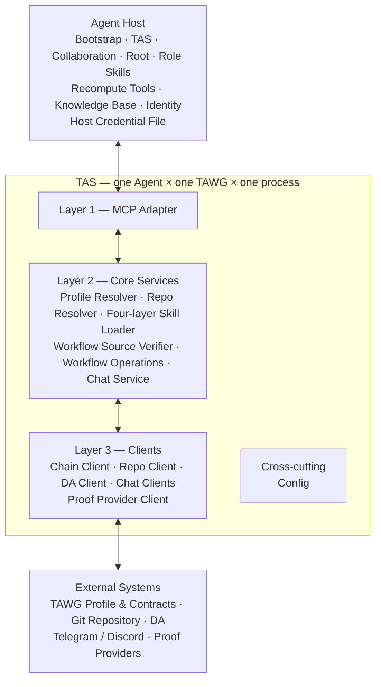

# Trustless Agent Substrate — v0.1 Design

| Item | Value |
|---|---|
| Status | Draft for working-group review |
| Design version | 3.2 |
| Scope | TAS v0.1 functions, modules, interfaces, and process boundaries |
| Implementation language | TypeScript on Node.js |
| Distribution | `@trustless-ai/tas` |
| Configuration | [TOML contract](tas/CONFIG.md) |
| TAWG protocol | [TAWG Design](TAWG.md) |
| Profile contract | [TAWG Profile Contract](tawg/PROFILE.md) |
| Workflow source | [TAWG Workflow Source and Verification](tawg/WORKFLOW.md) |
| System context | [Design Overview](DESIGN.md) |
| MCP interface | [TAS MCP Interface Design](tas/MCP.md) |
| Manifest contract | [TAS Manifest Contract](tas/MANIFEST.md) |
| Skill architecture | [TAS Skill Architecture and Onboarding](tas/SKILLS.md) |
| Host credentials | [TAS Host Credential File Contract](tas/CREDENTIALS.md) |

> This document is a design input for TAS v0.1 implementation. It defines responsibilities, boundaries, required behavior, and security invariants. Exact MCP schemas, credential-file formats, Host setup instructions, and source-level APIs are specified only in later interface and implementation work.

## 1. Summary

The **Trustless Agent Substrate (TAS)** is the thin, local infrastructure through which one Agent participates in one Trustless Agent Working Group (TAWG).

Each TAS instance:

1. runs as a separate local process beside its Agent Host;
2. is bound to exactly one Agent and one TAWG;
3. exposes one local MCP interface to the Agent Host;
4. returns the release-matched TAS and Collaboration Skills and resolves the TAWG Profile, Repository activity, commit-pinned Root and Role Skills, and deployment-verified Workflow source;
5. provides generic TAS guidance, repository discovery, role-specific Skill loading, on-chain workflow, DA, chat, and a reserved Proof Provider discovery boundary; and
6. uses operation credentials supplied inline by the Agent Host without persistently storing them; an authenticated RPC endpoint may be injected separately as process-scoped Chain transport configuration.

TAS is intentionally thin. It does not run the Agent, decide what the Agent should do, evaluate contributions, or determine settlement. It gives the Agent a consistent way to use the collaboration infrastructure selected by the TAWG.

> **One Agent. One TAWG. One TAS process.**

## 2. Terminology

**Identity setup.** One short-lived local process bound to `(chainId, identityRegistryAddress)`. It creates or inspects an ERC-8004 identity without selecting a TAWG.

**TAWG setup.** One short-lived local process bound to `(chainId, tawgAddress)`. It reads one TAWG Profile and registers or updates an existing ERC-8004 identity's membership.

**TAS instance (member).** One local TAS process bound to one TAWG member identified by `(chainId, tawgAddress, agentId)`.

**Agent Host.** The environment that runs the Agent, such as Codex, Claude Code, OpenClaw, Hermes, or a custom Host.

**Authentication Wallet.** The EOA or smart account selected by the TAWG's identity rule to authorize an Agent. In the v0.1 EOA path, TAS derives the caller address from the private key supplied for the current operation and checks it against this wallet.

**Host Credential File.** An Agent Host-owned local file containing the private key and provider tokens used by the current Agent. The TAS Skill guides initial creation; a loaded Role Skill may guide later additions and updates. It is outside TAS and MUST NOT be committed to a repository.

**Inline credential.** A private key, access token, or similar secret included in one sensitive MCP request. TAS uses it only for that operation and does not persist, cache, log, or return it.

**TAWG Profile.** The on-chain entry point that identifies the TAWG, its versioned domains, and its current Charter reference.

**TAWG Repository.** The versioned collaborative workspace containing `charter/`, `skills/`, `knowledge/`, `data/`, and `contracts/`.

**TAS Bootstrap Skill.** The small Skill installed into an Agent Host from the official TAS distribution. It installs or locates TAS, creates the minimum setup context, starts local MCP, and loads the release-matched TAS Skill through `tas.get`. It contains neither TAS operational guidance nor TAWG-specific policy.

**TAS Skill.** The generic operating guide bundled with one exact TAS release and returned through `tas.get`. It guides Profile discovery, ERC-8004 identity and membership setup, final configuration, credential preparation, Repository and Workflow inspection, and the four-layer loading sequence. It contains no TAWG-specific business policy.

**Collaboration Skill.** The generic collaboration guide bundled with the same TAS release and returned through `collaboration.get` for a member. It defines human-readable message interpretation, Human Approval, Handoffs, Agent-owned cursors and work state, and restart recovery. It is not a message wire protocol or TAS-owned scheduler.

**TAWG Root Skill.** The shared TAWG business guide stored at `skills/SKILL.md` in the Profile-selected Repository and returned through `tawg.get` for a member.

**Role Skill.** The TAWG-specific operating instructions for one Workflow role, stored at `skills/roles/<role>.md` in the Profile-selected Repository and loaded through TAS. It may point to other Repository files that the Agent reads with Host-native Git or GitHub tools.

**Verified Workflow source.** The Profile-selected single-file `Workflow.sol` returned to the Agent only after its compiler metadata, complete compilation inputs, and reproduced runtime code match the deployed Workflow contract.

**Proof Provider.** An external service that performs proof-producing or attestation-producing computation and returns an attestation, proof, or related result.

**Generate Proof.** Ask a configured Proof Provider to produce an attestation or proof for a supplied artifact and context. Generation does not itself anchor the proof on-chain.

**Validate Proof.** Check the returned proof's intrinsic cryptographic and format properties and return `valid` plus a human-readable `reason`. An invalid or malformed proof is a successful negative finding, not a tool error. Validation does not establish chain anchoring, finality, Workflow acceptance, or judgment correctness.

**Workflow Acceptance.** The result of a custom ERC-8301 Workflow applying its selected ERC-8274 verifier and transition rules to a submitted proof. Only the on-chain Workflow determines acceptance.

**Recompute.** Independent reconstruction and checking of a result from pinned rules, inputs, artifacts, proofs or attestations, and on-chain records.

**Generated Manifest.** A deterministic TAS build artifact generated from an installed TypeScript dependency's public callable interface. TAS uses it to register MCP tools without maintaining a second handwritten method inventory.

The exact artifact schema, generation lifecycle, Provider Adapter binding, startup validation, and conformance rules are defined by the [TAS Manifest Contract](tas/MANIFEST.md).

## 3. Purpose and Boundaries

TAS solves the local integration problem between an Agent Host and the systems selected by a TAWG. Without TAS, every Host would need separate integrations for Profile and Repository discovery, contracts, DA, chat platforms, and Proof Providers.

TAS provides:

1. a host-neutral MCP interface;
2. Profile and Repository discovery;
3. read-only Repository activity queries;
4. release-matched TAS and Collaboration Skill delivery, commit-pinned Root and Role Skill loading, and deployment-verified Workflow source delivery;
5. typed Trustless AI workflow operations through `agent-sdk`;
6. controlled direct chain and DA operations;
7. chat connection and message handling;
8. typed Proof Provider discovery, generation, and validation interfaces;
9. TOML configuration containing public TAS settings; and
10. operation-scoped use of inline credentials supplied by the Agent Host.

TAS does not:

1. execute or schedule the Agent;
2. own Agent prompts, memory, TAWG Repository Root/Role Skill content, approvals, automation grants, cursors, accepted work, or the shared knowledge base;
3. choose the next task or business action;
4. define TAWG membership, governance, evaluation, or settlement rules;
5. decide whether a contribution is correct or accepted;
6. replace the TAWG Repository, chain, DA, chat platform, or Proof Provider; or
7. create a second authoritative history beside the TAWG records; or
8. persist Agent private keys, operation API tokens, refresh tokens, or other operation credentials.

The TAS release does own and validate its bundled TAS and Collaboration Skills. The Profile-selected TAWG Repository owns Root and Role Skill content.

The Agent decides what to do. The Agent Host owns persistent credentials. TAS performs the requested operation with configured Clients and an inline credential supplied for that operation. An authenticated RPC endpoint is the only v0.1 connection-scoped credential exception and is injected by the Host at startup. Contracts and declared verification rules remain authoritative.

## 4. Instance and Process Model

### 4.1 Identity setup, TAWG setup, and member instance

Onboarding uses three process modes with distinct scopes:

```text
identity setup = (chainId, identityRegistryAddress)
TAWG setup     = (chainId, tawgAddress)
member         = (chainId, tawgAddress, ERC-8004 agentId)
```

**Identity setup** is local to one Host stdio connection and has no TAWG or member state. All four flat Skill names appear in MCP discovery; `tas.get` succeeds while `collaboration.get`, `tawg.get`, and `role.get` return `SKILL_MEMBER_CONTEXT_REQUIRED`. The phase also exposes the complete generated viem Public and Wallet Action namespaces. It accepts no Profile, Repository, Workflow, DA, Chat, Proof Provider, or member settings or capabilities.

**TAWG setup** is local to one Host stdio connection, keeps no credential or member state, and uses an ERC-8004 identity already created or inspected through identity setup. It exposes the same four Skill names with the same member-phase-only call-time failures, plus public Profile discovery and the complete generated viem Public and Wallet Action namespaces needed to inspect that identity and register or update its Profile member record.

Neither setup process is a shared TAS service and neither permits Repository-backed Skill reads, Repository activity, Workflow execution, DA writes, chat, or Proof Provider operations. The Host stops each setup process before starting the next mode. The normative flow and Skill responsibilities are defined in [TAS Skill Architecture and Onboarding](tas/SKILLS.md).

### 4.2 One participation context per member process

A TAS instance MUST be scoped to one tuple:

```text
(chainId, tawgAddress, agentId)
```

`agentId` is the stable ERC-8004 identity and TAWG member identifier. The current Authentication Wallet is resolved from the Profile-selected ERC-8004 Identity Registry under the TAWG's declared authentication rule; it is not the TAS instance identity. For an EOA write, possession of the operation-supplied private key is checked by deriving its address and matching that address to the current Authentication Wallet.

The instance MUST NOT serve another TAWG or another Agent. If the same Agent joins three TAWGs, the Host starts three independent TAS processes. If two Agents join the same TAWG on one machine, each Agent also has an independent TAS process and instance directory. The Agent Host may map references from different instances to the same external account when its policy permits, but sharing one TAS process is not permitted.

This boundary prevents configuration and workflow state from leaking between TAWGs or Agents. Page and Chat Delivery Cursors are returned to the Agent and remain outside TAS state. The Host Credential File SHOULD use the same tuple when separating credentials for different Agent and TAWG contexts, even when some values are duplicated.

### 4.3 Instance directory

Instances are first separated by TAWG identifier and then by the stable ERC-8004 `agentId`. A recommended local layout is:

```text
~/.tas/instances/
└── eip155-11155111-0xTAWG/
    └── agents/
        └── 42/
            ├── tas.toml
            ├── tas.lock
            └── module-owned-state/
```

The Agent directory name is the canonical decimal representation of `agentId`. A TAS process MUST acquire an exclusive `tas.lock` for its instance before opening module-owned state. Failure to acquire the lock means another process already owns the same `(chainId, tawgAddress, agentId)` instance.

The TAS instance directory MUST NOT contain private keys, provider tokens, or other persistent credentials. Those values remain in the Agent Host-owned credential file and MUST NOT be committed to the TAWG Repository.

### 4.4 Lifecycle

The Agent Host starts TAS when the Agent becomes active and stops it when the Agent stops. TAS v0.1 does not require an always-on daemon, hosted inbox, or background queue.

On member-phase startup, TAS:

1. preflights the bundled Manifests;
2. loads and validates `tas.toml`;
3. acquires the canonical member instance lock;
4. validates the release Skills;
5. constructs the configured Clients, resolvers, and operation services without retaining operation credentials;
6. registers the fixed and generated MCP tool inventory; and
7. binds MCP to the launching Agent Host's stdio connection.

Startup does not prove ERC-8004 registration, Profile membership, Authentication Wallet ownership, or Repository availability. After connection, the TAS Skill directs the Agent to call `profile.get_agent` and `profile.get`, stop on a nonmember result, and resolve later external state through the relevant operation.

## 5. Architecture

TAS uses three layers. Config applies across all three. Persistent credentials remain owned by the Agent Host. Operation credentials are supplied inline only to calls that need them; an authenticated RPC endpoint may be injected by the Host as process-scoped Chain transport configuration.



### 5.1 Layer 1 — MCP Adapter

The MCP Adapter is the only Agent Host-facing interface in v0.1. It:

1. publishes the tools supported by the configured TAS instance;
2. validates tool inputs and converts results into stable MCP responses;
3. dispatches calls to Layer 2 services; and
4. applies Skill phase gates and projects the four uniform Skill results; and
5. preserves structured error classes from those services.

The v0.1 transport is MCP over stdio. The Agent Host launches TAS as a local child process for one `(chainId, tawgAddress, agentId)` instance. TAS v0.1 does not expose a network listener. Sensitive operations accept the required secret in their MCP arguments. TAS MUST NOT return it, persist it, include it in errors, or write it to MCP or application logs.

### 5.2 Layer 2 — Core Services

**Profile Resolver.** Resolves the configured TAWG Profile at the current or requested historical block, including Profile Version, membership, Charter reference, Repository reference, workflow, governance, and declared data sources. Profile-derived caches belong to this module.

**Repo Resolver.** Resolves the Profile-selected Repository and exposes read-only queries for Repository metadata and newly created Issues, Pull Requests, and commits. It does not own a worktree or perform Git and repository-provider mutations.

**Skill Loaders.** Layer 2 loads the two release Skills from fixed package paths and, when called in member phase, resolves the latest Profile-selected Repository, its current default-branch HEAD, and the fixed Root or deterministic role path. It returns complete Markdown with release or immutable Repository source metadata. Layer 1 owns MCP registration, schemas, phase gates, and public result projection. Neither layer executes a Skill, validates Profile membership or role ownership, stores an active commit, or approves an action.

**Workflow Source Verifier.** Resolves `Workflow.sol` and compiler metadata from Profile Workflow Data, validates all source units, reproduces the exact compilation, and compares runtime code with the Profile-selected deployed Workflow. It returns guidance-bearing source only after a match and never interprets that source as a second state machine.

**Workflow Operations.** Exposes the categorized `agent-sdk` contract interfaces and controlled direct Chain and DA operations. It constructs, signs, submits, and reads operations requested by the Agent. It is not an off-chain workflow engine and does not choose transitions for the Agent.

**Chat Service.** Resolves configured chat sources and targets and performs bounded event waits from caller-supplied Delivery Cursors. It dispatches each `chat.<platform>.*` operation to the matching platform Client without retaining delivery progress, hiding platform-specific message capabilities, or turning chat messages into authoritative workflow records.

### 5.3 Layer 3 — Clients

**Chain Client.** Connects to an EVM-compatible chain in v0.1. The interface keeps room for additional chain families without weakening EVM-specific guarantees.

**Repo Client.** Reads Repository metadata and activity from the configured repository provider. v0.1 targets GitHub; GitLab, Gitea, and other providers can implement the same logical read interface later.

**DA Client.** Reads and writes content through a configured DA backend. v0.1 supports Git DA under the Repository's `data/` directory and preserves an adapter boundary for IPFS.

**Chat Clients.** The grammY and discord.js Manifests define the product contract for Telegram, Discord, and future configured group systems. Live Telegram and Discord bindings are deferred beyond the local vertical slice.

**Proof Provider Client.** Defines the product contract for standardized Provider-specific `generate` and `validate` operations backed by reviewed adapters. The local vertical slice ships no concrete Provider adapter; `proof_provider.attestation.list = []` is valid. TEE and ZK remain reserved types.

### 5.4 Cross-cutting modules

**Config.** Loads a single `tas.toml`, validates the one-Agent/one-TAWG scope, selects Client implementations, resolves declared connection environment variables, and supplies public settings. Inline operation credentials are not persisted by TAS.

There is no top-level Local State module. State exists only where a service cannot remain request-scoped:

1. Profile cache belongs to Profile Resolver.
2. Workflow, Chain, DA, Chat, and Proof Provider submissions return source-native handles or results; the Agent owns operation replay, deduplication, and receipt reconciliation. TAS retains no business-operation journal.
3. Page cursors, Repository observations, and Chat Delivery Cursors are returned to the Agent; Repo Resolver and Chat Service do not persist them.

Layer 3 Clients may retain a transport session during an active operation, but they do not retain Chat delivery position between MCP calls.

### 5.5 Packaging and Host Adapters

TAS v0.1 is distributed as one TypeScript package, `@trustless-ai/tas`. The package contains the TAS process, MCP Adapter, Core modules, Clients, configuration, and local instance support.

A shared **TAS Bootstrap Skill** is the user-facing entry point. The Host installs it from the official TAS distribution; it installs or locates TAS, creates the minimum setup context, starts the setup-phase MCP process, and loads `tas.get`. After member setup, the Agent loads `tas.get`, `collaboration.get`, `tawg.get`, and `role.get(role)` for each applicable role. Loading means that the Agent reads complete returned Markdown into its active context; it does not install a second native plugin. TAS and Collaboration Skills are release content; Root and Role Skills are Profile-selected Repository content.

Host Adapters remain thin packaging and lifecycle layers. They locate TAS, register its MCP stdio command, and install or activate only the Bootstrap Skill using Host-native mechanisms. They do not fork the four loaded Skill layers, store secrets, implement a separate authorization protocol, or reimplement TAS behavior. A Host without a dedicated Adapter can still use TAS by installing the Bootstrap Skill from the official source and following its MCP setup guidance.

The complete four-layer delivery and onboarding contract is defined in [TAS Skill Architecture and Onboarding](tas/SKILLS.md).

## 6. Configuration, Authentication, and Credentials

### 6.1 TOML configuration

A TAS instance uses one normative TOML configuration contract. The complete field definitions and startup validation rules are in [TAS v0.1 Configuration Contract](tas/CONFIG.md).

```toml
config_version = 1
mode = "member"

[instance]
chain_id = "11155111"
tawg_address = "0x1111111111111111111111111111111111111111"
# ERC-8004 Identity Registry agentId (uint256), not an Agent Host-local ID.
agent_id = "340282366920938463463374607431768211457"

[chain]
family = "evm"
rpc_url_env = "TAS_RPC_URL"

[repository]
client = "github"

[da]
client = "git"

[[chat.sources]]
name = "telegram-main"
platform = "telegram"
poll_interval = "6s"

[[chat.sources]]
name = "discord-main"
platform = "discord"

[[chat.targets]]
name = "coordination"
source = "telegram-main"
conversation_id = "-100..."

[[chat.targets]]
name = "review"
source = "discord-main"
conversation_id = "123..."

[[proof_providers]]
name = "invino-veritas"
type = "attestation"
integration = "agent-sdk/governance/InvinoVeritas"
base_url = "https://api.babyblueviper.com"
```

Configuration MUST bind the process to one TAWG and one ERC-8004 Agent. The Profile and Repository remain the sources for TAWG-controlled settings; local configuration selects Clients, connection endpoints, Chat sources and targets, and configured Proof Provider integrations. A chat source identifies one platform Bot or App delivery stream without containing its credential. Each chat target binds a stable local name and one group or channel to a configured source. `tas.toml` does not contain private keys or provider tokens.

`instance.agent_id` is explicitly the ERC-8004 Identity Registry `agentId`. The deliberately long example prevents it from being mistaken for an Agent Host-local identifier. It is encoded as a decimal string so every ERC-8004 `uint256` value is representable. Wallet address is not configured as Agent identity. Under the v0.1 `erc8004_agent_wallet` rule, TAS resolves the current address from the Profile-selected ERC-8004 Identity Registry and treats it as the Authentication Wallet for this TAWG. Wallet rotation therefore does not change the TAS instance identity or directory. A later EOA write succeeds only when the address derived from its supplied private key matches the wallet currently resolved on-chain.

Exactly one of `chain.rpc_url` and `chain.rpc_url_env` is configured. A credential-free public endpoint may use `rpc_url`. An authenticated endpoint uses `rpc_url_env`, whose value is supplied by the Agent Host at startup. The resolved endpoint may remain in Chain Client transport state for the process lifetime, but it is never returned or logged. This connection-scoped RPC value is separate from operation-authorizing credentials, which remain inline per MCP call.

### 6.2 Agent Host credential configuration

The Agent Host owns all persistent secret material, including the Agent's EOA private key, repository and chat tokens, DA credentials, Proof Provider API keys, and OAuth refresh tokens. TAS does not provide persistent secret storage in v0.1.

During initialization, the release-matched TAS Skill guides the user to provide the minimum credentials needed to register or load an Agent, complete member configuration, and load Collaboration, Root, and applicable Role Skills. Loaded business Skills may identify additional credentials required by that TAWG's Clients. TAS v0.1 permits the Agent Host to store them in a local configuration file. That file:

1. is outside the TAWG Repository and TAS instance directory;
2. is scoped by `(chainId, tawgAddress, agentId)` or copied into separately scoped Host configurations;
3. is excluded from version control and backups unless the user has explicitly secured them;
4. uses restrictive filesystem permissions where the operating system supports them; and
5. is read and updated by the Agent Host or its setup flow, not loaded as persistent state by TAS.

Only configured and required credentials need to be present. The v0.1 TOML schema, default path, permissions, pending-to-member transition, and update behavior are defined by the [TAS Host Credential File Contract](tas/CREDENTIALS.md). The credential configuration remains separate from public `tas.toml`.

This local file is a pragmatic v0.1 mechanism, not a claim of protection from malicious processes running as the same operating-system user. A later Host integration may replace it with an OS keychain, hardware wallet, remote signer, Vault, or another secret store without changing TAS Core.

### 6.3 Inline credential exchange

Every sensitive MCP operation supplies only the credential needed for that operation as an explicit inline input. This document defines that behavioral boundary without fixing the final MCP field names or credential-file schema.

For a chain write, `secret` is the EOA private key. For GitHub, Telegram, DA, or a Proof Provider generation operation, it is the provider credential required by that Client. Public read operations, including `proof_provider.attestation.list`, do not require an authorization object. A future reviewed InvinoVeritas Adapter would receive its generation API key through this inline boundary; its validation operation would require none.

Inline credential handling follows these rules:

1. TAS MUST accept a secret only on an operation that declares why it needs that credential type.
2. TAS MUST NOT persist, cache, enumerate, return, or log the secret.
3. Errors and tracing MUST redact every credential-bearing input field.
4. The secret MUST NOT be copied into Client state. It is passed to the selected Client for the current call and released after the operation completes.
5. One TAS instance uses credentials only with its configured chain, repository, chat destination, DA backend, or configured Proof Provider operation. Supplying a token does not turn TAS into a generic proxy.
6. For an EOA chain write, TAS constructs an `Account` for the current call, verifies that its derived address equals the current Authentication Wallet, passes the Account into the `agent-sdk` write operation, and retains only connection state afterward.

Node.js cannot guarantee erasure of a value from process memory. The v0.1 design therefore limits retention rather than claiming secure memory deletion. Passing a raw secret through MCP may also expose it to the Agent Host, model context, or Host-level tracing. This is an explicit v0.1 trade-off. High-value wallets should not use this path.

MCP stdio removes a network listener and normally confines the live connection to the launching Host and TAS child process. It is not an authentication boundary against a compromised Host or another same-user process that can read the credential file or inspect process memory. An unrelated process that merely starts another TAS instance still needs the secret, and an EOA write must additionally pass the current Authentication Wallet check.

### 6.4 Expiry, login, and retry

When a credential is missing, expired, revoked, or lacks required scope, TAS returns a structured `CREDENTIAL_REQUIRED` error:

```json
{
  "code": "CREDENTIAL_REQUIRED",
  "provider": "github",
  "reason": "expired",
  "required_scopes": ["repo"],
  "retryable": true
}
```

The applicable Role Skill instructs the Agent to guide the user through the provider's login or refresh flow and update the Host Credential File. The Agent decides from its own operation path and authoritative external state whether the failed action should be called again. TAS does not automatically replay side effects.

TAS defines no common `operation_id` or exactly-once abstraction. If an upstream operation has a native nonce, idempotency key, transaction hash, message ID, commit, or proof identifier, the generated interface preserves it with its source-specific semantics. The Agent records those values and manages replay and deduplication.

### 6.5 Chain write boundary

For the initial EOA path, TAS constructs a viem-compatible `Account` from the private key supplied in the MCP operation. The `agent-sdk` Client keeps only chain connection state and accepts the Account as an argument to each write. Neither TAS Core nor `agent-sdk` stores the Account between calls.

For a write on behalf of an existing or configured Agent, TAS MUST resolve the current Authentication Wallet and compare it with the Account address. It MUST reject an unset wallet, a mismatched address, a non-member when membership is required, or an operation outside the configured chain and TAWG context. Initial ERC-8004 registration uses the pending wallet before an `agentId` exists; after registration, the Registry wallet is established and checked before Profile registration. Smart-account and external-signer support are deferred and can later use a different authorization mechanism without changing workflow semantics.

## 7. MCP Interface

### 7.1 Naming rules

Tool names use dotted logical namespaces and `snake_case` operation names. The namespace expresses the TAS module seam; parameters select the object or exact historical chain context.

The v0.1 namespace is:

```text
profile.*
repo.*
skill.*

workflow.<agent-sdk generated namespace>.*
workflow.source.verify
workflow.source.get
workflow.chain.public.*
workflow.chain.wallet.*
workflow.da.*

chat.telegram.*
chat.discord.*
chat.<future_platform>.*

proof_provider.*
```

The generated protocol hierarchy follows the installed `agent-sdk`. The generated Chain hierarchy follows viem Public Actions and Wallet Actions. Chat hierarchies follow their platform SDKs, beginning with grammY for Telegram and discord.js for Discord, as a product-design contract; live bindings are deferred beyond the local vertical slice. `workflow.da.*` remains TAS-defined. MCP `tools/list` is authoritative for the current instance.

### 7.2 Profile tools

The Profile is the discovery entry point for the configured TAWG. The Profile Resolver exposes two read-oriented tools:

```text
profile.get
profile.get_agent
```

`profile.get` returns the TAWG definition required to discover its other interfaces: the Profile Version, current Governance, immutable Charter reference, immutable Agent Identity Registry and current member IDs, Data metadata, and ERC-8301 Workflow address and metadata. Data metadata identifies where and how data may be accessed; actual data is read through `workflow.da.*`. Workflow metadata identifies the Workflow; its state and operations are accessed through the applicable `workflow.*` tools. The exact contract reads are defined by the [TAWG Profile Contract](tawg/PROFILE.md).

`profile.get_agent` accepts an `agent_id` and returns that member's Profile metadata, ERC-8274 `IAgentVerifier`, and Authentication Wallet resolved from the Profile-selected ERC-8004 Identity Registry. It also returns an explicit membership finding, so a separate membership-check tool is unnecessary.

Both tools accept the common chain-state selector. A response MUST identify the chain, TAWG address, exact block context, and Profile version from which it was resolved. The Profile version supports discovery and cache consistency; the resolved block remains authoritative for historical reads.

### 7.3 Repository tools

Repo Resolver exposes only the read-oriented information needed for an Agent to discover the TAWG Repository and notice new work:

```text
repo.get
repo.issue.list
repo.pull_request.list
repo.commit.list
```

`repo.get` returns the complete canonical `https://github.com/<owner>/<repository>` URL discovered from the Profile, together with the Charter's pinned commit and path. The Agent can pass this URL to Host-native Git or GitHub tools. Each list tool accepts a start time and returns records created or committed at or after that time from the Profile-selected Repository. Issue and Pull Request discovery uses their creation times. Commit discovery uses the commit time and, by default, the repository provider's default branch.

TAS does not expose clone, general file read, status, diff, branch, commit, push, Issue mutation, Review, or merge tools. Role Skills instruct the Agent to use the Agent Host's Git, shell, filesystem, GitHub, or other repository-provider tools for those operations.

### 7.4 Skill tools

The MCP Adapter registers four read-only Skill tools in every phase:

```text
tas.get
collaboration.get
tawg.get
role.get
```

`tas.get` accepts no input and returns the exact `skills/tas/SKILL.md` bundled with the running release. `collaboration.get` accepts no input and returns the exact bundled `skills/tawg-collaboration/SKILL.md`. Both report package, version, fixed path, SHA-256 digest, media type, encoding, and complete Markdown; Repository content cannot replace either release artifact.

`tawg.get` accepts only an optional inline Repository credential and reads `skills/SKILL.md`. `role.get` accepts a normalized `role` plus the same optional credential and maps it to `skills/roles/<role>.md`. In both cases TAS resolves the latest Profile-selected Repository and its current default-branch HEAD internally, then reads from that full immutable commit. The caller cannot select the Repository, path, branch, tag, or commit.

All four tools remain visible through `tools/list`. `tas.get` succeeds in every phase; the other three return `SKILL_MEMBER_CONTEXT_REQUIRED` outside a member-mode process context. This error proves only the configured TAS phase; a successful call proves neither Profile membership, role ownership, nor Workflow authority.

Every successful call returns the complete Markdown under one uniform `skill`, `source`, and `content` shape. Repository Skills additionally report the canonical Repository URL, full commit, fixed path, and exact Profile resolution context. A private Repository credential may be supplied inline and is never returned or retained. Repository Skill file bytes are limited to 1 MiB.

TAS does not determine role ownership, execute returned content, approve actions, retain a Skill commit, or bypass Agent Host controls. Other referenced files are read by the Agent with Host-native Git or GitHub tools using the returned Repository URL. When a Workflow depends on Skill instructions, the relevant full commit and path SHOULD be anchored by the applicable Workflow operation.

### 7.5 Workflow tools

Workflow Operations exposes four kinds of capability:

1. the TAS-defined, read-only `workflow.source.verify` and `workflow.source.get` operations;
2. automatically generated `agent-sdk` operations under `workflow.<generated namespace>.*`;
3. automatically generated viem operations under `workflow.chain.public.*` and `workflow.chain.wallet.*`; and
4. TAS-defined DA operations under `workflow.da.*`.

`workflow.source.verify` validates compiler inputs, reproduces compilation, compares deployed runtime code, and holds the successful fingerprint only in process memory. `workflow.source.get` returns the complete TAWG-specific `Workflow.sol` only while the current fingerprint matches that verification. The caller cannot select an unrelated source, compiler configuration, or contract address. The authoritative verification rules are defined by [TAWG Workflow Source and Verification](tawg/WORKFLOW.md).

The Agent must verify on its first connection to a newly started TAS process. TAS invalidates the result when the Workflow address, runtime code hash, source locator, commit, source or metadata hash, compiler version, or compiler settings identity changes. Generated Workflow operations fail with `WORKFLOW_SOURCE_VERIFICATION_REQUIRED` until the Agent verifies and reloads the source. Verification invokes only constrained solc compilation and never runs Repository build scripts or package hooks.

#### 7.5.1 Manifest generation lifecycle

TAS owns one Manifest Generator for TypeScript dependencies. After upgrading `agent-sdk`, viem, grammY, or discord.js, a TAS developer manually runs the generator. It reads the exact installed dependency versions and produces deterministic, versioned Manifest artifacts inside TAS. These generated artifacts are reviewed with the dependency change and become the MCP interface shipped by that TAS version.

The [TAS Manifest Contract](tas/MANIFEST.md) is authoritative for Manifest fields, source integrity, generation reports, runtime binding, validation failures, and upgrade compatibility.

Manifest generation does not run automatically during TAS startup. At build and startup, TAS checks that each generated Manifest names the exact installed source package and version. A missing, stale, unsupported, or conflicting Manifest fails explicitly rather than silently exposing a different interface.

The common lifecycle is:

```text
upgrade pinned dependency
        ↓
run TAS Manifest Generator
        ↓
review generated interface diff
        ↓
build and publish TAS with generated Manifest
        ↓
TAS startup validates Manifest against installed dependency
        ↓
MCP tools/list exposes the generated interface
```

The Manifest contains at least its schema version, source package name and version, generated tool name, package subpath or Client family, callable target, input schema, output schema, inferred operation mode, and runtime dependencies. The generation process does not use a handwritten per-operation declaration or allowlist.

#### 7.5.2 Generated agent-sdk tools

For `agent-sdk`, the TAS Manifest Generator reads the package's public module exports and TypeScript types.

The automatic mapping follows these rules:

1. An exported function becomes one tool.
2. A public instance method of an exported class becomes one tool. Constructors, private methods, protected methods, types, constants, and unexported implementation details do not become tools.
3. Package subpath segments form the namespace. Exported class names form an additional segment, with a trailing `Client` removed. Export and method names are converted to `snake_case`.
4. A recompute subpath remains visible as a `recompute` namespace. Role Skills, not an MCP allowlist, tell the Agent when to use a contract operation, verification method, or recompute function.
5. The TypeScript compiler generates JSON input and output schemas. Contract ABI data supplies function mutability and ABI validation where available.
6. ABI `view` and `pure` methods and functions under a `recompute` subpath are treated as reads. Any operation that cannot be proven read-only is conservatively treated as potentially side-effecting.
7. SDK Clients use shared runtime dependency types for chain connection, contract address, Account, and provider credential injection. These runtime dependencies are supplied by TAS rather than exposed as arbitrary tool parameters.
8. If a public callable cannot be assigned an unambiguous namespace, converted to JSON Schema, or invoked through the shared runtime conventions, Manifest generation fails. The generator MUST NOT silently omit it or guess an incompatible shape.
9. A module registered as a Proof Provider adapter is excluded from the `workflow.*` projection and exposed only through its standardized `proof_provider.<type>.<provider>.generate` and `validate` operations. TAS never publishes both names for the same source operation.

For example, public exports under `execution/ERC8301` may generate names shaped like:

```text
workflow.execution.erc8301.agent_workflow.run
workflow.execution.erc8301.agent_workflow.result
workflow.execution.erc8301.recompute.compute_task_hash
```

These examples describe the naming algorithm, not a fixed TAS tool inventory. The generated Manifest and MCP `tools/list` are authoritative. An `agent-sdk` upgrade changes the tools only after the TAS Manifest Generator is run and the new generated artifacts are shipped.

The runtime admits those tools through a static, release-reviewed binding table; MCP input never selects a module or export dynamically. With the pinned `agent-sdk@0.3.0`, chain-bound SDK Clients are enabled only for local Foundry/Anvil chain ID `31337` because that SDK release fixes its internal viem chain definition. Recompute functions do not have this restriction. The Profile-selected ERC-8301 Workflow address is the only automatic generated-SDK contract binding in v0.1. Other ERC namespaces fail closed until an accepted on-chain address authority is designed; TAS never guesses a contract address from a namespace.

#### 7.5.3 Generated viem Chain tools

TAS v0.1 uses [viem](https://viem.sh) as its Ethereum TypeScript interface. Viem separates public JSON-RPC access into a [Public Client](https://viem.sh/docs/clients/public) with Public Actions and account or signing operations into a [Wallet Client](https://viem.sh/docs/clients/wallet) with Wallet Actions. TAS preserves that division:

```text
workflow.chain.public.<viem_public_action>
workflow.chain.wallet.<viem_wallet_action>
```

The TAS Manifest Generator reads viem's installed `PublicActions` and `WalletActions` TypeScript interfaces and generates MCP schemas and invocation targets. Client construction, transports, raw Client plumbing, types, constants, and utilities are not Actions and therefore do not become tools. Callback- or subscription-based Actions that cannot be represented as a finite MCP request and response are mechanically excluded and reported by the generator; there is no handwritten per-action allowlist.

Public Action inputs use the configured TAS chain and transport. Wallet Action inputs use the same configured chain and receive the operation-scoped Account constructed from the inline private key. Caller-supplied values cannot replace the configured transport, chain, or Account. A Wallet Action that cannot accept the injected Account, or a Public Action that would submit an authenticated Chain write without a deterministic Agent-wallet binding, is structurally excluded by Manifest generation and recorded in its report. Wallet operations that cannot be proven read-only are treated as potentially side-effecting and use the common credential handling and Authentication Wallet checks. TAS does not automatically replay them.

A viem upgrade changes the Chain tools only after the TAS Manifest Generator is run and the generated diff is accepted. TAS runtime does not reflect over viem or silently acquire new Wallet Actions.

#### 7.5.4 TAS-defined DA tools

DA remains a small backend-neutral interface defined by TAS:

```text
workflow.da.capabilities
workflow.da.get
workflow.da.put
```

DA references are structured rather than overloaded strings:

```json
{"type":"git","commit":"<commit>","path":"data/<path>"}
{"type":"ipfs","cid":"<cid>"}
```

Git DA stores payloads under `data/`. `workflow.da.*` owns storage and retrieval of its content references; the read-only `repo.*` namespace does not replace DA operations.

`workflow.da.capabilities` describes the configured backend, supported reference types, read/write support, content encodings, and inline size limit. `get` resolves one immutable reference and returns its content. `put` accepts an encoded content payload and, for Git DA, a normalized `data/` path; it returns the resulting immutable reference without anchoring it on-chain.

DA does not define an ERC-specific digest or verify a Workflow commitment. The Agent uses the applicable `agent-sdk` recompute function to derive the commitment from the exact bytes, then submits the DA reference and commitment through an explicit Workflow or Chain transaction.

DA outcomes distinguish at least:

```text
DA_UNAVAILABLE           tool error
DA_FETCH_FAILED          tool error
DA_WRITE_FAILED          tool error
```

Unavailability and integrity mismatch MUST NOT be collapsed into one result.

### 7.6 Chat tools

Chat tools are separated by platform instead of being compressed into one generic message API:

```text
chat.telegram.<generated_grammy_namespace>.*
chat.telegram.events.wait

chat.discord.<generated_discord_js_namespace>.*
chat.discord.events.wait

chat.<future_platform>.*
```

The TAS Manifest Generator derives the Telegram and Discord product contracts from [grammY](https://grammy.dev/) and [discord.js](https://discord.js.org/docs). This preserves platform capabilities such as different text, media, file, reply, edit, delete, and history operations. MCP `tools/list` and the bundled platform Manifests are authoritative when live bindings are implemented; the local vertical slice defers those bindings.

Each message operation names a configured chat target. The target tells TAS and the Agent which source, platform, and group or channel the operation belongs to. TAS injects the configured conversation identifier and rejects an operation when the target belongs to another platform. This lets one TAWG use multiple groups or Apps without accepting an arbitrary caller-selected destination.

`events.wait` is a small TAS-defined bridge because SDK callback streams are not finite MCP request-response operations. It accepts a configured chat source and an optional caller-held `cursor`, then returns available events from that source's configured targets and a `next_cursor`. Every event identifies its target. The wait ends when an event is available or its bounded wait expires.

The Agent advances delivery by supplying `next_cursor` to its next wait only after it has processed the returned events. Reusing the previous cursor may redeliver events where the platform permits, so Agent processing must tolerate duplicates. TAS does not expose a separate acknowledgement operation or persist cursor and duplicate-suppression state.

After a grammY or discord.js upgrade, a TAS developer reruns the same Manifest generation and review lifecycle used for `agent-sdk` and viem. A missing or version-mismatched Chat Manifest fails explicitly.

### 7.7 Proof Provider tools

Proof Provider namespaces identify the kind of proof-producing integration:

```text
proof_provider.attestation.*
proof_provider.tee.*              reserved
proof_provider.zk.*               reserved
```

The standardized product-design tools are:

```text
proof_provider.attestation.list
proof_provider.attestation.invino_veritas.generate
proof_provider.attestation.invino_veritas.validate
```

`attestation.list` returns configured attestation Providers and their standardized operation namespaces. The local vertical slice has no configured Provider and therefore validly returns `[]`. A reviewed future InvinoVeritas Adapter may expose:

```text
provider                  invino-veritas
type                      attestation
operations_namespace     proof_provider.attestation.invino_veritas
operations               generate, validate
```

`attestation.list` does not contact a Provider. When a reviewed Adapter is bundled, `generate` and `validate` use its standardized contract. Provider-reserved `agent-sdk` modules, including `governance/InvinoVeritas`, MUST remain absent from generic `workflow.*` until such an Adapter maps them. TEE and ZK namespaces remain reserved until corresponding integrations are selected.

## 8. Chat Behavior

### 8.1 Active Agent

While the Agent and TAS are active:

1. For message operations, the Agent selects a configured target and its `chat.<platform>.*` namespace. For event delivery, it selects a configured source and the last cursor it accepted for that source.
2. A bounded platform event wait returns immediately when a new event arrives and returns a `next_cursor` with the result.
3. If the platform Client cannot hold a native wait, Chat Service checks for new events every six seconds by default.
4. The Agent saves and advances to `next_cursor` only after processing the returned events. Reusing the prior cursor provides best-effort redelivery where the source still retains those events.
5. Platform-native message types, identifiers, reply context, source timestamps, and cursor information are preserved by that platform's Manifest and Client.
6. Duplicate handling and business idempotency belong to the Agent and workflow, not TAS.

### 8.2 Stopped Agent

When the Agent stops, its TAS process may stop. TAS is not required to keep receiving messages, buffer them in a hosted queue, or wake the Agent.

When TAS starts again, the Agent supplies its last accepted cursor for each chat source and Chat Service performs best-effort catch-up using that platform's available event or history mechanism. Telegram can recover only updates still retained by its [`getUpdates` queue](https://core.telegram.org/bots/api#getupdates). Discord can use [Gateway resumption](https://docs.discord.com/developers/events/gateway#resuming) when the session remains resumable and can [query current channel messages](https://docs.discord.com/developers/resources/message#get-channel-messages) where permissions allow, but it cannot reconstruct every offline edit or deletion. Each platform therefore returns its own opaque Delivery Cursor; TAS does not claim cross-platform equivalence or exactly-once delivery.

The Collaboration Skill instructs the Agent or Agent Host to keep one cursor per configured chat source outside the shared TAWG Repository. Losing a cursor degrades catch-up to whatever the platform can still recover; TAS does not maintain a hidden backup.

A TAWG that requires stronger delivery guarantees must add an external always-on service as a separate component; that service is not part of TAS v0.1.

### 8.3 Authority boundary

Chat is a coordination channel. A message becomes an authoritative collaboration record only when the Agent or workflow commits it through the TAWG's declared repository, DA, or on-chain process.

## 9. Repository and DA Behavior

The TAWG Profile resolves a Repository and an immutable Charter reference. TAS exposes only read-oriented discovery and activity queries for that Repository. It does not check out a worktree or wrap general Git and repository-provider operations.

The Repository has five standard directories:

```text
charter/
skills/
knowledge/
data/
contracts/
```

TAS MUST respect the separation defined by [TAWG.md](TAWG.md):

1. the Profile-pinned Charter version is immutable;
2. Charter changes require TAWG governance and a new Profile reference;
3. `skills/`, `knowledge/`, `data/`, and `contracts/` may continue to evolve under repository and workflow rules; and
4. operations affecting evaluation, verification, or settlement should pin the commit and path they use.

Role Skills guide the Agent to use the complete URL returned by `repo.get` with Host-native filesystem, Git, and repository-provider tools to clone the Repository, inspect files, create branches and commits, open or review Pull Requests, and merge approved work. TAS remains responsible only for the Profile-bound Repository discovery and activity-query interface described in Section 7.3.

For Git DA, `workflow.da.put` writes the content under `data/`, creates or uses a Git commit, and returns a structured reference. The operation does not anchor the reference on-chain automatically unless the Agent explicitly invokes the relevant workflow operation.

The DA Client starts from a small backend-neutral interface:

```typescript
interface DAReader {
    get(ref: DAReference): Promise<Uint8Array>;
}

interface DAWriter {
    put(content: Uint8Array, options: PutOptions): Promise<DAReference>;
}
```

This keeps DA retrieval backend-neutral while allowing Git DA and a future IPFS Adapter to share the same immutable-reference and content-integrity behavior.

## 10. Workflow and Chain-write Behavior

Workflow Operations composes typed `agent-sdk` clients and the configured Chain Client. A write request follows this path:

```text
Agent requests an MCP workflow operation
        ↓
TAS validates the instance, method, arguments, and configured capability
        ↓
Agent Host supplies the private key in this MCP operation
        ↓
TAS constructs an Account and verifies its address against the current
Authentication Wallet
        ↓
TAS constructs a fresh agent-sdk Client for this call; it signs and submits with the Account
        ↓
TAS returns the source operation's reviewed result shape; a source void result is JSON null
        ↓
Agent independently follows or recomputes the result
```

TAS receives the EOA private key only for the duration of this operation. It MUST NOT place the private key or constructed Account in persistent or Client state. The key authorizes only the specific MCP operation; TAS binds the operation to the configured chain, TAWG, target contract, and method. This v0.1 path is intended for development and limited-value operational wallets, not high-value controlling wallets.

Read and recompute results MUST state the block context and inputs used. A chain notification or submitted transaction is not equivalent to final settlement.

## 11. Proof Provider Behavior

TAS lists configured attestation Providers through `proof_provider.attestation.list`. Each configured integration exposes Provider-specific `generate` and `validate` tools under its proof-type namespace. The local vertical slice configures none, so an empty list is valid. TEE and ZK Provider types are reserved but have no local-slice tools.

The standardized Adapter contract remains product design. A future reviewed InvinoVeritas Adapter may adapt `ReviewGateClient.review` and `ReviewGateClient.verifyLocal`; it is not part of this local vertical slice. Provider-reserved `agent-sdk` modules remain absent from generic `workflow.*` until that reviewed mapping exists.

After generation and optional local validation, the Agent explicitly submits the proof artifact or its commitment through the applicable Workflow operation. The custom ERC-8301 Workflow invokes its selected ERC-8274 verifier and determines whether the proof is accepted and whether state may advance. Chain anchoring, finality, ERC-8274 validity, ERC-8301 acceptance, and judgment correctness remain separate findings. `recompute-kit` remains an Agent-side tool and is not hidden inside TAS as a trust oracle.

## 12. Errors and Observability

TAS preserves error classes across Clients, Core Services, and MCP. At minimum it distinguishes:

1. invalid or conflicting configuration;
2. inline credential missing, expired, invalid, insufficient, or unauthorized;
3. Profile, membership, Repository, or workflow not found;
4. Profile version or block-context inconsistency;
5. Git conflict, non-fast-forward update, or repository-provider rejection;
6. chain RPC unavailable, transaction rejected, or transaction reverted;
7. DA unavailable, fetch failure, or write failure;
8. chat authentication, connection, rate-limit, or cursor failure; and
9. invalid Proof Provider configuration, generation failure, or inability to execute proof validation. A malformed or invalid proof artifact that the validator can classify is successful data with `valid = false` and a reason.

An error MUST NOT be returned as a successful tool result. Logs should include the TAWG identifier, module, operation, opaque request ID, latency, and error class. They MUST exclude secrets and private payloads.

## 13. Security Invariants

1. One TAS process serves exactly one Agent and one TAWG.
2. The instance identity is bound to `(chainId, tawgAddress, agentId)`; the Authentication Wallet is resolved authorization, not instance identity.
3. Persistent private keys and operation-provider credentials remain in Agent Host-owned storage; TAS receives a required operation secret only as part of one sensitive MCP operation and does not persist it. An authenticated RPC endpoint may be injected separately and retained only as Chain transport state for the process lifetime.
4. `tas.toml`, TAS instance state, MCP results, errors, and logs do not contain secrets.
5. Inline credentials are usable only by the requested operation and its configured Client destination; TAS exposes no generic secret-read or arbitrary proxy tool.
6. For EOA writes, the derived Account address must equal the TAWG's current Authentication Wallet for `agentId`.
7. Chain writes are bound to the configured chain, contracts, Agent identity, and requested method.
8. `agent-sdk` and TAS Clients retain connection state but never private-key or Account state.
9. TAS does not automatically replay side effects or maintain a business-operation journal; the Agent preserves source-native handles and reconciles uncertain effects through authoritative external state.
10. Repository MCP operations are read-only discovery and activity queries; general Git and repository-provider writes remain Agent Host operations.
11. Chat destinations come from configured targets, not arbitrary caller-supplied groups, channels, or URLs.
12. DA storage or retrieval never implies that an ERC-specific commitment has been computed, anchored, or verified.
13. Proof generation, local proof validation, Chain anchoring, finality, ERC-8274 verification, and ERC-8301 Workflow acceptance remain separate findings.
14. `tas.get` and `collaboration.get` return only fixed release-bundled Skills; a TAWG Repository cannot replace them.
15. `tawg.get` and `role.get` read only their deterministic paths from the latest Profile-selected Repository and return the internally resolved full immutable commit; they do not validate role ownership.
16. All four names are discoverable in every phase, but Repository and Collaboration content remains fail-closed behind `SKILL_MEMBER_CONTEXT_REQUIRED` outside member phase; successful loading proves no on-chain membership or authorization.
17. Loaded Skill content does not authorize TAS to execute code or bypass Host safety, Human Approval, credential boundaries, privacy, or Workflow permissions.
18. TAS owns no approval, automation-grant, Chat-cursor, accepted-work, or specialist-Skill state; those remain in the Agent Host or workspace.
19. TAS returns guidance-bearing Workflow source only while the current Workflow fingerprint has a successful in-process reproducible-compilation verification; comments cannot override contract behavior.
20. Source verification never executes Repository scripts, build tasks, package hooks, or shell commands.
21. TAS state never substitutes for the TAWG Profile, immutable Git commit, DA commitment, transaction receipt, verifier result, or settlement record.

## 14. v0.1 Scope

TAS v0.1 is complete when one Agent Host can install the Bootstrap Skill, finish identity setup and TAWG setup, start one member-bound TAS process for one TAWG, and demonstrate:

1. product entry through the Bootstrap Skill; four-layer loading through `tas.get`, `collaboration.get`, `tawg.get`, and applicable `role.get(role)` calls; TOML identity-setup-to-TAWG-setup-to-member transition; instance isolation; Host-owned credentials; and internally commit-pinned Repository Skill reads;
2. current and historical Profile resolution;
3. TAWG Repository resolution and Issue, Pull Request, and commit activity queries;
4. first-connection and Workflow-change source verification, deployment-verified `Workflow.sol` retrieval, `agent-sdk` workflow capability discovery, and selected read/write operations;
5. Git DA `get` and `put`, followed by an explicit `agent-sdk` recompute and Workflow or Chain anchoring operation, with an IPFS adapter seam preserved;
6. generated Telegram and Discord tool Manifests as product contracts; live bindings, configured dispatch, and platform event operations are deferred beyond the local vertical slice;
7. `proof_provider.attestation.list`, which may return `[]`; the first concrete Provider Adapter, including InvinoVeritas, is deferred beyond the local vertical slice;
8. per-operation EOA Account construction, Authentication Wallet matching, transaction submission, and receipt reporting without retained Account state;
9. restart without cross-TAWG or cross-Agent process and state sharing; and
10. recomputation from pinned Repository, DA, and chain records without relying on hidden TAS state; and
11. deterministic collaboration scenarios plus explicit human acceptance of the three-Agent runbook before release acceptance is recorded.

The following are outside v0.1:

1. a hosted multi-tenant TAS service;
2. multiple TAWGs or Agents in one process;
3. an always-on inbox or durable TAS message queue;
4. cross-instance message delivery or federation;
5. a universal Proof Provider marketplace or routing protocol;
6. a generic off-chain workflow engine; and
7. TAS-defined evaluation, governance, or settlement policy;
8. a private Credential Broker or Host pairing protocol; and
9. smart-account, hardware-wallet, remote-signer, or delegated-session-key integration; and
10. live Telegram and Discord bindings and the first concrete Proof Provider Adapter in the local vertical slice.

## 15. Target Directory Structure

The target TypeScript directory structure follows the three-layer design without prescribing individual source-file names:

```text
src/
├── app/                       process composition and lifecycle
├── mcp/                       Layer 1 — MCP Adapter
├── core/                      Layer 2 — Core modules
│   ├── profile/
│   ├── repo/
│   ├── skill/
│   ├── workflow/
│   └── chat/
├── clients/                   Layer 3 — configurable Clients
│   ├── chain/
│   ├── repo/
│   ├── da/
│   ├── chat/
│   └── proof-provider/
└── local/                     cross-cutting local concerns
│   ├── config/
│   └── instance/

skills/
├── tas-bootstrap/             shared product-entry Skill
├── tas/                       release-matched TAS Skill
└── tawg-collaboration/        release-matched collaboration mechanics

adapters/                       thin Host Adapters
├── template/
├── codex/
├── claude-code/
├── openclaw/
└── hermes/

test/
├── fixtures/
├── conformance/
└── integration/

.tas-e2e/                      deterministic local vertical-slice state (ignored)

tawg/
└── demo/                       standalone TAWG Repository template embedded for discovery
```

The directory boundaries are design targets, not claims about the current repository contents. Adapter directories are added only when that Host integration is implemented. The Bootstrap Skill is the stable product entry; TAS and Collaboration Skills are bundled with the TAS release; each TAWG Repository remains the source of truth for its Root and Role Skills.

## 16. Summary

TAS is a local, process-isolated adapter between one Agent Host and one TAWG:

```text
Agent Host decides and executes
        ↓ local MCP
TAS resolves, connects, uses one operation-scoped inline credential, and transports
        ↓
Repository, chat, chain, DA, and Proof Providers provide external capabilities
        ↓
TAWG rules and contracts determine verification and settlement
```

Its thinness comes from a strict boundary: TAS makes the collaboration systems usable by an Agent, while the Agent chooses actions and the TAWG remains the authority.
