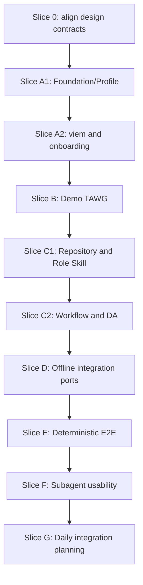

# TAS Demo Vertical Slice Master Implementation Plan

> **For agentic workers:** REQUIRED SUB-SKILL: Use `superpowers:subagent-driven-development` (recommended) or `superpowers:executing-plans` to execute this plan. Complete one referenced plan and its gate before starting the next.

**Goal:** Deliver a working TAS vertical slice in which independently operated Agents self-register ERC-8004 identities, self-join a Demo TAWG, collaborate for three rounds, and settle cumulative points on a local chain before TAS integrates the Daily Contribution TAWG.

**Architecture:** Build a bootable three-layer TypeScript TAS first, add the version-controlled `tawg/demo` consumer, then add only the general Repository, Workflow, DA, Chat, and Proof Provider seams required by the vertical flow. Deterministic E2E is the repeatable gate; independent Subagents provide a second Agent-usability gate.

**Tech Stack:** Node.js `>=24 <25`, TypeScript `7.0.2`, npm, MCP TypeScript SDK v2, viem, `@trustless-ai/agent-sdk`, Zod, Vitest, Foundry/Anvil, Solidity, grammY and discord.js type surfaces, plus injected offline Repository/DA and Chat test Clients.

**Spec:** `docs/superpowers/specs/2026-08-22-tas-demo-vertical-slice-design.md` and the accepted TAS/TAWG design documents referenced by `docs/tas/IMPLEMENTATION.md`.

## Global Constraints

- Use red-green-refactor for implementation tasks.
- Preserve the legacy Go scaffold until the TypeScript vertical acceptance gate passes.
- Keep dependency direction `app -> mcp -> core -> clients`; Clients never import MCP code.
- Never add a `demo.*` MCP namespace or Demo branching in TAS Core.
- Every Agent creates or loads its own wallet, registers its own ERC-8004 identity, and submits its own Profile and Workflow transactions.
- The harness may provide public locators and test funds but never an Agent credential, identity, membership, role action, or business transaction.
- TAS retains no private key, Account, Chat cursor, global operation ID, retry journal, or automatic side-effect replay.
- Use the production Chat MCP schemas with injected offline Clients; do not add `chat.test.*`.
- Ship no concrete Proof Provider in this slice. Preserve the adapter seam and empty discovery behavior.
- Runtime E2E state lives under `.tas-e2e/` and must never enter a commit.
- A deterministic automated test is required before a Subagent usability scenario is accepted.
- All GitHub writes follow the repository's global GitHub MCP rule.

## Plan Graph



## Slice 0: Align the Accepted Design Contracts

**Files:**

- Modify: `docs/TAS.md`
- Modify: `docs/tas/CONFIG.md`
- Modify: `docs/tas/MCP.md`
- Modify: `docs/tas/MANIFEST.md`
- Modify: `docs/tas/SKILLS.md`
- Modify: `docs/PROJECT_STRUCTURE.md`
- Modify: `.gitignore`
- Test: documentation searches described below

- [ ] **Step 1: Add the failing consistency search**

Record the expected execution-phase vocabulary and run targeted searches for obsolete first-slice claims:

```bash
rg -n "identity setup|TAWG setup|member" docs/TAS.md docs/tas
rg -n "initial result includes|first Provider Adapter|InvinoVeritas-backed|live Telegram|live Discord" docs/TAS.md docs/tas
rg -n "Phase 1|Phase 2|Phase 4|Phase 5" docs/PROJECT_STRUCTURE.md docs/tas/IMPLEMENTATION.md
```

Expected before alignment: missing identity-setup rules and concrete Provider/live-platform language that conflicts with the accepted first-slice boundary.

- [ ] **Step 2: Align configuration and process modes**

Define three modes consistently:

```text
identity setup  = (chainId, identityRegistryAddress)
TAWG setup      = (chainId, tawgAddress)
member          = (chainId, tawgAddress, ERC-8004 agentId)
```

Identity setup exposes only `skill.tas.get` and generated viem Public/Wallet Actions. It accepts no Repository, DA, Chat, Proof Provider, Profile, or member settings.

- [ ] **Step 3: Align Chat and Proof Provider delivery boundaries**

Keep grammY/discord.js manifests and the standardized Provider adapter contract as product design. Mark live platform bindings and the first concrete Proof Provider adapter as deferred integrations rather than prerequisites for the local vertical slice. Make `proof_provider.attestation.list = []` the valid no-adapter state. Keep Provider-reserved `agent-sdk` modules such as `governance/InvinoVeritas` out of generic `workflow.*` until a reviewed Adapter explicitly maps them.

- [ ] **Step 4: Align Skills and project structure**

Add identity-setup guidance to the TAS Skill contract. Add `tawg/demo/`, the new plans, and `.tas-e2e/` to the target structure. Keep Daily Contribution outside TAS business logic.

- [ ] **Step 5: Ignore runtime artifacts and verify consistency**

Add only `.tas-e2e/` to `.gitignore`. Repeat the searches and run:

```bash
git diff --check
git status --short
```

Expected: only deliberate design/plan changes appear; no runtime material is present.

- [ ] **Step 6: Commit design-contract alignment**

```bash
git add .gitignore docs/TAS.md docs/tas/CONFIG.md docs/tas/MCP.md docs/tas/MANIFEST.md docs/tas/SKILLS.md docs/PROJECT_STRUCTURE.md
git commit -m "docs: align TAS vertical slice contracts"
```

## Slice A: Bootable TAS

Execute these existing detailed plans in order:

1. `docs/superpowers/plans/2026-08-18-tas-foundation-profile.md`; then
2. `docs/superpowers/plans/2026-08-22-tas-viem-chain-onboarding.md`.

They must include all three process modes after their identity-setup alignment.

**Combined gate:**

```bash
npm ci
npm run typecheck
npm test
npm run build
```

Additionally prove:

1. identity setup can register an ERC-8004 identity without a TAWG;
2. TAWG setup can register or update that Agent's Profile membership;
3. member startup binds one process to one `(chainId, tawgAddress, agentId)` tuple; and
4. every Wallet call constructs an Account from the one inline credential and retains no Account state.

## Slice B: Demo TAWG

Execute:

`docs/superpowers/plans/2026-08-22-tas-demo-tawg.md`

**Gate:** the Demo contract suite proves three or more rounds, cumulative points, permanent completion, role enforcement, and rejection of every specified invalid transition.

## Slice C: Participating TAS

Execute in order:

1. `docs/superpowers/plans/2026-08-19-tas-repository-skill.md`; then
2. `docs/superpowers/plans/2026-08-22-tas-workflow-da.md`.

**Combined gate:** one member TAS can resolve the Demo Repository, load a commit-pinned Role Skill, verify and retrieve the exact deployed Workflow source, publish and retrieve contribution content through Git DA, and expose the generated Workflow operations used by both roles.

## Slice D: Offline Integration Ports

Execute:

`docs/superpowers/plans/2026-08-22-tas-offline-integrations.md`

**Gate:** the production Telegram/Discord MCP shapes pass against Fake Clients, Chat cursor state remains with the caller, and the Proof Provider registry supports empty discovery plus a Fake adapter without any concrete production adapter.

## Slices E and F: Vertical Acceptance

Execute:

`docs/superpowers/plans/2026-08-22-tas-demo-e2e.md`

Run its deterministic E2E task before its Subagent task.

**Combined gate:** two Contributor identities and one fixed Evaluator identity independently self-register and self-join, complete three rounds with required process restarts, recover from authoritative state, and leave no runtime artifacts in the Git worktree.

## Slice G: Daily Contribution Integration

Do not write a detailed Daily implementation plan until Slices A-F pass. At that point:

1. inspect the then-current `tawg-daily-contribution` contract and Role Skills;
2. record the exact Profile, Workflow, DA, Chat, and proof capabilities it requires;
3. prove each requirement is already general TAS behavior or file a general TAS issue;
4. reject every proposed `daily.*` or scenario-name branch in TAS; and
5. write a separate reviewed integration plan for Bot, rounds, Appeals, summaries, and token settlement.

## Final Verification

After every referenced plan passes:

```bash
npm ci
npm run typecheck
npm test
npm run build
git diff --check
git status --short
```

Review the generated Manifest diffs, Workflow compiler material, MCP conformance inventory, and E2E evidence before declaring the vertical slice complete.

## Plan Completion Checklist

- [ ] Slice 0 design contracts are consistent.
- [ ] Slice A identity, TAWG setup, and member processes pass.
- [ ] Slice B Demo contracts and Role Skills pass.
- [ ] Slice C Repository, Workflow, and DA behavior passes.
- [ ] Slice D offline integration ports pass.
- [ ] Slice E deterministic E2E passes from clean and recovery states.
- [ ] Slice F independent Subagents pass without hidden instructions.
- [ ] Daily integration receives its own later reviewed plan.
