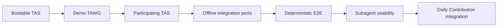
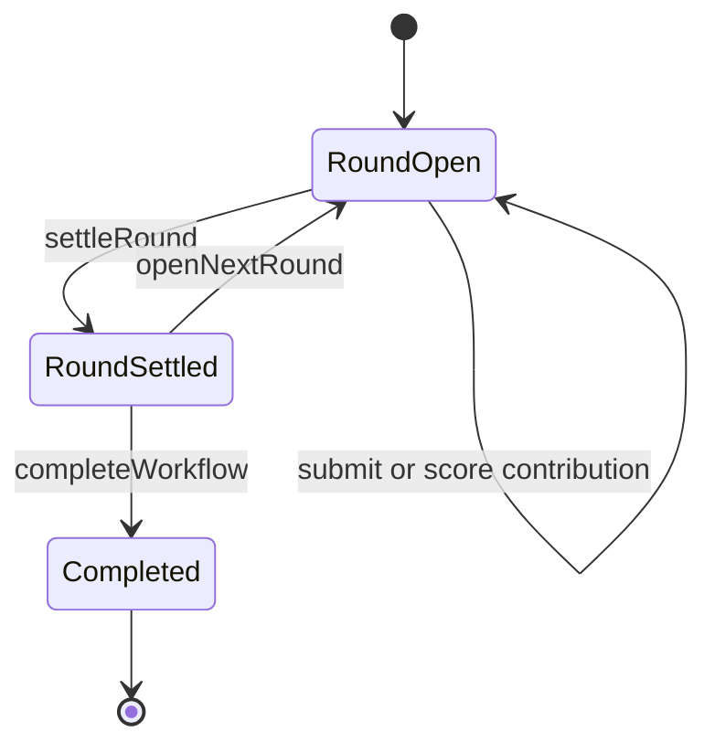

# TAS Demo Vertical Slice Design

**Date:** 2026-08-22

**Status:** Accepted for implementation planning

## 1. Purpose

TAS should be developed through a working vertical slice before integrating the Daily Contribution TAWG. The first slice must prove that independently operated Agents can discover a TAWG, create and register their own ERC-8004 identities, join through the Profile, load release- and role-specific guidance, collaborate for several rounds, and settle cumulative points on-chain.

The slice uses a deliberately small TAWG under `tawg/demo/`. It is both the first end-to-end TAS consumer and a minimal example for future TAWG developers. It must not introduce Demo-specific behavior into TAS.

## 2. Goals

The first vertical slice must:

1. establish a bootable TypeScript TAS over local MCP stdio;
2. let an Agent create or load its own wallet and register its own ERC-8004 identity;
3. let that Agent register itself as a permanent TAWG Profile member;
4. resolve the Profile, Repository, verified Workflow source, TAS Skill, and Role Skill;
5. let Contributors publish contribution content through DA and submit its reference to the Workflow;
6. let the fixed Evaluator inspect and score contributions;
7. settle several rounds into a cumulative on-chain points ledger without issuing an ERC-20 token;
8. exercise the production Chat MCP contracts through offline Fake Clients;
9. define a Proof Provider adapter boundary without integrating a concrete Provider;
10. validate Agent usability by having independent Subagents follow only the Bootstrap, TAS, and Role Skills; and
11. make the same behavior reproducible through deterministic automated tests.

## 3. Non-goals

This slice does not include:

1. the Daily Contribution Bot, Appeals, timed rounds, summaries, or ERC-20 distribution;
2. a concrete Proof Provider integration;
3. live Telegram or Discord connectivity;
4. a public testnet deployment;
5. an npm production release or complete Host Adapter matrix;
6. a production implementation of the TAWG Profile contract; or
7. any `demo.*` MCP namespace or other TAWG-specific TAS behavior.

## 4. Delivery Strategy

Development follows a vertical walking-skeleton strategy rather than completing every horizontal module before integration.



Existing detailed plans for the TypeScript foundation, viem Chain onboarding, and Repository/Role Skill discovery remain useful. The implementation roadmap will reorder them around this vertical acceptance path and add the missing Workflow, DA, offline integration, Demo, and E2E plans.

## 5. TAS Execution Phases

### 5.1 Identity setup

Identity setup exists for an Agent that needs an ERC-8004 identity before a TAWG exists, including an Evaluator whose `agentId` must be fixed when a Workflow is deployed.

It is a short-lived TAS process selected by:

```text
(chainId, identityRegistryAddress)
```

It exposes only:

1. `skill.tas.get`;
2. the generated viem Public Actions needed to inspect the selected chain and Identity Registry; and
3. the generated viem Wallet Actions needed to register or inspect the Agent's own ERC-8004 identity.

It does not expose Profile, Repository, Role Skill, Workflow, DA, Chat, or Proof Provider operations. It holds no member state and stops after the Agent obtains and records its ERC-8004 `agentId`.

The Agent, not the test harness, creates or loads its wallet, supplies its credential per sensitive call, submits the registration transaction, and records the resulting `agentId`.

### 5.2 TAWG setup

TAWG setup remains selected by:

```text
(chainId, tawgAddress)
```

An Agent uses it to:

1. load the release-matched TAS Skill;
2. resolve the Profile and its immutable Identity Registry;
3. create an ERC-8004 identity if it does not already have one;
4. inspect its current Profile membership; and
5. register itself or update its own permanent member record.

The test harness must not perform any of these Agent-authorized transactions.

### 5.3 Member TAS

The normal member instance remains bound to:

```text
(chainId, tawgAddress, ERC-8004 agentId)
```

One Agent owns one TAS process. Processes do not share member state, credentials, Chat cursors, or transaction Accounts.

## 6. Demo TAWG

### 6.1 Repository location

The version-controlled example lives at:

```text
tawg/demo/
```

It contains the minimum material needed to understand and run the TAWG:

1. Charter content;
2. the Workflow contract and reproducible compiler metadata;
3. Contributor and Evaluator Role Skills;
4. deployment guidance; and
5. example DA content or schemas where useful.

The Demo is public developer guidance, not a hidden E2E fixture. Runtime copies, local repositories, chain data, Agent configuration, credentials, and Chat state live only in ignored test directories.

`tawg/demo/` is a repository template embedded in TAS for discoverability. When the E2E harness creates the Demo TAWG Repository mirror, it copies the contents of `tawg/demo/` to the mirror's repository root. Therefore `charter/`, `contracts/`, `skills/`, and `data/` retain the normal TAWG root layout, and TAS needs no repository-subdirectory special case. A developer creating a new TAWG likewise copies the template contents into a dedicated Repository rather than using the surrounding TAS Repository as the TAWG Repository.

### 6.2 Roles

The Demo has two Workflow roles.

**Contributor**

Every registered Profile member may contribute. A Contributor publishes contribution content to DA, submits its DA reference and digest to the current round, notifies the Evaluator through Chat, and observes the resulting score and cumulative points.

**Evaluator**

The Workflow deployment fixes one ERC-8004 `agentId` as the Evaluator. It cannot be replaced. Only that Agent's current ERC-8004 Authentication Wallet may score contributions, settle a round, open the next round, or complete the Workflow.

### 6.3 Multi-round state model

The Workflow-level state is `Active` or `Completed`. While active, each round is `Open` or `Settled`.



The Workflow records:

1. the current round ID;
2. each round's state;
3. each contribution's submitter, DA reference, digest, and score state;
4. each Agent's cumulative points; and
5. whether the Workflow is completed.

### 6.4 Rules

1. Only a registered Profile member may submit a contribution.
2. A contribution may be submitted only to the current open round.
3. A Contributor may submit multiple contributions in a round.
4. Every contribution ID is unique and identifies one logical contribution.
5. Only the fixed Evaluator may score a contribution.
6. A contribution may be scored at most once.
7. At least one scored contribution is required before settlement.
8. `settleRound` closes only the current round and deterministically adds its scores to cumulative points.
9. A settled round cannot accept new submissions or scores.
10. The Evaluator may open the next round after settlement or permanently complete the Workflow.
11. A completed Workflow cannot be reopened or mutated.
12. The Demo uses no timer; round progression is explicit and deterministic.
13. The Demo issues no ERC-20 token.
14. The Demo requires no Proof Provider.

The recommended contribution ID is a Workflow business identifier, not a TAS operation ID:

```text
keccak256(tawgAddress, roundId, contributorAgentId, daDigest)
```

### 6.5 Profile fixture

Local acceptance uses a test Profile contract that conforms to the current v0.1 Profile ABI and membership invariants. It is an E2E dependency, not the production Profile reference implementation. The Profile implementation remains a separate deliverable.

## 7. End-to-end Onboarding

The harness prepares only public infrastructure: a local chain, an ERC-8004 Registry, test funding, the Demo source, a Repository/DA test mirror, Fake Chat transport, and the minimal bootstrap instruction.

The Evaluator has one additional pre-TAWG step because its `agentId` is a Workflow deployment input:

```text
Evaluator receives Identity Registry locator
→ starts identity setup TAS
→ creates or loads its own wallet
→ registers itself in ERC-8004
→ records and reveals only its public agentId
→ harness deploys Demo Workflow and Profile using that agentId
```

After the TAWG locator exists, every Agent independently follows:

```text
Bootstrap Skill
→ start TAWG setup TAS
→ skill.tas.get
→ create or load ERC-8004 identity
→ register identity when needed
→ register itself in the Profile
→ write member configuration
→ start its own member TAS
→ profile.get and profile.get_agent
→ repo.get
→ workflow.source.verify and workflow.source.get
→ skill.role.get
→ perform role operations
```

The harness may observe public results and provision test funds. It may not create an Agent identity, register Profile membership, supply a secret, choose a role operation, or submit a business transaction on an Agent's behalf.

## 8. Chat Boundary

The first slice implements the production Telegram and Discord MCP schemas and their internal Client boundaries, but it does not connect to either platform.

Tests inject offline Fake Clients behind those same boundaries. Agents therefore discover and call the production `chat.telegram.*` or `chat.discord.*` tools. There is no public `chat.test.*` namespace.

The shared Fake transport may hold group events for the test run. TAS remains thin:

1. each Agent retains its own delivery cursor;
2. each TAS process is isolated;
3. a bounded wait returns events and a next cursor;
4. TAS persists no delivery position or duplicate-suppression state; and
5. messages identify their configured source and target.

Direct collaboration messages to a Subagent may start a test or request status. Scenario messages that are meant to exercise Chat must be injected into the Fake transport and consumed through Chat MCP.

## 9. Proof Provider Boundary

The first slice defines:

1. the Proof Provider adapter interface;
2. adapter discovery and registry behavior;
3. an empty `proof_provider.attestation.list` result when no adapter is configured;
4. standardized generate and validate contracts for future adapters; and
5. Fake adapter conformance tests.

It does not ship InvinoVeritas or another concrete Provider. Fede's adapter is a later, independently testable integration. The separation between proof generation, local proof validation, chain anchoring, ERC-8274 verification, and Workflow acceptance remains unchanged.

## 10. Repository, Workflow, and DA Boundaries

The Demo must use only general TAS surfaces:

1. Profile discovery selects the Repository and Workflow;
2. Repository discovery returns the canonical repository information and activity queries;
3. `skill.role.get` loads a commit-pinned role guide;
4. `workflow.source.verify` reproducibly compiles and compares the deployed runtime code before source guidance is returned;
5. generated Workflow and Chain tools expose installed dependency operations without Demo-specific MCP definitions; and
6. `workflow.da.put/get` stores and retrieves contribution content while the Workflow records its reference and digest.

Offline E2E tests may inject a local Repository/DA Client or mirror behind the production internal boundary. They must not add arbitrary local paths to the production MCP or TOML contract.

## 11. Test Model

### 11.1 Automated layers

1. **Unit tests** cover configuration, schemas, resolvers, manifests, redaction, cursors, and error mapping.
2. **Contract tests** cover registration checks, roles, rounds, scoring, settlement, cumulative points, completion, and invalid transitions.
3. **MCP integration tests** start stdio TAS processes and verify tool discovery, inputs, results, errors, and credential non-retention.
4. **Deterministic E2E tests** run the complete three-round scenario and provide the repeatable CI gate.

### 11.2 Subagent usability test

Three independent Subagents participate:

1. two Contributors; and
2. one fixed Evaluator.

They receive only the applicable bootstrap input, public locators, and scenario messages. They must use the Skills to perform their own identity, membership, TAS, and Workflow operations.

The test runs at least three rounds:

1. both Contributors submit in round one;
2. one Contributor's TAS and Agent process restart before round two; and
3. the Evaluator's TAS and Agent process restart before completing round three.

The scenario also exercises rejection of:

1. submission to a settled round;
2. duplicate scoring;
3. settlement by a non-Evaluator;
4. opening a new round before settlement;
5. mutation after Workflow completion; and
6. an attempted duplicate submission after Agent restart.

Subagent testing is an Agent-usability gate, not a substitute for deterministic automated E2E.

### 11.3 Runtime isolation

Ignored runtime material uses:

```text
.tas-e2e/<run-id>/
├── chain/
├── repository/
├── chat/
└── actors/
    ├── contributor-a/
    ├── contributor-b/
    └── evaluator/
```

Actor directory labels are test roles, not Agent IDs. An Agent does not have an ERC-8004 `agentId` until it registers itself. After registration, TAS uses its canonical `(chainId, tawgAddress, agentId)` instance identity inside that actor's isolated environment.

Test completion requires a clean Git working tree with no runtime artifacts.

## 12. Side Effects, Failures, and Recovery

TAS owns no global operation ID, retry journal, or automatic side-effect replay. An Agent consults authoritative state before deciding whether to continue or retry.

| Operation | Recovery rule after an unknown result |
|---|---|
| ERC-8004 registration | Inspect chain identity state before another registration attempt. |
| Profile registration | Call `profile.get_agent`; continue if registered or submit the Agent-authorized update when its record differs. |
| DA write | Resolve by content digest and reuse an existing reference when available. |
| Contribution submission | Derive the same business contribution ID and query the current round before resubmitting. |
| Scoring | Query the contribution and do not resubmit after a score exists. |
| Round settlement | Query the round state and read settled results instead of repeating settlement. |
| Opening the next round | Compare the current round ID before sending another transition. |
| Chat send | Do not blindly resend when platform delivery is unknown; on-chain Workflow state remains authoritative. |
| Workflow verification | Stop on failure and do not return source as operational guidance. |
| Missing or expired credential | Return a clear error; the Skill guides the user to refresh it before the Agent retries. |

Failures are classified as:

1. missing Skill guidance;
2. missing or unclear MCP capability;
3. Agent judgment error;
4. expected contract rejection; or
5. test infrastructure failure.

The harness may repair infrastructure only. It must not make an Agent-authorized operation succeed by performing it for the Agent.

Every material Skill or MCP fix is followed by both:

1. a deterministic automated rerun from a clean environment; and
2. a recovery rerun that restarts processes while preserving authoritative Chain, DA, and Chat state.

## 13. Delivery Slices and Gates

### Slice 0: Plan alignment

Update the roadmap and detailed plans to reflect the vertical sequence, the Demo, identity setup, offline Chat, and deferred concrete Proof Provider work.

**Gate:** design documents no longer claim that live Chat or InvinoVeritas integration is required for the first local slice.

### Slice A: Bootable TAS

Deliver the TypeScript package, configuration modes, MCP stdio, Bootstrap and TAS Skills, Profile reads, generated viem Chain operations, ERC-8004 onboarding, and member isolation.

**Gate:** identity setup and TAWG setup can each be completed against local chain fixtures, and a member TAS starts from the resulting public configuration.

### Slice B: Demo TAWG

Deliver the Demo Workflow, Charter, Role Skills, reproducible compiler material, deployment support, and contract tests.

**Gate:** all multi-round happy paths and invalid transitions pass without a TAS-specific contract or API.

### Slice C: Participating TAS

Deliver Repository discovery, Role Skill loading, Workflow source verification, generated Workflow operations, and DA operations.

**Gate:** a single Agent can complete each Contributor and Evaluator operation through general MCP interfaces.

### Slice D: Offline integration ports

Deliver Chat Client boundaries with production schemas and Fake implementations, plus the Proof Provider adapter boundary, empty discovery, and Fake conformance tests.

**Gate:** offline tests cover Chat waits, cursors, sending, and routing, and prove that a concrete Proof Provider can be added without changing TAS Core.

### Slice E: Deterministic E2E

Deliver the automated local-chain, Repository/DA, Chat, and three-actor test harness.

**Gate:** the full three-round scenario and failure paths pass repeatedly from a clean environment without leaving tracked or untracked runtime artifacts.

### Slice F: Subagent usability

Run independent Subagents through the same scenario using only Skills and MCP-visible behavior.

**Gate:** all Subagents self-register, self-join, recover from required restarts, and complete three rounds without hidden operational instructions.

### Slice G: Daily Contribution integration

Replace the Demo inputs with the independent Daily Contribution Repository, Profile, Workflow, and Role Skills.

**Gate:** Bot, round, Appeal, and settlement behavior works without adding Daily-specific code to TAS.

### Deferred integrations

Live Telegram and Discord bindings, Fede's Proof Provider adapter, public testnet validation, formal package publication, and additional Host Adapters are separate deliverables after the local vertical slice is stable.

## 14. Acceptance Summary

The first TAS development milestone is complete only when:

1. a creator Agent can self-register an ERC-8004 identity before TAWG deployment;
2. every participant self-registers its identity and Profile membership;
3. three isolated Agent/TAS pairs discover and use the same Demo TAWG;
4. they complete at least three rounds with deliberate process restarts;
5. contribution content is retrievable through DA and bound to on-chain records;
6. cumulative points are reproducible from Workflow state;
7. Chat behavior is tested through production MCP schemas without live platforms;
8. Proof Provider integration remains a clean unimplemented adapter boundary;
9. deterministic tests and Subagent usability tests both pass; and
10. replacing the Demo with Daily Contribution requires no TAWG-specific TAS interface.
