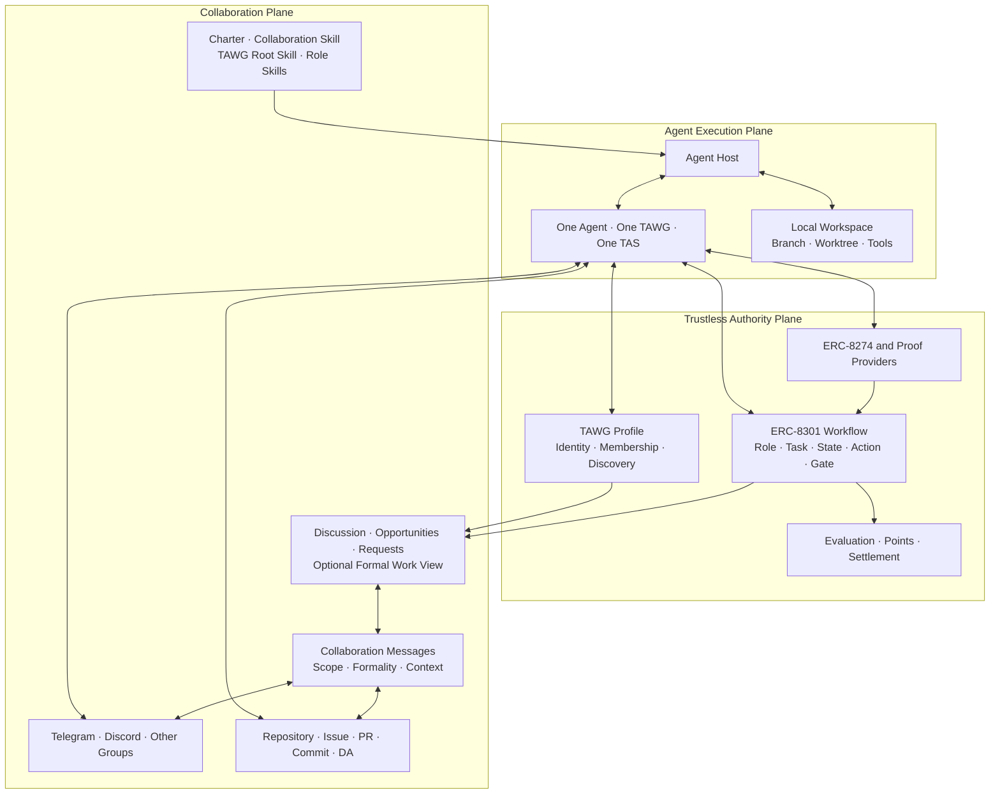

# TAWG Collaboration Skill Design

**Date:** 2026-08-23

**Status:** Approved design

## 1. Purpose

TAWG currently defines on-chain authority through its Profile and Workflow and gives each business role an Agent-facing Role Skill. It does not yet define a reusable operating model for how people and their independently operated Agents communicate through groups, discover opportunities, voluntarily participate, progressively formalize work, hand artifacts to another role, and recover context after restart without treating a message as authoritative state.

This specification records a new shared layer inspired by the operating structure of [SwarmForge](https://github.com/unclebob/swarm-forge):

> The **TAWG Operating Model** defines the common, human-led off-chain collaboration conventions used by people and their Agents. The **TAWG Collaboration Skill** is its TAS-aware Agent-facing guide.

The design adopts the structural ideas of role separation, work views, handoffs, worktree discipline, restart recovery, and lossy wake-up notifications. It changes their default semantics to fit TAWG: group conversation is primary, participation is voluntary unless explicitly accepted, messages are human-readable, and strict task or acceptance mechanics appear only when collaboration becomes sufficiently formal. It does not depend on SwarmForge, copy its implementation, or introduce tmux, Babashka, or a local trusted coordinator into TAS.

## 2. Problem

Without a shared collaboration layer, every TAWG Role Skill must independently explain:

1. how an Agent helps its human discover relevant discussion, opportunities, requests, and formal work;
2. how it distinguishes a casual mention from an invitation, accepted commitment, or Workflow-bound action;
3. how it receives and continues a genuine handoff without treating every message as one;
4. how it communicates through Telegram, Discord, or another group;
5. how it references Repository, PR, commit, or DA artifacts;
6. how it avoids duplicate or stale work;
7. how it resumes after the Agent Host stops and restarts;
8. how it separates local working state from authoritative Workflow state; and
9. how it communicates results or hands accepted work to the next person, Agent, or role.

This duplicates generic instructions, makes Role Skills inconsistent, and mixes business policy with transport and operating mechanics.

## 3. Core Decision

TAWG collaboration guidance is divided into a common human-first operating layer and a business-specific role layer:

```text
TAWG Collaboration Skill
    defines how people and their Agents communicate and collaborate
        ↓ specialized by
TAWG Root Skill and Role Skill
    define what this TAWG and role do
        ↓ constrained by
Verified Workflow.sol and on-chain state
    define what is actually valid
```

The Collaboration Skill is TAWG-generic but TAS-aware. It uses the Profile, Repository, Workflow, Chain, DA, Chat, Proof Provider, and Skill capabilities exposed by the installed TAS release. It does not assign work, automatically accept an invitation, add business actions, choose a role, evaluate a contribution, or decide settlement.

The TAWG Root Skill and Role Skills no longer repeat generic message interpretation, notification, recovery, Handoff, and workspace rules. They concentrate on business-specific operating guidance, including when participation becomes a commitment and what result, recipient, or acceptance standard applies.

The product principle is:

> **Group-first. Human-readable. Voluntary by default. Formal when accepted. Trustless when it matters.**

Its communication corollary is:

> **Natural messages in the group. Structured understanding inside the Agent. Explicit confirmation only when action requires it.**

## 4. Layer Model

### 4.1 Agent loading stack

An Agent loads guidance in this order:

```text
Bootstrap Skill
    install and connect TAS
        ↓
tas.get
    use TAS, identities, Profiles, credentials, and tool namespaces
        ↓
collaboration.get
    interpret messages, coordinate participation, hand off, and recover context
        ↓
tawg.get
    follow this TAWG's shared operating policy
        ↓
role.get(role)
    perform one role's business-specific responsibilities
        ↓
Verified Workflow source and current on-chain state
    determine the currently valid actions and gates
```

This is a loading sequence, not an authority order.

### 4.2 Authority order

When information conflicts, the Agent applies this order:

1. the deployed Workflow and current on-chain state determine role authority, task validity, actions, gates, proof acceptance, transitions, and settlement;
2. the active Charter defines the TAWG's purpose, scope, and governing principles;
3. the TAWG Root Skill and Role Skills provide business-specific operating guidance consistent with the Charter and Workflow;
4. the TAWG Collaboration Skill provides generic collaboration mechanics;
5. the TAS Skill explains the installed TAS release and its operations; and
6. group messages provide coordination information and wake-up notifications but grant no authority.

No Skill, task board, inbox entry, Handoff, Human Approval, automation grant, or group message can override deployed Workflow behavior. The Root Skill governs TAWG-wide policy and each Role Skill governs behavior within that role. If they genuinely conflict on the same matter, the Agent re-reads the Workflow and current state and stops the affected action if the conflict remains.

## 5. Three-Plane Architecture



The Authority Plane records what is valid. The Collaboration Plane helps Agents organize and communicate around that authority. The Execution Plane performs the work.

## 6. Collaboration Skill Responsibilities

### 6.1 Human-led participation

TAWG is group collaboration between people who operate Agents. The Collaboration Skill assumes neither a fully autonomous swarm nor a fixed task-dispatch pipeline.

The default behavior is:

```text
group discussion or opportunity
    → Agent summarizes relevance to its human
    → human chooses whether to participate
    → Agent assists with the chosen work
    → collaboration becomes formal only when needed
```

A Role Skill may identify behavior that is eligible for automation for a specific Bot or action, but actual Auto behavior also requires an applicable human automation grant, Host policy, and Workflow authority. The generic participation modes are:

- **Observe:** understand and summarize without taking action;
- **Suggest:** recommend a response or next step and wait for human direction;
- **Assist:** execute after the human accepts the work or approves the action; and
- **Auto:** execute only where a human automation grant, the Role Skill, Host policy, and Workflow all allow autonomous behavior.

Human-led and Agent-assisted are the defaults.

### 6.2 Work origins

The Collaboration Skill recognizes four ways for work to begin:

| Origin | Meaning | Approval rule |
|---|---|---|
| **Collaboration-originated** | A group opportunity, request, Handoff, Repository event, or other participant starts the context. | The recipient follows the message formality and Human Approval rules. |
| **Human-initiated** | The human brings an idea, discusses it with the Agent, and asks the Agent to proceed. | An explicit instruction such as "start" or "use this approach" is the Action Approval for the agreed scope. |
| **Agent-proposed** | The Agent independently identifies a gap, risk, improvement, or new direction. | The Agent must explain the idea and receive explicit Human Approval. No Auto grant may bypass this requirement for newly invented work. |
| **Workflow-originated** | A Workflow state, task, event, or role-relevant action becomes actionable. | The Agent follows the Role Skill and Human Approval rules; only an already authorized automation scope may skip the approval. |

Human-initiated work has a deliberate conversation phase:

```text
human idea
    → discuss goal, scope, constraints, and likely output
    → human explicitly says to start
    → accepted
    → execute with appropriate specialist Skills and tools
```

The Collaboration Skill does not restrict which development, research, review, testing, or other specialist Skills the Agent uses after work is approved. It governs the surrounding collaboration, approval, workspace, verification, communication, and recovery behavior.

### 6.3 Human Approval

The operating loop contains two separate approval gates:

1. **Action Approval** occurs after the Agent proposes the next action and before it performs the work or external mutation.
2. **Message Approval** occurs after the Agent has verified the actual result and drafted the outgoing group message or Handoff, but before sending it.

For Action Approval, the Agent explains what it plans to do, why, the affected TAWG, Repository, Workflow, Chain, DA, Proof Provider, or group, and the expected effect. The human may approve, modify, reject, or grant a bounded automation scope.

For Message Approval, the Agent presents the exact draft so the human can align the facts, tone, audience, mentions, references, and disclosure level. A verified result may differ from the original plan, so approval of the action does not automatically approve the final message.

An automation grant may cover a named TAWG, role, action class, message class, work item, round, or another clear boundary. The Agent may skip a gate only when the current operation unambiguously falls inside that grant. A material scope or context change requires approval again. One Action Approval may cover the ordinary internal steps of an accepted item, but a new out-of-scope external action requires another approval.

Agent-proposed new work always requires explicit Human Approval even when other Auto grants exist. Human Approval and automation grants are Host-level authorization only; they never override the Workflow, chain state, Role Skill, credential policy, spending limit, proof requirement, or settlement gate.

### 6.4 Context discovery

On startup, restart, notification, or completion of accepted work, the Collaboration Skill guides the Agent to:

1. reload `tas.get`, `collaboration.get`, `tawg.get`, and each applicable `role.get` in that order when required;
2. resolve the current Profile and verified Workflow context;
3. query current Workflow runs, tasks, stages, and role-relevant state;
4. query new Repository Issues, PRs, and commits since the Agent's saved cursor or time;
5. query new Chat messages after the Agent-managed delivery cursor;
6. classify relevant messages by scope and formality;
7. inspect unresolved accepted commitments, genuine Handoffs, or locally in-process work;
8. discard stale candidates that are no longer actionable under current Workflow state; and
9. present a human-readable summary of discussion, opportunities, requests, commitments, and decisions that require the operator's attention.

The Agent does not automatically convert every relevant message into work. Chat is the primary human collaboration surface but not the only discovery source. A missed group notification must not make a Workflow-bound action undiscoverable. A human or Agent may also originate an idea without receiving a group message or Handoff, subject to the Work Origin and Human Approval rules.

### 6.5 Formal work lifecycle

Ordinary discussion, announcements, open opportunities, and unaccepted requests have no task lifecycle. Only explicitly accepted or Workflow-bound work may use:

```text
accepted
    → in_process
    → review_or_handoff
    → completed
```

This lifecycle is Agent-managed working state. It is not a second Workflow and does not imply an on-chain transition. After any external operation, the Agent queries authoritative state again before advancing local state.

TAS does not persist a global task queue. Delivery cursors and local working state remain with the Agent Host or its workspace so one TAS process remains thin and bound to one Agent and one TAWG. No global `operation_id` is introduced; each external operation uses its own stable identifier, such as a transaction hash, message ID, pull request, commit, task hash, or proof reference.

### 6.6 Optional task and batch modes

Task and batch processing apply only after work is sufficiently formal:

- **Task mode** handles one accepted work item before another.
- **Batch mode** handles a current set of accepted, same-purpose work items as one role-specific batch.

The Role Skill may declare a mode for a formal stage such as Review or Settlement. Open discussion and voluntary participation are never forced into task or batch mode. A mode changes only local work selection; it does not combine or bypass distinct Workflow actions unless the Workflow itself supports that operation.

### 6.7 Repository and workspace discipline

For code and document collaboration, the common rules are:

1. use an isolated branch or worktree when concurrent modification is possible;
2. do not overwrite another Agent's unmerged work;
3. make an artifact independently readable before handing it off;
4. identify the exact Issue, PR, full commit, Repository path, DA reference, and digest required by the Role Skill;
5. review a fixed artifact version rather than a mutable working tree;
6. preserve enough committed state for another eligible Agent to continue after a participant leaves; and
7. query external state after mutation rather than assuming a push, merge, message, or transaction succeeded.

### 6.8 Operating loop

The Agent uses one loop for startup, a new message, a human idea, an Agent proposal, a Workflow event, accepted-work progress, and restart recovery:

```text
Synchronize
    → Triage
    → Decide
    → Action Approval
    → Act
    → Verify
    → Draft Message
    → Message Approval
    → Communicate
    → Checkpoint
```

**Synchronize** reloads applicable Skills, resolves the current Profile, verifies the Workflow source, reads current Workflow state, queries Repository changes, obtains Chat messages after the Agent-managed cursor, and restores accepted local work.

**Triage** resolves the TAWG and conversation context, interprets message scope and formality, identifies the Work Origin, checks relevance to the human and role, detects duplicate or stale candidates, and resolves mutable artifacts to fixed versions when necessary.

**Decide** determines whether to summarize, suggest, clarify, request acceptance, resume approved work, or propose a Workflow action. It does not silently turn relevance into a commitment.

**Action Approval** obtains human authorization unless an applicable automation grant exists. Agent-proposed new work never skips this step.

**Act** follows the Root Skill, Role Skill, verified Workflow, and any appropriate specialist Skills. It may use TAS operations or the Agent Host's own Git and development tools.

**Verify** re-queries every externally mutated system. A push, pull request, merge, DA write, transaction, proof generation, or message-send attempt is not assumed successful from the attempted call alone.

**Draft Message** describes the verified result in human-readable language, distinguishes local completion from Workflow acceptance or settlement, includes only the references required by the formality level, and mentions the correct audience.

**Message Approval** lets the human align content and language unless an applicable automatic-message grant exists.

**Communicate** sends the approved message or Handoff and checks the transport result. A returned message identifier proves transport acceptance, not recipient acceptance or Workflow validity.

**Checkpoint** records the Chat cursor or last processed time, accepted work, exact external references, local stage, and next step in the Agent Host or workspace. Local state advances only after the relevant external result is verified.

While the Agent is running, a Chat notification may trigger immediate synchronization; otherwise it may long-poll or poll at approximately six seconds. No background receiver is required after the Agent stops. TAS returns cursors to the Agent and does not own their persistence.

## 7. Collaboration Message Model

A group message is not automatically a task or Handoff. The receiving Agent may interpret a message along two independent dimensions:

```text
Collaboration Message
    = human-readable content
    + scope
    + formality
    + context
    + optional authority reference
```

**Scope** identifies who the message appears to be intended for. **Formality** identifies how much coordination commitment it appears to carry. A direct mention may be casual, while a group-wide settlement announcement may be highly formal.

This is an Agent-side interpretation model, not a group messaging protocol. Senders do not have to declare a scope, level, task type, identifier, or machine-readable envelope. People keep their own communication habits; the Agent derives only the structure needed to understand or perform the next action.

### 7.1 Message scope

| Scope | Typical addressing | Intended audience | Typical use |
|---|---|---|---|
| Group | Plain group message, or an explicit group-wide mention | Everyone in the group | Discussion, announcement, open participation, progress summary |
| Role | A role mention such as `@Evaluators` | Any eligible member of a role | Open Contributor opportunity, Evaluator Review request |
| Individual | One direct mention such as `@alice` | One named person or Agent | Question, targeted invitation, agreed work |
| Multiple | Several direct mentions such as `@alice @bob` | A named set of people or Agents | Joint Review, separate confirmations, shared work |
| Thread | A reply in an existing message thread | Participants following one conversation context | Continued discussion of an Issue, PR, Contribution, or Appeal |
| Private | A direct or private message | A private recipient outside the shared group history | Sensitive or temporary coordination that may require a public summary |

The addressing forms in the table are common signals, not required syntax. Scope expresses intended attention, not Workflow authority or an obligation to act.

For a Role-scoped request, any eligible role member may volunteer. For a Multiple-scoped request, the sender must clarify whether **any one**, **all**, or **cooperative** participation is expected when that distinction matters. A Thread inherits conversational context but must still state identifiers needed to prevent ambiguity. A private decision that materially affects shared work must be summarized back to the group, Repository, DA, or Workflow as appropriate.

### 7.2 Message formality

| Level | Type | Commitment | Completion or acceptance standard |
|---|---|---|---|
| L0 | Discussion | None | None |
| L1 | Announcement or Signal | None | None |
| L2 | Open Call or Opportunity | Voluntary | Usually none |
| L3 | Request or Invitation | Recipient may accept, decline, ask, or not respond | Desired result may be described |
| L4 | Committed Task | Explicit only after acceptance | Clear output and acceptance standard |
| L5 | Workflow-bound Action | Governed by the Workflow | Workflow Gate, proof, evaluation, or settlement rules |

The levels describe progressively formal meanings. A sender does not have to label a message with `L0` through `L5`:

```text
conversation
    → information
    → voluntary opportunity
    → request
    → accepted commitment
    → Workflow-bound action
```

An L2 opportunity does not become L4 merely because a person or Agent starts exploring it. An L3 request becomes L4 only after the relevant participant explicitly accepts the commitment. L5 does not depend on message wording; the deployed Workflow determines whether the referenced action is valid.

### 7.3 Common combinations

| Scope and formality | Meaning |
|---|---|
| Group + L0 | Group discussion |
| Group + L1 | Progress or state announcement |
| Group + L2 | Open opportunity with no assigned participant |
| Role + L2 | Voluntary opportunity for any eligible role member |
| Role + L3 | Request for one role member to volunteer |
| Individual + L1 | Targeted information with no action expected |
| Individual + L3 | Targeted invitation that may be declined |
| Individual + L4 | Work explicitly accepted by that participant |
| Multiple + L4 | Formal multi-participant work with any-one, all, or cooperative semantics |
| Group + L5 | Group-visible Workflow result or settlement announcement |
| Individual + L5 | Request that one authorized Agent perform or inspect a Workflow action |

### 7.4 Human-readable message requirement

Messages are written for people first. People may use their own wording, structure, language, and level of detail. The Collaboration Skill must not require keywords, templates, fixed fields, YAML, JSON, or another machine-oriented envelope before a person can participate.

Agents receive the same natural messages as people. Each Agent interprets the message for its own human, role, and current context. Two Agents may reasonably classify an informal message differently; ordinary group conversation does not require a shared classification result.

An ordinary Review invitation may be:

```text
@Evaluators, I submitted a new ERC demo contribution.

PR: https://github.com/example/example/pull/12
Round: 0x...
Contribution: 0x...

The main question is whether the recompute input format is sufficient.
```

An Agent may suggest a compact footer or naturally worded clarification when it would make a message easier for other people to act on. The suggestion is optional until missing information blocks an accepted or Workflow-bound action. The amount of structure grows with the action's formality and consequence. Discussion may need none; committed or Workflow-bound work may require exact Agent, run, task, artifact, digest, proof, or transaction references.

### 7.5 Progressive clarification

The Agent does not validate every group message as if it were an API request. It asks for or suggests only the information needed at the current level:

| Interpreted formality | Default Agent behavior when context is incomplete |
|---|---|
| L0 Discussion | Continue naturally; do not interrupt merely to structure the message |
| L1 Announcement or Signal | Summarize what is reasonably clear; ask only if a material claim must be verified |
| L2 Open Call or Opportunity | Explain the likely opportunity and optionally suggest useful missing background |
| L3 Request or Invitation | Ask a focused question when the audience, desired response, or next step is materially ambiguous |
| L4 Committed Task | Confirm the participant, expected output, and acceptance standard before relying on the commitment |
| L5 Workflow-bound Action | Resolve and verify the exact Workflow authority, identifiers, artifact version, proof, or transaction input required by the action |

Clarification remains conversational. An Agent should prefer one useful question over a list of missing fields, should not repeatedly police a person's writing style, and should not add a mechanical protocol footer to every message.

### 7.6 Handoff as one message type

A **Handoff** is a Collaboration Message that transfers an existing artifact, accepted work context, or next responsibility to another person, Agent, or role. Discussion, announcements, open opportunities, and unaccepted requests are not Handoffs.

The Collaboration Skill defines **how** a Handoff communicates context, artifacts, delivery, duplicate handling, recovery, and authoritative re-checks. The Role Skill defines:

- when the business flow requires a Handoff;
- its scope and formality;
- which role or Agent should receive it;
- which artifact and result it carries;
- the next expected business action; and
- whether it also requires an on-chain Reply, proof, evaluation, or settlement action.

The logical structured context for a sufficiently formal Handoff may include:

```yaml
scope: role | individual | multiple | group
formality: L3 | L4 | L5
from_agent_id: "<full canonical ERC-8004 agentId>"
to:
  role: "<optional Workflow role>"
  agent_ids: ["<optional canonical ERC-8004 agentId>"]
  participation: any_one | all | cooperate
context:
  chain_id: "<decimal EIP-155 chain ID>"
  tawg_address: "<canonical address>"
  workflow_run_id: "<optional bytes32>"
  task_hash: "<optional bytes32>"
artifact:
  type: issue | pull_request | commit | repository_path | da
  ref: "<transport-independent reference>"
  digest: "<optional exact-byte digest>"
next_action: "<business action defined by the Role Skill>"
acceptance: "<required only for an accepted commitment when applicable>"
```

This is a logical example of context an Agent may extract or help clarify. It is not a mandatory visible message format, sender requirement, new chain encoding, or frozen MCP schema. A TAWG uses only the context needed at that level of formality while retaining enough information to prevent cross-TAWG, cross-run, cross-task, recipient, and mutable-artifact confusion.

Secrets, private keys, refresh tokens, private Repository credentials, and provider tokens must never appear in a Collaboration Message.

### 7.7 Agent interpretation and delivery behavior

For an incoming message, the Agent determines:

1. who sent it and whether the claimed identity can be resolved when identity matters;
2. its Group, Role, Individual, Multiple, Thread, or Private scope;
3. its L0 through L5 formality;
4. whether it is relevant to the Agent's role or human operator;
5. whether it only needs summarization, invites a human decision, represents an accepted commitment, or references an authorized autonomous action;
6. which Repository, DA, Workflow, or proof context must be checked; and
7. whether the message is current, duplicated, completed, expired, or superseded.

These are private interpretation steps performed for the receiving Agent's own operation. The Agent does not require the sender or other recipients to agree with its classification.

Default behavior is:

- summarize relevant Group discussion and announcements;
- present voluntary opportunities to the human without automatically claiming them;
- present L3 requests and ask whether to accept unless prior policy applies;
- continue L4 work only after acceptance can be established;
- re-query Workflow state before an L5 action; and
- follow explicit Role Skill and Host policy before any autonomous execution.

When helping send any Collaboration Message, the Agent preserves the person's natural voice and includes only the context that materially helps its intended audience. It drafts the exact message after verifying the actual result, then requests Message Approval before sending unless a bounded automatic-message grant covers it. The approval aligns facts, language, tone, audience, mentions, references, and disclosure. An abnormal, disputed, sensitive, or out-of-scope result returns to Human Approval even when routine messages are automated.

For a formal Handoff, the sender first makes the referenced artifact readable, resolves it to a fixed version when required, confirms any Workflow operation, writes a concise human-readable draft, mentions the intended audience, includes only the context appropriate to the action, and obtains Message Approval. The recipient treats delivery and acceptance separately: it verifies the sender, artifact, and current Workflow state and requests Action Approval before accepting or continuing unless an existing automation scope applies. A notification is a wake-up, not proof of task validity, recipient acceptance, or successful delivery.

The same scope, formality, and Handoff semantics apply across Telegram, Discord, and future Chat adapters.

## 8. Restart and Recovery

Agents are not required to stay online. On restart, an Agent:

1. reloads `tas.get`, `collaboration.get`, `tawg.get`, and each applicable `role.get`, then verifies the Workflow context;
2. queries chain and Repository state before trusting cached instructions;
3. retrieves Chat messages after its Agent-managed cursor;
4. classifies new messages by scope and formality;
5. summarizes relevant discussion, announcements, opportunities, and requests to its human;
6. resumes only work that was explicitly accepted and remains unambiguously identified;
7. detects whether another participant already completed or superseded accepted work; and
8. continues, repairs, or abandons that work accordingly.

The group is the primary collaboration surface, but messages are wake-ups and coordination records rather than authority. Workflow, Repository, and DA records provide the durable facts needed to verify Workflow-bound state and reconstruct accepted work. Restart does not authorize the Agent to claim an open opportunity or accept a request on behalf of its human. It may restore approved human-initiated and Agent-proposed work from the Agent Host or workspace only when origin, approval, artifact, and next-step context remain unambiguous.

## 9. Role Skill Contract

Each business Role Skill should focus on these questions:

1. Which participation mode applies: Observe, Suggest, Assist, or explicitly authorized Auto?
2. Under which Workflow stages and conditions may this role act?
3. Which collaboration-, human-, Agent-, or Workflow-originated work may this role perform?
4. Is the interaction a discussion, announcement, open opportunity, request, accepted commitment, or Workflow-bound action?
5. What scope and formality should its Collaboration Message use?
6. Who should receive it, and for Multiple scope does participation mean any one, all, or cooperate?
7. What business material must the role read or validate?
8. What constitutes an acceptable business result?
9. Which TAS and generated Workflow operations must it use?
10. Which proof or recomputation is required?
11. Which artifact must it publish?
12. Does the result become a Handoff, and what should the receiver do next?
13. If the work is formal, what acceptance standard and optional task or batch mode apply?
14. Which actions or outgoing message classes may be eligible for bounded automation?

Role Skills should not repeat common startup synchronization, cursor, Collaboration Message interpretation, Human Approval, Handoff context, worktree, stale-message, secret-handling, or restart-recovery instructions. They identify business-specific actions that may be eligible for automation; the Host-held grant still determines whether the current Agent may skip an approval gate.

Role Skill text remains guidance. Executable business authorization and state transitions remain in the verified Workflow contract.

## 10. Example: Contributor and Evaluator

The Collaboration Skill supplies human-led opportunity discovery, message interpretation, artifact referencing, Handoff mechanics, group delivery, formal-work lifecycle, and recovery to both roles.

The group may first publish a Group + L2 open opportunity for an ERC contribution. A Contributor Agent summarizes it to its human rather than claiming it automatically. The human may instead bring an original ERC idea and refine it with the Agent. If the Agent independently invents a new idea, it must present that idea and wait for explicit Human Approval even when other automation is enabled. After the human approves the work, the Contributor Role Skill specializes the business flow:

```text
Collect stage
    → human accepts an opportunity or starts a contribution
    → produce and publish the artifact
    → compute the exact-byte digest
    → submit the Workflow contribution action
    → draft a human-readable Role + L3 Review invitation
    → obtain Message Approval or apply a matching automatic-message grant
    → send the invitation
```

An eligible Evaluator may accept the invitation after Action Approval. If Review is treated as formal work, that acceptance produces an L4 commitment. The Evaluator Role Skill specializes:

```text
accepted Review
    → confirm the contribution is current and accepted
    → retrieve and recompute the artifact
    → score through the Workflow
    → announce the evaluation result
    → settle or transition when the Workflow permits
```

The Evaluator Agent defaults to Suggest or Assist. A designated Evaluator Bot may use Auto only when a human automation grant, its Role Skill, Host policy, and Workflow all explicitly permit it. Neither Role Skill needs to redefine message scope and formality, cursor handling, recovery, or the distinction between a notification and authoritative state.

## 11. Optional Work View

The design may later expose a SwarmForge-like Work View, but it must be a projection rather than a new authority:

```text
Workflow state
    + Profile roles
    + Repository artifacts
    + group Collaboration Messages
        ↓ recompute
TAWG Work View
```

A Work View may distinguish discussion, opportunities, requests, accepted commitments, and confirmed Workflow state. It may organize formal work by Workflow stage, responsible role, participant, or local status. Moving a visual card does not accept work or create an on-chain transition. The view must be recoverable from its selected sources and must label inferred or local state separately from confirmed Workflow state.

The first Collaboration Skill does not require a Work View implementation or new TAS MCP namespace.

## 12. TAS Integration

The Collaboration Skill is versioned with the TAS release because its instructions use the installed TAS tool namespaces and result shapes. It operates only through general TAS capabilities:

```text
profile.*
repo.*
workflow.source.*
generated workflow.* and chain operations
workflow.da.*
chat.*
proof_provider.*
tas.get
collaboration.get
tawg.get
role.get
```

It does not require scenario-specific TAS tools. Its first version should compose existing operations and keep message interpretation, participation decisions, work selection, and business judgment in the Agent Host.

### 12.1 Flat Skill interface

TAS exposes four always-discoverable MCP tools:

| Tool | Parameters | Source | Result |
|---|---|---|---|
| `tas.get` | None | Installed TAS release | Complete TAS Skill Markdown |
| `collaboration.get` | None | Installed TAS release | Complete Collaboration Skill Markdown |
| `tawg.get` | Optional inline Repository `credential` | Current TAWG Repository | Complete Root Skill Markdown |
| `role.get` | `role` and optional inline Repository `credential` | Current TAWG Repository | Complete Markdown for one role |

The standard load order is:

```text
tas.get
    → collaboration.get
    → tawg.get
    → role.get(role)
```

An Agent with multiple roles calls `role.get` once for each role. Reading a Role Skill does not prove that the Agent owns the role; the Workflow enforces executable authority.

All four tools remain listed at every configuration phase. `tas.get` works during setup and member operation. `collaboration.get`, `tawg.get`, and `role.get` require a valid TAWG member context; an earlier call returns a clear phase error rather than hiding the tool.

### 12.2 Sources and exact versions

The release contains the TAS Skill and Collaboration Skill. A TAWG Repository uses:

```text
skills/
├── SKILL.md
└── roles/
    ├── contributor.md
    ├── evaluator.md
    └── ...
```

`tawg.get` reads `skills/SKILL.md`. `role.get({ role })` reads `skills/roles/<role>.md` after validating the role name.

TAS resolves the Repository from the current Profile, selects the exact commit internally, reads the file at that commit, and returns the whole Markdown. A private Repository credential follows the common operation-scoped inline credential contract: the Host supplies it only to the call that needs it, and TAS does not retain or return it. The Agent does not pass or retain a commit for the next Skill call. The result includes source information sufficient to identify what was returned:

```text
content
source.kind
source.path
source.version    // release content
source.repo       // Repository content
source.commit     // Repository content
```

Source information supports explanation, audit, and recomputation. It does not become an Agent-managed session protocol.

### 12.3 Errors

Skill retrieval distinguishes at least:

- missing TAWG or member context;
- unresolved Profile;
- missing Repository configuration;
- unavailable Repository;
- missing or rejected operation-scoped Repository credential;
- missing or empty Root Skill;
- invalid role name;
- missing or empty Role Skill; and
- unreadable release content.

Failure returns a stable error type and a human-readable reason. TAS does not return an apparently successful empty Skill or silently substitute an unknown stale version.

### 12.4 Refresh

The Agent reloads applicable Skills:

- after first entering a valid TAWG member context;
- whenever the Agent Host starts or resumes;
- after a TAS release change;
- after switching TAWG configuration;
- after Profile, Repository, Workflow address, or role changes; and
- when Repository discovery finds a commit that may change the Root or Role Skill.

The Agent does not reload Skills on every six-second Chat poll. If only cached content is available, it may help explain historical context only when clearly marked stale. An unverified stale Skill must not determine a new L5 action.

### 12.5 Superseded interface and migration

This approved design supersedes the current pre-Collaboration Skill surface where:

- TAS exposes `skill.tas.get` and `skill.role.get`;
- setup-phase `tools/list` omits member-only Skill tools;
- the caller may pass a Repository commit to Role Skill retrieval; and
- no separately returned Collaboration or TAWG Root Skill exists.

Implementation must therefore update the runtime tool registry, generated or fixed inventories, manifests, Bootstrap and TAS Skills, TAWG Root and Role Skills, active TAS design documents, package contents, conformance fixtures, integration tests, and demo instructions to the four flat interfaces and call-time phase errors defined here. Historical implementation plans may retain their original names as records of earlier work, but current normative documentation and executable behavior must not present both surfaces as valid.

## 13. Collaboration Skill Artifact

`collaboration.get` returns one complete `SKILL.md`. v0.1 does not split the instructions into reference files or require another resource-loading protocol.

The Skill is written as imperative Agent guidance rather than design rationale. Its sections are:

```text
Purpose
Authority and Boundaries
Required Skill Loading Order
Core Principles
Work Origins
Participation and Human Approval
Startup and Synchronization
Collaboration Message Model
  Scope
  Formality
  Progressive Clarification
Operating Loop
Accepted Work
Handoff
Outgoing Message Approval
Repository and Workspace Discipline
Verification After External Actions
Restart and Recovery
Secrets and Safety
Completion Checklist
```

The completion checklist verifies that origin and approval are clear, Workflow state remains current, artifacts are fixed where required, external mutations were re-queried, proof and settlement claims are accurately scoped, the outgoing message was approved or covered by automation, the correct recipient is mentioned, recovery state is saved, and no secret is disclosed.

## 14. Non-goals

This design does not:

1. turn TAS into an Agent scheduler or trusted coordinator;
2. introduce a universal business Workflow or role topology;
3. require tmux, filesystem handoff queues, Babashka, or SwarmForge;
4. make Chat authoritative;
5. make a fully autonomous swarm the default operating mode;
6. force a participant to accept an open opportunity, mention, or request;
7. require participants to label, classify, or format messages for an Agent;
8. require a strict message wire schema, including for ordinary group messages;
9. require every Collaboration Message or Handoff to be stored on-chain;
10. persist a shared queue inside TAS;
11. define a new settlement mechanism;
12. replace the TAWG Charter, Root Skill, Role Skills, or Workflow source;
13. persist Agent-owned Chat cursors or working state in TAS;
14. add a global `operation_id` protocol;
15. implement a Human Approval UI inside TAS;
16. constrain which specialist development Skills an Agent may use after approval;
17. add scenario-specific TAS operations; or
18. implement the optional Work View in v0.1.

## 15. Security and Consistency Invariants

1. A Collaboration Message, mention, Handoff, or notification never grants a Workflow role or permission.
2. A mention identifies an audience; it does not by itself create an obligation.
3. An L3 request becomes an L4 commitment only through explicit acceptance.
4. Scope and formality are interpretations, not fields the sender must provide.
5. Collaboration Messages remain human-readable, with structure proportional to their formality.
6. An Agent may clarify information needed for action but must not police ordinary human conversation.
7. Action Approval precedes work or external mutation unless a bounded automation grant applies.
8. Message Approval precedes an outgoing Collaboration Message, including a Handoff, unless a bounded automatic-message grant applies.
9. Agent-proposed new work always receives explicit Human Approval; Auto cannot waive it.
10. Human Approval and Auto grants do not override Workflow, chain, role, credential, proof, limit, or settlement constraints.
11. The recipient re-checks current Workflow state before an L5 action.
12. Cross-TAWG and cross-run context is explicit whenever confusion is possible.
13. Mutable artifact references are insufficient when business evaluation requires a fixed version.
14. Secrets never enter Skills, Handoffs, group messages, Repository content, or DA payloads.
15. Duplicate notifications do not imply duplicate business operations.
16. Local completion does not imply Workflow acceptance or settlement.
17. A valid proof does not by itself mean anchored, Workflow-accepted, settled, or a correct judgment.
18. A delivered Handoff does not mean the recipient accepted the work.
19. A Work View is a projection, not authority.
20. Auto behavior requires explicit Role Skill scope, Host policy, Workflow authority, and an applicable human automation grant.
21. Collaboration Skill updates cannot silently reinterpret historical Workflow actions.
22. TAS remains one Agent, one TAWG, one process and does not become a shared message broker.

## 16. Verification

### 16.1 Deterministic interface tests

Tests verify that:

1. all four flat Skill tools are always discoverable;
2. only `tas.get` succeeds before member context and the other calls return clear phase errors;
3. every successful call returns complete Markdown;
4. `collaboration.get` returns content matched to the installed TAS release;
5. `tawg.get` reads `skills/SKILL.md` at an exact Repository commit;
6. `role.get` reads one validated `skills/roles/<role>.md` per call;
7. multiple roles load through multiple calls;
8. invalid role names and path traversal are rejected;
9. Repository results include exact repo, path, and commit source information; and
10. missing, empty, or unreadable Skills return explicit errors.

### 16.2 Agent scenario tests

Local or simulated Chat tests, without requiring live Telegram or Discord, verify that an Agent:

1. does not create work from L0 discussion;
2. presents an L2 opportunity without claiming it;
3. waits for acceptance on an L3 request;
4. can discuss a human-originated idea and treat the human's explicit start instruction as approval;
5. always requests Human Approval for Agent-proposed new work even when other Auto grants exist;
6. may use any relevant specialist Skill after work is approved;
7. verifies an incoming Handoff before requesting acceptance;
8. requests Action Approval before an uncovered action;
9. drafts the verified result and requests Message Approval before an uncovered send;
10. skips an approval only inside an applicable automation grant;
11. re-reads Workflow and chain state before an L5 action;
12. resumes only accepted, unambiguous, still-valid work after restart;
13. does not duplicate work after repeated notifications;
14. stops or redirects work already completed or superseded by another participant; and
15. loads multiple Role Skills through separate `role.get` calls.

Agent scenario tests evaluate decisions and behavior rather than exact natural-language wording. Deterministic authority and MCP boundaries remain ordinary code tests.

## 17. Final Human Acceptance

After automated verification, one human operates three independently configured Agents through at least two or three collaboration rounds.

The environment uses three Agent Host sessions, three TAS processes and directories, three distinct ERC-8004 identities and credentials, one shared TAWG, a local group simulator, and local Anvil. Cursors, local work, credentials, and automation scopes remain isolated per Agent.

The human validates this journey:

1. each Agent initializes itself and loads `tas.get`, `collaboration.get`, `tawg.get`, and its `role.get` content;
2. ordinary discussion produces summaries but no task creation;
3. an open opportunity is visible to all three Agents but claimed by none automatically;
4. the human brings an idea to Agent A, refines it through conversation, explicitly approves it, and Agent A uses appropriate development Skills;
5. Agent B independently proposes an idea and waits for explicit approval despite other Auto grants;
6. Agent A drafts a Handoff, the human aligns its content and language, and only then approves sending it;
7. Agent B receives the Handoff, verifies artifact and Workflow context, separates delivery from acceptance, and asks for Action Approval before continuing;
8. Agent C reviews or performs an L5 action against a fixed artifact, obtains Action Approval, re-verifies the result, and obtains Message Approval before announcing it;
9. a bounded automatic-message grant permits only the named routine messages, while out-of-scope, abnormal, disputed, sensitive, and Agent-proposed work returns to the human;
10. a stopped Agent restarts from its cursor, recovers accepted work, ignores unclaimed opportunities, and avoids repeated external actions;
11. duplicate notifications and concurrent work do not create duplicate mutations or workspace overwrites; and
12. later rounds do not inherit stale cursor, commit, Workflow, or work state from an earlier round.

The human accepts the feature only when group messages remain natural and readable, approvals appear at the correct points, automation stays bounded, Handoffs work across independent Agents, restart recovery succeeds, no cross-Agent state leaks, and Workflow and chain state remain authoritative.

## 18. Success Criteria

This design is successful when:

1. all TAWG Agents follow common human-first message, recovery, Handoff, and workspace conventions;
2. business Role Skills become shorter and focus on role-specific logic;
3. Telegram and Discord use the same scope and formality semantics while retaining natural group communication;
4. people can communicate in their own style without learning or satisfying an Agent message protocol;
5. Agents can infer useful structure and ask focused questions only when missing context matters to an action;
6. human-originated ideas can become approved work through natural dialogue;
7. Agent-proposed ideas never start without explicit Human Approval;
8. Action and Message Approval protect execution and communication while bounded automation remains possible;
9. an Agent can use appropriate specialist Skills without the Collaboration Skill prescribing its implementation method;
10. an Agent can restart, summarize new context, and recover explicitly accepted work without having received every wake-up notification;
11. no local queue, Work View, Skill, approval, or message competes with the Workflow as authority;
12. TAS requires no TAWG-specific operation namespace;
13. a new TAWG Instance can reuse the Collaboration Skill while defining entirely different roles and business Workflow behavior; and
14. one human can operate three independent Agents through multiple complete collaboration rounds.
