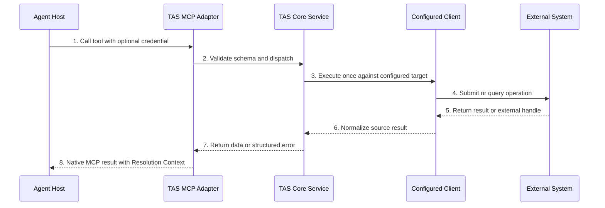

# TAS MCP Interface Design

| Item | Value |
|---|---|
| Status | TAS v0.1 implemented contract; human collaboration acceptance pending |
| Scope | TAS v0.1 MCP conventions shared by all namespaces |
| Transport | Local MCP over stdio |
| Parent design | [TAS v0.1 Design](../TAS.md) |
| Configuration | [TAS v0.1 Configuration Contract](CONFIG.md) |
| Generated tools | [TAS Manifest Contract](MANIFEST.md) |
| Detailed tool schemas | Added namespace by namespace after review |

> **Key decisions**
>
> 1. TAS uses native MCP tool results with structured content; it does not introduce a second response protocol.
> 2. Identity setup is bound to `(chainId, identityRegistryAddress)`, TAWG setup to `(chainId, tawgAddress)`, and a normal member process to `(chainId, tawgAddress, agentId)`. Tool callers cannot override any context.
> 3. TAS v0.1 uses synchronous calls, bounded waits, and external system handles. It does not depend on MCP Tasks or maintain a general task system.
> 4. TAS does not define a global side-effect or retry identifier. The Agent owns its operation path, replay, deduplication, and reconciliation through source-native handles and authoritative external state.
> 5. Credentials are supplied inline for one operation, never returned or persisted by TAS, and never collected through MCP Elicitation.
> 6. Every result identifies the exact chain, Profile, Repository, or DA context actually used so another participant can recompute it.
> 7. TAS generates `agent-sdk`, viem, grammY, and discord.js tool Manifests manually after dependency upgrades and ships the reviewed generated interfaces with each TAS release.
> 8. Page and Chat Delivery Cursors are returned to and maintained by the Agent. TAS does not persist cursor or Chat duplicate-suppression state.
> 9. A Host installs the minimal TAS Bootstrap Skill. It starts setup MCP and loads `tas.get`; after member setup the Agent loads `collaboration.get`, `tawg.get`, and `role.get(role)` for each applicable role.
> 10. Proof Providers generate proofs and TAS adapters may validate those proof artifacts as a preflight check. Only the custom ERC-8301 Workflow and its ERC-8274 verifier determine on-chain acceptance.
> 11. `workflow.source.verify` performs reproducible compilation and chain comparison; `workflow.source.get` returns guidance-bearing `Workflow.sol` only while the current Workflow fingerprint has a successful in-process verification.

## 1. Glossary

1. **Identity setup.** One short-lived local process bound to `(chainId, identityRegistryAddress)`. It has no TAWG or member context.
2. **TAWG setup.** One short-lived local process bound to `(chainId, tawgAddress)` for Profile discovery and membership onboarding with an existing ERC-8004 identity.
3. **TAS instance.** One local member process bound to `(chainId, tawgAddress, agentId)`.
4. **Tool result.** The native MCP `CallToolResult` returned by a TAS tool.
5. **Structured content.** Machine-readable JSON returned in MCP `structuredContent` and validated against a tool's `outputSchema`.
6. **Resolution Context.** The exact immutable chain, Profile, Repository, and DA references used or produced by an operation. It is a composition of independently resolved sources, not a cross-system atomic snapshot.
7. **`request_id`.** A TAS-generated identifier for one tool invocation. It supports error and log correlation and changes on retry.
8. **Inline credential.** A private key, access token, API key, or equivalent secret supplied to one tool call and released after that call.
9. **External handle.** A source-native identifier such as a transaction hash or message ID.
10. **Page cursor.** An opaque value used to continue a list operation.
11. **Delivery cursor.** An opaque, platform-specific value returned by Chat `events.wait` and supplied by the Agent to a later wait. It is distinct from a page cursor and has no cross-platform ordering meaning.
12. **Generated Manifest.** A deterministic TAS build artifact generated from an installed TypeScript dependency's public callable interface and used to register MCP tools.
13. **TAS Bootstrap Skill.** The minimal Host-installed Skill that installs TAS, starts identity or TAWG setup MCP, and loads `tas.get`.
14. **TAS Skill.** The generic, release-matched instructions bundled with TAS and returned through `tas.get`.
15. **Collaboration Skill.** The generic, release-matched collaboration instructions returned through `collaboration.get` for a member.
16. **TAWG Root Skill.** Shared TAWG business guidance at `skills/SKILL.md` in the Profile-selected Repository and returned through `tawg.get`.
17. **Role Skill.** TAWG-specific instructions for one Workflow role at `skills/roles/<role>.md` and returned through `role.get`.
18. **Skill source.** The package-bound source identifying a release Skill or immutable `(repository URL, commit, path)` source identifying Repository Skill content.
19. **Verified Workflow source.** The single TAWG-specific `Workflow.sol` selected by Profile Workflow Data and matched to deployed runtime bytecode through its compiler-produced metadata and a reproducible compilation.

## 2. Background

TAS provides one host-neutral MCP interface through which independently operated Agent Hosts load the four Skill layers, finish onboarding, and use the TAWG's Profile, Repository, workflow contracts, DA, chat groups, and Proof Providers. The interface must work across Codex, Claude Code, OpenClaw, Hermes, and other Hosts without moving TAS behavior into Host-specific Adapters.

The Trustless AI repositories already contain MCP tools, but their result shapes are specific to their own use cases. TAS needs additional common semantics for Agent identity, immutable resolution, credentials, external side effects, retries, live data, and recomputation.

This document defines those common semantics before defining each namespace's exact tool schemas. It follows the MCP tool model, including `inputSchema`, `outputSchema`, `structuredContent`, `isError`, and standard tool annotations. See the [MCP Tools specification](https://modelcontextprotocol.io/specification/2026-07-28/server/tools).

## 3. Problem

Without shared MCP conventions, each TAS module would make independent decisions about:

1. how successful results and tool failures are represented;
2. whether a retry may duplicate a transaction, message, DA write, or proof request;
3. how private keys and provider tokens enter an operation;
4. whether a result refers to mutable `latest` state or an immutable historical state;
5. how lists remain stable while their source changes;
6. how Agents discover the difference between a logical tool and the current backend's actual capabilities; and
7. how another participant can independently recompute a result.

Those decisions must be consistent across all namespaces while keeping TAS thin. TAS must not become a second workflow engine, general task queue, credential vault, or authoritative data store.

## 4. Solution

### 4.1 Native MCP result model

TAS uses the native MCP tool result:

```text
CallToolResult
├── resultType = complete
├── structuredContent
│   ├── context
│   └── data | error
├── content
└── isError
```

1. `structuredContent` contains the complete machine-readable result.
2. `content` contains only a compact text summary for Hosts that display or consume unstructured tool content.
3. `isError` is the native success or tool-error indicator.
4. TAS does not add `ok`, `success`, or another status field that duplicates `isError`.
5. Every tool defines an `outputSchema`, and successful `structuredContent` conforms to it.
6. For compatibility with MCP clients, the compact text summary reflects the structured result without becoming an alternative source of truth.

A successful result has this logical structure:

```text
structuredContent
├── context
└── data
```

A tool execution failure has this logical structure:

```text
structuredContent
├── context
└── error
```

Malformed MCP requests, unknown tools, and input-schema violations use MCP or JSON-RPC protocol errors. Credential failures, repository-provider failures, transaction failures, unavailable data, and other failures encountered while executing a valid tool use `isError = true`.

### 4.2 Execution modes

TAS v0.1 supports three execution modes.

#### 4.2.1 Synchronous operations

Operations that normally complete inside one bounded call return their final result directly. Examples include Profile reads, local Git inspection, chain calls, DA reads, proof validation, and message submission acknowledgement.

#### 4.2.2 Bounded waits

Some tools wait for an event only until the caller's bounded deadline:

```text
chat.telegram.events.wait
chat.discord.events.wait
workflow.chain.public.wait_for_transaction_receipt
```

A Chat `events.wait` tool accepts an optional caller-held Delivery Cursor and returns immediately when an event is available. Its result includes a `next_cursor`. If the selected platform Client cannot hold a native wait, Chat Service checks at the configured interval, whose v0.1 default is six seconds. Reaching the wait bound without an event is a successful empty result, not an error.

#### 4.2.3 External asynchronous operations

When the authoritative external system already exposes a durable handle, TAS returns that handle instead of creating a TAS task:

```text
chain write
    submit → transaction hash
    wait_for_transaction_receipt(transaction hash)

```

TAS v0.1 does not depend on the MCP Tasks extension. MCP Tasks may later wrap the same operations as a Host-experience enhancement, but a task ID never replaces the source-native external handle. See the [MCP Tasks specification](https://modelcontextprotocol.io/specification/2026-07-28/basic/utilities/tasks).

### 4.3 Side effects and replay

TAS defines no common `operation_id`, retry journal, business-operation registry, or exactly-once abstraction. Every MCP call is an independent request. The Agent owns the higher-level operation path and decides whether, when, and with what arguments to call a tool again.

For a side effect, TAS:

1. performs no hidden automatic retry after submission begins;
2. returns the source-native handle or result when the source supplies one, such as a transaction hash, message ID, Git commit, or proof identifier;
3. returns a structured error when the call fails or its outcome cannot be established; and
4. retains no business deduplication or replay state after the call.

The Agent records the returned handles and relevant inputs in its own operation path. Before replaying uncertain work, it queries the authoritative external system, chain, DA reference, or Workflow state when possible. If the underlying generated SDK operation natively exposes an idempotency key, nonce, request identifier, or equivalent field, that field remains an ordinary operation-specific input with the source system's semantics; TAS does not normalize it into a cross-tool concept.

### 4.4 Credentials

Tools that require external authorization accept one optional common credential argument with this logical structure:

```text
credential
├── type = inline
└── secret
```

The tool determines the expected credential from its configured Client. The caller does not use the credential argument to choose another chain, repository, group, DA backend, or Proof Provider.

1. TAS v0.1 supports only the `inline` credential type.
2. The credential argument remains optional in the MCP input schema so TAS can return a structured `CREDENTIAL_REQUIRED` tool error.
3. The secret is marked `writeOnly` in JSON Schema as a client hint, not as a security guarantee, and is bounded to 4,096 characters before runtime validation.
4. TAS excludes the complete credential from request digests, logs, traces, errors, text summaries, and results.
5. TAS does not persist or cache the credential and does not retain a constructed EVM Account after the call.
6. One operation accepts at most one credential in v0.1.
7. After refreshing a credential, the Agent decides whether replay is safe from its own operation path and the authoritative external state.

An RPC endpoint injected through the environment at TAS startup is not an MCP tool credential. It is process-scoped Chain transport configuration defined by the [TAS v0.1 Configuration Contract](CONFIG.md). It cannot authorize an Agent or a workflow operation and never appears in tool arguments, results, errors, or public context.

TAS does not request private keys, tokens, or API keys through MCP Elicitation or `input_required`. MCP form Elicitation must not collect sensitive credentials, and URL-mode Elicitation would require a different credential-ownership model. See the [MCP Elicitation specification](https://modelcontextprotocol.io/specification/2026-07-28/client/elicitation).

Credential errors use two boundaries:

1. `CREDENTIAL_REQUIRED` means the credential is missing, expired, revoked, invalid, or lacks required scope. The Agent Host refreshes or replaces it; the Agent then decides whether to call the operation again.
2. `AUTHORIZATION_DENIED` means the credential is valid but does not authorize this operation. `WALLET_MISMATCH` is the specific EVM case where the supplied private key does not derive the current Authentication Wallet.

### 4.5 Public context

Tool callers cannot supply or override the identity-setup, TAWG-setup, or member context. Every result contains a TAS-generated context with this logical structure:

```text
context
├── instance
│   ├── phase                    identity_setup | tawg_setup | member
│   ├── chain_id
│   ├── identity_registry_address identity setup only
│   ├── tawg_address             TAWG setup and member only
│   └── agent_id                 member only
├── request_id
└── resolved           optional
    ├── profile
    ├── chain
    ├── repository
    └── da
```

1. `instance` always comes from the current TAS process. Identity-setup results contain only `chain_id` and the identity Registry address; TAWG-setup results omit `agent_id`; member-phase results always include it.
2. `request_id` is generated for every tool call and changes on retry.
3. `resolved` contains only the immutable references used or produced by the current operation.
4. Chain IDs, Agent IDs, block numbers, and other values that may exceed the JavaScript safe-integer range use decimal strings.
5. EVM addresses are normalized consistently.
6. Git commits are full hashes, never abbreviations.
7. Credentials, RPC URLs, provider tokens, and local filesystem paths never appear in public context.

### 4.6 Resolution Context

Chain-derived reads use a common selector with these logical variants:

```text
latest
safe
finalized
block_number
block_hash
```

1. An omitted selector means `latest`.
2. Every response reports the exact block number and block hash actually used.
3. Unsupported `safe` or `finalized` resolution fails explicitly and never silently degrades to `latest`.
4. A block-number selector resolves the chain's current canonical hash for that height.
5. Long-term recomputation should use a block hash or finalized context.

Profile, membership, Authentication Wallet, and workflow-address reads within one operation resolve at the same chain block.

Repository discovery starts from the Repository and immutable Charter reference returned by the Profile. Repository activity queries report source-native identifiers and full commit hashes. Inputs affecting evaluation, verification, or settlement record the actual immutable commit rather than only a branch or Pull Request state.

DA uses its own immutable reference. Git DA binds the full commit and normalized path. Future IPFS support binds the CID and applicable codec context. Any Workflow- or ERC-specific digest is computed separately from the exact retrieved bytes and is not part of the DA reference.

These independently resolved sources form the Resolution Context. They are not described as a global atomic snapshot because chain, Git, and DA do not share one transaction or clock. If TAS detects that resolution changed during an operation, it returns `RESOLUTION_CONFLICT` instead of mixing contexts.

### 4.7 Pagination and cursors

List tools use cursor pagination rather than page numbers or offsets:

```text
input
├── limit
├── cursor       omitted on the first page
└── filters

output
├── data.items
└── page
    ├── next_cursor
    └── consistency
```

1. Cursors are opaque to the caller.
2. Absence of `next_cursor` means the list is exhausted.
3. The server enforces a maximum limit. A short page does not itself prove exhaustion.
4. TAS does not calculate a total count unless the source provides a reliable and inexpensive value.
5. A cursor binds the TAS instance, tool, filters, ordering, and resolved context.
6. Changed filters or context return `CURSOR_CONTEXT_MISMATCH`.
7. Invalid and expired cursors return `CURSOR_INVALID` and `CURSOR_EXPIRED`.
8. Cursors contain no credentials or sensitive local information.
9. Cursors are self-contained or source-native values returned to the Agent; they are not lookup keys for TAS-persisted pagination state.

Lists backed by fixed chain blocks or Git commits report `consistency = pinned`. Lists backed by evolving systems such as Repository activity and chat report `consistency = live` and retain source-native object IDs so callers can deduplicate.

Every list tool defines a stable default order. A platform history operation's page cursor remains separate from the Delivery Cursor used by its `chat.<platform>.events.wait` tool.

Chat delivery uses this logical request-response shape:

```text
input
├── source
├── cursor          optional on first use
└── wait_bound

output
├── events[]
│   └── target
└── next_cursor
```

The Agent maintains one Delivery Cursor per configured chat source. A source represents one Telegram Bot, Discord App, or equivalent platform delivery stream and may contain multiple configured group or channel targets. It supplies `next_cursor` to a later wait only after it has processed the returned events. Reusing the previous cursor may redeliver events where the platform permits; Agent processing must therefore tolerate duplicates. TAS validates that a cursor belongs to the selected platform, source, and supported cursor schema, but it does not persist delivery progress, acknowledgement, or duplicate-suppression state.

### 4.8 Errors and negative findings

`isError = true` means TAS could not complete the requested tool action. A successfully computed negative finding remains successful data.

Examples:

```text
Proof payload parsed and cryptographic validation completed; proof is invalid
    isError = false
    data valid = false
    data reason = "Signature is invalid."

Proof payload is malformed or is not an InvinoVeritas proof event
    isError = false
    data valid = false
    data reason = "The artifact is not a valid InvinoVeritas proof event."
```

The same principle applies to invalid or malformed proof artifacts, reverted transaction receipts, empty Repository activity windows, and other independently observed negative facts. A tool error is reserved for failure to execute the validator at all, not for a negative conclusion about the supplied artifact.

Tool errors use:

```text
error
├── code
├── category
├── message
├── retryable
├── recovery
│   ├── action
│   └── retry_after_ms     optional
└── details                optional and redacted
```

Stable categories are:

```text
validation
configuration
credential
authorization
not_found
conflict
unavailable
rate_limit
timeout
integrity
external
internal
```

Stable recovery actions are:

```text
retry
wait
refresh_credential
change_request
reconcile
user_action
abort
```

Agents branch on `code`, `retryable`, and `recovery.action`, not on human-readable message text.

The initial common error codes are:

```text
INVALID_ARGUMENT
UNSUPPORTED_OPERATION
CAPABILITY_UNAVAILABLE
CONFIGURATION_INVALID
CREDENTIAL_REQUIRED
AUTHORIZATION_DENIED
WALLET_MISMATCH
NOT_FOUND
CONFLICT
RATE_LIMITED
TIMEOUT
EXTERNAL_UNAVAILABLE
INTERNAL_ERROR
OPERATION_OUTCOME_UNKNOWN
RESOLUTION_CONFLICT
HISTORICAL_STATE_UNAVAILABLE
FINALITY_UNSUPPORTED
CURSOR_INVALID
CURSOR_EXPIRED
CURSOR_CONTEXT_MISMATCH
```

Namespace designs add stable module-specific codes for Profile, Repo, Chain, DA, Chat, and Proof Provider failures. Raw stack traces, upstream response bodies, credentials, and local paths are never returned.

### 4.9 Tool discovery and capabilities

Standard MCP `tools/list` is authoritative for which logical tools the current TAS process exposes. The list remains stable for the process lifetime and does not change because a credential is absent. Configuration changes take effect after a TAS restart in v0.1.

The four flat Skill names are present in `tools/list` in identity setup, TAWG setup, and member phases. `tas.get` succeeds everywhere. Outside member phase, `collaboration.get`, `tawg.get`, and `role.get` return `SKILL_MEMBER_CONTEXT_REQUIRED`. Identity setup otherwise exposes the complete generated `workflow.chain.public.*` and `workflow.chain.wallet.*` namespaces. TAWG setup additionally exposes public Profile discovery for `(chainId, tawgAddress)` and uses the same generated viem namespaces for membership onboarding. Neither setup mode maintains a per-operation Chain allowlist or exposes Repository activity, generated `agent-sdk` Workflow operations, DA, Chat, or Proof Provider operations. Member phase exposes the complete inventory selected by configuration. Discovery and phase are not authorization: every transaction still requires its inline credential and all contract rules still apply.

Backend-specific capability tools describe what the configured implementation supports without duplicating `tools/list`:

```text
workflow.da.capabilities
```

These include DA reference types. Generated Chain and Chat operations are represented directly by their generated tool inventories in `tools/list` and their bundled Manifests. `proof_provider.attestation.list` maps configured attestation Providers to standardized Provider operation namespaces backed by their integration adapters.

Every TAS tool supplies accurate standard MCP annotations:

```text
readOnlyHint
destructiveHint
idempotentHint
openWorldHint
```

Annotations help the Host present and approve operations but do not replace TAS validation or authorization. Tool descriptions state whether the operation requires a credential, modifies an external system, may incur cost, returns live or pinned data, and which external system remains authoritative.

### 4.10 Namespace inventory

The v0.1 namespaces are:

```text
profile.*
repo.*
skill.*

workflow.<agent-sdk generated namespace>.*
workflow.source.verify
workflow.source.get
workflow.chain.public.*
workflow.chain.wallet.*
workflow.da.*

chat.telegram.*
chat.discord.*
chat.<future_platform>.*

proof_provider.*
```

The Repository namespace is read-only and contains only:

```text
repo.get
repo.issue.list
repo.pull_request.list
repo.commit.list
```

Proof Provider namespaces identify Provider type:

```text
proof_provider.attestation.*
proof_provider.tee.*              reserved
proof_provider.zk.*               reserved
```

The v0.1 Proof Provider tools are:

```text
proof_provider.attestation.list
proof_provider.attestation.invino_veritas.generate
proof_provider.attestation.invino_veritas.validate
```

`attestation.list` returns non-secret public Provider metadata and the standardized namespace used to operate each configured attestation Provider. In the local vertical slice it validly returns `[]`; live Chat bindings and the first concrete Provider Adapter are deferred. A future reviewed InvinoVeritas Adapter may report:

```text
name                      invino-veritas
type                      attestation
source_package            @trustless-ai/agent-sdk
source_module             governance/InvinoVeritas
operations_namespace      proof_provider.attestation.invino_veritas
operations[]              generate, validate
```

The list call does not contact the Provider. A Provider-reserved source module, including `governance/InvinoVeritas`, is not exposed under `workflow.*` until a reviewed Adapter maps it to the standardized operations. TEE and ZK have no v0.1 tools and therefore do not appear in MCP `tools/list` merely because their type namespaces are reserved.

### 4.11 Profile namespace

The Profile is the discovery entry point for the configured TAWG. The v0.1 Profile namespace contains only:

```text
profile.get
profile.get_agent
```

`profile.get` returns one logical projection of the TAWG definition at the resolved chain block:

```text
version
governance
charter
    repository
    commit
    path
agents
    identity_registry
    agent_ids
data
    TAWG-defined JSON metadata
workflow
    address
    TAWG-defined JSON metadata
```

The returned Data object is discovery metadata. It identifies declared data categories, sources, locator rules, and availability terms; it does not contain the external payloads. Agents use the applicable `workflow.da.*` tools to retrieve, publish, or verify concrete data.

The returned Workflow object identifies the ERC-8301 Workflow and its pinned `Workflow.sol` and compiler-metadata locators. On first connection or after a Workflow fingerprint change, Agents use `workflow.source.verify` and then `workflow.source.get` to obtain the verified source. They use the applicable generated `workflow.*` tools to read Workflow state or submit operations. Profile metadata does not replace deployed Workflow behavior.

`profile.get_agent` accepts an `agent_id` and returns:

```text
agent_id
is_member
data
agent_verifier
authentication_wallet
```

The member `data` object and `agent_verifier` come from the Profile. `authentication_wallet` is resolved at the same chain block from the Profile-selected ERC-8004 Identity Registry. The verifier is the member's ERC-8274 `IAgentVerifier`; TAS MUST NOT silently substitute an underlying `IProofVerifier`.

A non-member is a successful negative finding with `is_member = false`; it is not a tool execution failure. Member-only fields are absent for a non-member. Invalid Profile JSON or an internally inconsistent projection fails with `PROFILE_INCONSISTENT`.

Both tools are read-only, non-destructive, and require no credential. Both accept the common chain-state selector. Every field returned by one call resolves at the same exact block, reported in the Resolution Context together with the Profile version. Profile version is a discovery and cache-consistency marker; it is not a substitute for the block used for authoritative historical resolution.

The Profile namespace intentionally has no separate version, Charter, membership-check, Data, Workflow, or governance MCP tool in v0.1. Those values are part of `profile.get` or `profile.get_agent`. The underlying Solidity getters and TAS projection are defined by the [TAWG Profile Contract](../tawg/PROFILE.md).

### 4.12 Workflow source namespace

The Workflow source namespace contains exactly two TAS-defined, read-only tools:

```text
workflow.source.verify
workflow.source.get
```

`workflow.source.verify` resolves the Profile and Workflow Data at the selected chain block, retrieves the full immutable Repository commit's `Workflow.sol` and compiler-produced metadata, validates every compiler source hash, recompiles with the exact compiler version and settings, and compares the reproduced runtime code with the code at the Profile-selected `workflowAddress`. It records a successful verification fingerprint in process memory and returns the complete verification context and findings without returning the source as active Agent guidance.

`workflow.source.get` resolves the current Workflow fingerprint and returns the complete guidance-bearing source only when the exact same fingerprint has a successful verification in the current process. It performs no implicit compilation. With no matching verification it fails with `WORKFLOW_SOURCE_VERIFICATION_REQUIRED`.

The fingerprint and results identify the chain and relevant block, Workflow address, runtime code hash, Repository and commit, source and metadata paths, source and metadata hashes, compiler version, compiler-settings identity, and verification status. `get` additionally returns the source content. Supporting verification findings do not become a second Workflow authority.

The caller cannot override the Repository, commit, paths, Workflow address, compiler version, compiler settings, or comparison target. A private Repository credential may be supplied inline. Both operations are read-only and non-destructive for the same immutable resolution context.

Verification coordination is process-scoped, not MCP-connection-scoped. TAS runs at most one verification pipeline at a time and may share it with one additional caller only when both resolve the exact same immutable descriptor and Repository credential identity. Unrelated or excess concurrent requests fail fast with `WORKFLOW_COMPILER_BUSY`. Each request has one total deadline; cancelling one shared caller detaches only that caller, while cancelling every caller or closing TAS aborts the underlying Repository, runtime-code, and compiler work. TAS drops the operation credential and materialized source when the pipeline settles.

TAS v0.1 requires the Workflow source locator to use the same canonical Repository selected by the Profile Charter, although it may select a different full commit. The verifier uses only exact compiler versions bundled with the TAS release and never downloads a compiler during a request.

Verification is mandatory on the first Agent connection to each newly started TAS process. TAS invalidates the in-memory result when the Workflow address, runtime code hash, source locator, full commit, source hash, metadata hash, compiler version, or compiler settings identity changes. A Profile Version change in another domain does not invalidate an otherwise identical Workflow fingerprint.

Before a generated Workflow operation proceeds, TAS compares its current Workflow fingerprint with the verified fingerprint. A missing or stale match fails with `WORKFLOW_SOURCE_VERIFICATION_REQUIRED`; TAS does not silently compile or continue with stale guidance. The TAS Skill or applicable Role Skill responds by calling `verify`, then `get`, and then reassessing the requested operation against the newly verified source.

The verifier invokes only a constrained solc Standard JSON compilation in a separate Node child process. The parent sends bounded compiler input through stdin, captures bounded output, supplies a minimal non-secret environment, and force-terminates the child on cancellation, timeout, malformed output, or transport overflow before admitting queued compiler work. This isolates TAS from a compiler-process crash but is not an OS-enforced host-wide memory quota; production hosts that accept untrusted TAWG source should add their platform's process/container memory limit. TAS never executes Repository scripts, package lifecycle hooks, Foundry scripts, Hardhat tasks, shell commands, or imported source as local setup code. Completed source-digest, compiler-metadata, and deployed-runtime comparisons return `valid: false` with the respective `source_mismatch`, `metadata_mismatch`, or `runtime_mismatch` reason.

TAWG Workflow v0.1 rejects a proxy, replaceable implementation, missing metadata commitment, unavailable compiler input, irreproducible compilation, or runtime-code mismatch. Its conservative deployment check rejects executable `DELEGATECALL` and `CALLCODE` instructions while skipping PUSH data. A completed comparison reports `{ valid, reason }`; content or runtime mismatches return `valid: false`, while unavailable, malformed, or unsupported verifier inputs use typed tool errors. Source-specific error codes include:

```text
WORKFLOW_SOURCE_UNAVAILABLE
WORKFLOW_SOURCE_VERIFICATION_REQUIRED
WORKFLOW_METADATA_INVALID
WORKFLOW_COMPILER_UNAVAILABLE
WORKFLOW_COMPILER_BUSY
WORKFLOW_COMPILE_FAILED
WORKFLOW_DEPLOYMENT_UNSUPPORTED
```

The authoritative source and verification model is defined by [TAWG Workflow Source and Verification](../tawg/WORKFLOW.md). The exact internal Solidity convention and marked-comment syntax remain deferred to that specification's next design stage.

### 4.13 Repository namespace

The Repository namespace helps an Agent discover the Profile-selected Repository and new activity that may require attention:

```text
repo.get
repo.issue.list
repo.pull_request.list
repo.commit.list
```

`repo.get` returns the Repository information anchored by the Profile:

```text
repository_url              canonical https://github.com/<owner>/<repository>
charter
    commit
    path
```

The exact Profile block and version are reported in the Resolution Context. `repository_url` is the complete canonical GitHub URL that the Agent can pass to its Host-native Git or GitHub tools. It has no user information, query, fragment, trailing slash, or `.git` suffix. The Repository URL is never supplied by the caller, so one TAS instance cannot query an unrelated Repository.

The three list tools accept an RFC 3339 `since` time and an optional pagination cursor:

1. `repo.issue.list` returns Issues whose `created_at` is at or after `since`.
2. `repo.pull_request.list` returns Pull Requests whose `created_at` is at or after `since`.
3. `repo.commit.list` returns commits whose `committed_at` is at or after `since`; v0.1 queries the repository provider's default branch.

The lower bound is inclusive so polling cannot lose an object at the boundary. Results use reverse chronological ordering, newest first, and retain stable source-native IDs or full commit hashes, allowing the Agent to deduplicate a repeated boundary item. Each response reports an `observed_at` time that the Skill may use as the next polling boundary. Empty results are successful.

These tools report `consistency = live`. Their cursor binds the Profile-selected Repository, `since`, ordering, and source observation. They are read-only and non-destructive. A provider credential may be supplied inline when the Repository is private or the provider requires authentication.

TAS does not expose clone, general file read, status, diff, branch, commit, push, Issue mutation, Review, approval, merge, or close tools. After discovery, Role Skills guide the Agent to use the complete `repository_url` with its Host's Git, shell, filesystem, GitHub, or other repository-provider tools for further inspection and action.

TAS v0.1's GitHub Client accepts the canonical locator `https://github.com/<owner>/<repository>` without user information, query, fragment, trailing slash, or `.git` suffix. Other providers and GitHub Enterprise hosts remain future Client implementations.

Initial Repository-specific errors are:

```text
REPOSITORY_LOCATOR_UNSUPPORTED
REPOSITORY_NOT_FOUND
REPOSITORY_FETCH_FAILED
REPOSITORY_RATE_LIMITED
REPOSITORY_CURSOR_INVALID
REPOSITORY_CURSOR_CONTEXT_MISMATCH
```

### 4.14 Skill tools

TAS registers the same four read-only tools in every phase:

```text
tas.get
collaboration.get
tawg.get
role.get
```

All four declare:

```text
readOnlyHint     true
destructiveHint  false
idempotentHint   true
openWorldHint    true
```

`tas.get` and `collaboration.get` accept a strict empty object. `tawg.get` accepts only an optional inline Repository credential. `role.get` requires `role` and accepts the same optional credential:

```text
tawg.get input
    credential? { type = inline, secret = writeOnly string }

role.get input
    role          [a-z][a-z0-9_-]{0,63}
    credential?   { type = inline, secret = writeOnly string }
```

Unknown fields are rejected. Neither Repository-backed call accepts a Repository, path, branch, tag, or commit selector. A credential secret is limited to 4096 characters, used only for the current Repository operation, and never returned.

The four tools have one uniform successful `data` shape:

```text
skill
    name                      tas | tawg-collaboration | tawg | role
    role?                     present only for role.get
source
    kind                      release | repository
    package?                  @trustless-ai/tas for release Skills
    version?                  exact running version for release Skills
    repository_url?           canonical Profile-selected URL for Repository Skills
    commit?                   internally resolved full commit for Repository Skills
    path                      fixed Skill path
    content_digest
        algorithm             sha256
        value                 lowercase 64-hex digest
content
    media_type                text/markdown; charset=utf-8
    encoding                  utf8
    value                     complete Markdown
```

Release paths are fixed to `skills/tas/SKILL.md` and `skills/tawg-collaboration/SKILL.md`. Repository paths are fixed to `skills/SKILL.md` and `skills/roles/<role>.md`. Repository results also include the exact Profile block/version and `(repository URL, commit)` in the common Resolution Context.

For example, `role.get({ "role": "contributor" })` returns `data` shaped as:

```json
{
  "skill": { "name": "role", "role": "contributor" },
  "source": {
    "kind": "repository",
    "repository_url": "https://github.com/example/example-tawg",
    "commit": "0123456789abcdef0123456789abcdef01234567",
    "path": "skills/roles/contributor.md",
    "content_digest": {
      "algorithm": "sha256",
      "value": "0123456789abcdef0123456789abcdef0123456789abcdef0123456789abcdef"
    }
  },
  "content": {
    "media_type": "text/markdown; charset=utf-8",
    "encoding": "utf8",
    "value": "# Contributor\n...complete Skill Markdown...\n"
  }
}
```

`tas.get` succeeds in identity setup, TAWG setup, and member phases. `collaboration.get`, `tawg.get`, and `role.get` return `SKILL_MEMBER_CONTEXT_REQUIRED` outside member phase. That error means only that the process lacks member-mode configuration; a successful call proves neither `profile.get_agent.is_member`, role ownership, nor Workflow authority.

In member phase, `tawg.get` and `role.get` resolve the latest Profile-selected Repository, resolve its current default-branch HEAD to one full commit, and read the fixed path from that exact commit. Resolution happens on every call. TAS reports the immutable source it actually read but stores no active Skill commit. A later call may intentionally discover a newer HEAD.

All four return complete Markdown in native MCP `structuredContent`; compact text content does not duplicate the document. TAS executes no returned content, grants no role, approves no action, and does not weaken Host permissions. Repository content is untrusted instruction input. A Role Skill may reference other files, which the Agent reads with Host-native Git or GitHub tools using the returned Repository URL and commit when immutability matters.

Repository Skill file bytes have a fixed 1 MiB limit and must decode as non-empty UTF-8. If Workflow interpretation, evaluation, verification, or settlement depends on a Skill, the applicable Workflow SHOULD anchor the full commit and path through its own operation.

Bundled release Skills are validated during startup. Invalid bundled bytes fail startup with:

```text
TAS_SKILL_BUNDLE_INVALID
```

Skill tool calls may return:

```text
SKILL_MEMBER_CONTEXT_REQUIRED
SKILL_NOT_FOUND
SKILL_INVALID
SKILL_ROLE_INVALID
SKILL_FETCH_FAILED
SKILL_CONTENT_TOO_LARGE
CREDENTIAL_REQUIRED
REPOSITORY_RATE_LIMITED
```

Profile and Repository resolution occurs inside Repository-backed Skill calls, so these shared resolution errors may also propagate:

```text
PROFILE_INCONSISTENT
REPOSITORY_LOCATOR_UNSUPPORTED
FINALITY_UNSUPPORTED
HISTORICAL_STATE_UNAVAILABLE
RESOLUTION_CONFLICT
EXTERNAL_UNAVAILABLE
```

Provider `REPOSITORY_NOT_FOUND` is normalized to `SKILL_NOT_FOUND`; other content-read failures are normalized to `SKILL_FETCH_FAILED` except `CREDENTIAL_REQUIRED` and `REPOSITORY_RATE_LIMITED`. Strict MCP input-schema failures occur before the Skill service and use the standard MCP input-validation error rather than a TAS tool-error code.

The earlier prefixed two-tool Skill surface has been removed. TAS v0.1 provides no compatibility aliases: Hosts and Skills use the four flat names above.

### 4.15 Generated dependency tools

TAS does not maintain handwritten inventories for `agent-sdk` protocol methods, Ethereum Chain methods, or chat-platform SDK methods. TAS owns a Manifest Generator that produces deterministic MCP interface artifacts from the exact installed `agent-sdk`, viem, grammY, and discord.js versions.

The [TAS Manifest Contract](MANIFEST.md) defines the canonical JSON artifact, source and Provider Adapter Manifest classes, generation report, runtime binding, validation failures, versioning, and conformance requirements. This section defines how those generated tools appear through MCP.

After any of these dependencies is upgraded, a TAS developer manually runs the Manifest Generator and reviews the generated interface diff. The generated Manifest is built and published with TAS. Generation never occurs implicitly at runtime. TAS build and startup reject a Manifest whose recorded dependency name or version does not match the installed dependency.

```text
dependency upgrade
        ↓
manual TAS Manifest generation
        ↓
generated interface review
        ↓
TAS build and release
        ↓
runtime Manifest validation and MCP registration
```

The generated dependency Manifests have no separately maintained per-operation exposure declarations or allowlists. Role Skills explain which generated capabilities are appropriate for a particular workflow; TAS does not encode that judgment by hiding otherwise representable dependency operations.

Proof Provider adapter Manifests are a separate interface class. They provide the semantic mapping from a Provider SDK's source methods to the standardized `generate` and `validate` roles because that meaning cannot be inferred safely from TypeScript names alone. A source module claimed by a Provider adapter is excluded from the generic `workflow.*` Manifest projection.

#### 4.15.1 agent-sdk Manifest

The agent-sdk Manifest is generated directly from public callable exports and their TypeScript types.

The generation algorithm is:

1. Package subpath segments become lowercase namespace segments.
2. Each exported function becomes a tool operation.
3. Each public instance method of an exported class becomes a tool operation under a class-name segment. A trailing `Client` is removed.
4. Names use `snake_case`. Constructors, private and protected methods, types, constants, and unexported implementation details are excluded mechanically.
5. Recompute package subpaths remain explicit `recompute` namespace segments.
6. The TypeScript compiler generates the MCP input and output schemas. Contract ABI data supplies mutability and ABI validation when available.
7. ABI `view` and `pure` methods and functions under a `recompute` subpath are reads. Anything not provably read-only is conservatively treated as potentially side-effecting.
8. Shared SDK runtime types identify the chain connection, resolved contract address, Account, and provider credential that TAS must inject. They are not arbitrary caller-selected destinations.
9. Public callables claimed by a reviewed Proof Provider adapter are excluded from `workflow.*` and exposed only through that adapter's Provider namespace.
10. Ambiguous names, duplicate tool names, unsupported public types, or callables that do not follow the shared runtime conventions fail Manifest generation. Generation never silently skips a public callable.
11. Each function and class-method binding records the complete ordered source-call arguments. Caller fields use named input slots, including optional parameters; an injected SDK `{ rpcUrl, address }` parameter uses a `chain_config` runtime slot and is absent from the caller schema.
12. Runtime JavaScript files used to classify read and side-effect behavior are re-read after the reviewed package-tree snapshot, recorded with their digests in the generation report, and bound into the Manifest entrypoint digest.
13. After that snapshot, the generator also re-reads each public package export. Its normalized `types` and `default` paths must exactly match the analyzer's reviewed entrypoint metadata, the type bytes are hashed, and the runtime `default` path must belong to the reviewed runtime-file closure. Both paths are included in the report and entrypoint digest.

The runtime validates the complete bundled Manifest against a static table of reviewed package export and class-member bindings before it exposes the adapter. It never turns a tool name or caller value into a dynamic import path. Each class-method call constructs a fresh SDK Client with the operation's Account and retains neither object after the call; a source `void` result is represented as JSON `null`.

The pinned `agent-sdk@0.3.0` chain Clients currently construct their own viem transport with the Foundry chain definition. TAS v0.1 therefore enables chain-bound generated SDK calls only for chain ID `31337`; pure recompute functions remain chain-independent. The verified Profile directly authorizes only its ERC-8301 Workflow address. A generated namespace that needs another contract address remains discoverable from the reviewed Manifest but fails with `MANIFEST_BINDING_UNSUPPORTED` until the Profile or another accepted on-chain authority defines that address. TAS does not guess that every ERC contract is the Workflow.

For example:

```text
agent-sdk export path
    execution/ERC8301

exported class and method
    AgentWorkflowClient.run

generated MCP tool
    workflow.execution.erc8301.agent_workflow.run
```

An exported recompute function may generate:

```text
workflow.execution.erc8301.recompute.compute_task_hash
```

The generated Manifest records at least:

```text
manifest_schema_version
source_package
source_package_version
tool_name
package_subpath
call_target
ordered_invocation_arguments
input_schema
output_schema
operation_mode
runtime_dependencies
```

#### 4.15.2 viem Chain Manifest

TAS uses viem's Public Client and Wallet Client split as the Chain interface:

```text
workflow.chain.public.<viem_public_action>
workflow.chain.wallet.<viem_wallet_action>
```

The TAS Manifest Generator reads the installed viem `PublicActions` and `WalletActions` TypeScript interfaces. Public and Wallet Actions become MCP tools using their viem names converted to `snake_case`. Client construction, transports, base Client plumbing, types, constants, and utilities are outside those Action interfaces and do not become tools.

An Action whose callback or subscription signature cannot be represented as one finite MCP request and response is mechanically excluded and listed in the generation report. This rule is structural rather than a handwritten operation allowlist.

Public Actions use TAS's configured chain and transport. Wallet Actions use the configured chain and the operation-scoped Account constructed from the inline private key. The caller cannot override the chain, transport, or Account through generated arguments. A Wallet Action that cannot accept TAS's injected Account is structurally excluded and reported. A Public Action that could submit an authenticated Chain write without a deterministic Authentication Wallet binding is likewise excluded. Raw signed-transaction submission cannot bypass Account injection. Included Wallet Actions that cannot be proven read-only are treated as potentially side-effecting, receive the common credential handling, and are never replayed automatically by TAS. When the operation acts for an existing or configured Agent, TAS requires the derived Account to match that Agent's current Authentication Wallet. Initial ERC-8004 registration is unbound until the Registry returns an `agentId`; TAS then applies the wallet checks required before Profile registration. Registry-specific wallet establishment or rotation follows the selected Registry's contract rules.

TAS rejects an unsupported Manifest schema version, dependency-version mismatch, or tool-name collision at build or startup. `tools/list` then remains stable for that TAS process. Dependency upgrades do not change the interface until the TAS Manifest Generator is run and the resulting artifacts are included in a TAS release.

#### 4.15.3 Chat platform Manifests

Chat operations are generated separately for each platform:

```text
chat.telegram.<generated_grammy_namespace>.*
chat.discord.<generated_discord_js_namespace>.*
chat.<future_platform>.*
```

The Telegram generator reads [grammY](https://grammy.dev/)'s public Bot API request-response surface and Telegram Update types. The Discord generator reads the applicable public [discord.js](https://discord.js.org/docs) message, channel, and Gateway event types. Public operations with finite JSON-compatible inputs and outputs become MCP tools under their platform namespace. Constructors, transports, caches, callback registration, constants, types, unrelated Client plumbing, and signatures that cannot form a finite JSON request-response operation are excluded mechanically and listed in the generation report. An ambiguous eligible invocation target fails generation rather than being silently approximated.

TAS does not normalize these generated operations into one lowest-common-denominator message API. Telegram and Discord therefore retain their own text, media, file, reply, edit, delete, history, and other representable capabilities. A platform-library upgrade changes its MCP surface only after manual Manifest regeneration, review, and release.

Each message operation accepts a configured target name, not an arbitrary destination. TAS resolves that name to one chat source, platform, and group or channel, injects the configured conversation identifier, and rejects a platform mismatch. Role Skills tell the Agent which source and target names exist, which platform namespace each uses, and the collaboration purpose of each target. Credentials remain operation-scoped inline inputs.

Incoming callback streams cannot be exposed directly as finite MCP tools, so TAS adds only this small platform-specific bridge:

```text
chat.telegram.events.wait

chat.discord.events.wait
```

The event schemas are generated from the corresponding platform types. `events.wait` is bounded, accepts a configured chat source and an optional Agent-held cursor, and returns events from that source's configured targets plus a `next_cursor`, or a successful empty result. Every event identifies its target. The Agent advances by passing that cursor to a later call; TAS persists no Chat delivery position. Telegram update offsets and Discord Gateway session sequences belong to Bot or App delivery streams rather than individual groups, and they are not presented as equivalent or globally durable cursors.

### 4.16 DA namespace

DA uses three TAS-defined tools:

```text
workflow.da.capabilities
workflow.da.get
workflow.da.put
```

#### 4.16.1 References and content

The canonical references are:

```json
{"type":"git","commit":"<full-commit-hash>","path":"data/<normalized-path>"}
{"type":"ipfs","cid":"<cid>"}
```

A Git reference is always resolved against the Repository selected by the TAWG Profile. The caller cannot supply another Repository. The commit is full length, and the normalized path must remain below `data/`; absolute paths and traversal are rejected. The Git `commit + path` pair and IPFS CID are the authoritative DA references.

Inline content uses this logical envelope:

```text
content
├── encoding        utf8 | base64
├── value
└── media_type      optional
```

The configured backend publishes its maximum inline byte length through `capabilities`. Oversized input or output fails explicitly; TAS does not silently truncate content.

#### 4.16.2 `workflow.da.capabilities`

Returns the configured backend and its effective interface:

```text
backend
reference_types[]
read
write
content_encodings[]
max_inline_bytes
```

TAS v0.1 implements Git DA. IPFS remains a reserved Client boundary and is reported only when an IPFS implementation is actually configured and available.

#### 4.16.3 `workflow.da.get`

Accepts one canonical `ref`. It retrieves the immutable content and returns:

```text
ref
content
size_bytes
```

A private Repository credential may be supplied inline. `get` uses the common Resolution Context and never resolves a mutable branch in place of the requested commit.

#### 4.16.4 `workflow.da.put`

Accepts an inline `content` envelope, an optional backend-specific destination, and a credential when required. For Git DA, the destination is a normalized path under `data/`. TAS writes the exact decoded bytes, creates or obtains the immutable Git commit, and returns:

```text
ref
size_bytes
```

`put` is side-effecting. TAS returns the produced immutable reference but keeps no replay or deduplication record. The Agent decides whether a later write is needed from its own operation path. The operation does not anchor the reference on-chain. Anchoring requires a separate explicit Workflow or Chain operation.

DA does not define a protocol digest or verify a Workflow commitment. After `put`, the Agent uses the applicable `agent-sdk` recompute function to derive the ERC-specific commitment from the exact bytes, then submits the DA reference and commitment through the applicable Workflow or Chain operation.

Initial DA-specific errors are:

```text
DA_REFERENCE_INVALID
DA_PATH_INVALID
DA_UNAVAILABLE
DA_FETCH_FAILED
DA_WRITE_FAILED
DA_CONTENT_TOO_LARGE
```

### 4.17 Proof Provider namespace

Proof Provider namespaces separate proof production from proof validation:

```text
proof_provider.<type>.<provider>.generate
proof_provider.<type>.<provider>.validate
```

Each configured Provider integration supplies a reviewed adapter Manifest with exact input and output schemas for these two semantic operations. The Provider-specific namespace preserves those schemas without forcing attestation, TEE, and ZK payloads into one opaque universal envelope.

**Generate.** `generate` asks the configured Provider to produce an attestation or proof for the supplied artifact and context. It may incur cost and contact an external service, so it requires an inline Provider credential when applicable. It returns the Provider result and the proof artifact but performs no Chain transaction and makes no claim of Workflow acceptance.

**Validate.** `validate` independently checks the returned proof artifact itself. Depending on the proof type, this may check canonical encoding, input/output binding, signature, issuer, proof format, TEE attestation, or ZK proof. It MUST NOT call the producing Provider's generation endpoint or require that Provider's credential. A future proof type may declare public verification material or Chain reads as validation inputs. Validation is read-only.

A completed validation returns exactly one boolean conclusion and one non-empty human-readable explanation:

```text
valid
reason
```

`valid = false` is a successful negative result, including tampered content, an invalid signature, a wrong issuer, malformed proof-event content, or an artifact that is not one of the Provider's proofs. The `reason` explains the applicable finding for an Agent or human and may summarize more than one failed intrinsic check. Stable machine-readable reason codes and a common cross-Provider check taxonomy are deferred beyond v0.1.

Only inability to execute the validator itself is a tool error, such as a missing validator implementation or an unexpected internal runtime failure. Schema-invalid MCP arguments are rejected by normal MCP input validation before Provider validation begins.

For a future reviewed InvinoVeritas Adapter (deferred beyond the local vertical slice):

```text
proof_provider.attestation.invino_veritas.generate
    adapts ReviewGateClient.review with signed proof generation required

proof_provider.attestation.invino_veritas.validate
    adapts ReviewGateClient.verifyLocal
    checks event-id integrity, signature, issuer, and proof-event format
```

The future InvinoVeritas Adapter's `generate` input is:

```text
artifact
artifact_type       optional
context             optional
credential
```

The adapter always requests a signed proof; it does not expose the source Client's `sign = false` option because an operation named `generate` must return a proof artifact. The output preserves the typed verdict, confidence, summary, issues, optional alternatives, and signed proof returned by the source integration.

The corresponding `validate` input is the typed response returned by `generate`. The Adapter reduces `verifyLocal`'s independent findings to the v0.1 Agent-facing result:

```text
valid
reason
```

The Adapter constructs `reason` from `id_integrity`, `signature_valid`, `issued_by_invinoveritas`, and `is_proof_event`. `valid = false` means the proof artifact failed one or more intrinsic checks. It does not describe ERC-8274 verification or ERC-8301 Workflow state.

The operation sequence is deliberately split:

```text
Proof Provider generate
        ↓
Proof artifact
        ↓
Proof Provider validate
        ↓
Agent submits proof or commitment through the TAWG Workflow
        ↓
ERC-8274 verifies on-chain under the Workflow's selected verifier
        ↓
ERC-8301 Workflow accepts, rejects, or remains unchanged
```

TAS exposes no generic `verify_anchor` or `accept` Proof Provider tool. Anchoring and finality are observed through Chain and Workflow reads. Acceptance is determined only by the custom ERC-8301 Workflow and its ERC-8274 verifier. These findings remain distinct:

```text
valid proof
    != anchored proof
    != finalized anchor
    != Workflow-accepted proof
    != correct judgment
```

Initial Proof Provider-specific errors are:

```text
PROOF_PROVIDER_UNAVAILABLE
PROOF_GENERATION_FAILED
```

Invalid, malformed, wrongly issued, or signature-invalid proof artifacts are successful `validate` results with `valid = false` and a non-empty `reason`; they do not use Provider-specific error codes. Unexpected inability to run the validator uses the common tool execution error model.

### 4.18 Side-effect flow



### 4.19 Deferred interface work

The following interface work is intentionally deferred:

1. exact generated `chat.telegram.*` and `chat.discord.*` schemas are produced from their reviewed dependency Manifests rather than handwritten here; and
2. TEE and ZK Provider discovery and operation interfaces remain deferred until corresponding integrations are selected.

Future namespace work must use the common result, credential, side-effect, context, cursor, capability, and error rules defined here.
