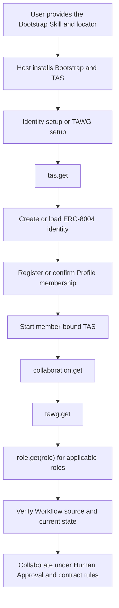

# TAS Skill Architecture and Onboarding

| Item | Value |
|---|---|
| Status | TAS v0.1 implemented design; human scenario acceptance pending |
| Scope | Skill layers, delivery, onboarding, authority, and responsibility boundaries |
| Parent design | [TAS v0.1 Design](../TAS.md) |
| MCP interface | [TAS MCP Interface Design](MCP.md) |
| Configuration | [TAS v0.1 Configuration Contract](CONFIG.md) |
| Host credentials | [TAS Host Credential File Contract](CREDENTIALS.md) |

## 1. Four layers

TAS v0.1 separates product setup, TAS operation, generic collaboration, and TAWG business behavior:

```text
TAS Bootstrap Skill
        ↓
tas.get                 release-bundled TAS operation
        ↓
collaboration.get       release-bundled collaboration mechanics
        ↓
tawg.get                Repository-owned TAWG Root policy
        ↓
role.get(role)          Repository-owned role behavior
```

The Bootstrap Skill is installed through the Agent Host's native Skill mechanism. The other four are complete Markdown documents returned through MCP. Loading means reading instruction text into the Agent's context; it does not execute code, install another plugin, grant a role, or authorize a transaction.

## 2. Sources and ownership

### 2.1 Bootstrap Skill

`skills/tas-bootstrap/SKILL.md` is the minimal product entry. It installs or locates the official `@trustless-ai/tas` package, creates a temporary identity-setup or TAWG-setup configuration, registers the local stdio server, checks `tools/list`, calls only `tas.get` among the four Skill tools, and hands control to the returned TAS Skill.

It does not reproduce identity, membership, Workflow, collaboration, or role procedures.

### 2.2 TAS Skill

`tas.get` returns `skills/tas/SKILL.md` from the exact running TAS release. It guides:

- ERC-8004 identity creation or loading;
- Profile discovery and permanent member registration/update;
- Host-owned credential preparation and inline use;
- member configuration and one-Agent/one-TAWG process isolation;
- Repository discovery, Workflow source verification, DA, Chain, Chat, and Proof Provider use; and
- loading the remaining collaboration, Root, and Role Skills.

It contains TAS operating rules, not TAWG business policy.

### 2.3 Collaboration Skill

`collaboration.get` returns `skills/tawg-collaboration/SKILL.md` from the same TAS release. It defines the generic collaboration mechanics shared across TAWGs:

- natural, human-readable group communication;
- Scope and Formality interpretation inside the Agent rather than a wire protocol;
- Collaboration-, Human-, Agent-, and Workflow-originated work;
- Action Approval and Message Approval, including bounded automation grants;
- accepted-work and Handoff mechanics;
- Agent-owned cursors, restart recovery, deduplication, and verification; and
- separation of attempted, delivered, proven, anchored, Workflow-accepted, and settled outcomes.

TAS stores none of the approval, automation, cursor, or accepted-work state described by this Skill.

### 2.4 TAWG Root Skill

`tawg.get` reads exactly `skills/SKILL.md` from the Repository selected by the latest Profile. The Root Skill defines shared business context, available roles, TAWG-specific invariants, and how to select applicable Role Skills. TAS resolves the Repository's current default-branch HEAD internally and returns the exact full commit used.

### 2.5 TAWG Role Skill

`role.get(role)` maps `[a-z][a-z0-9_-]{0,63}` to `skills/roles/<role>.md` in the same Profile-selected Repository. A Role Skill describes business-specific actions, artifacts, gates, proofs, recipients, mentions, and completion rules. It refers generic approval, message, Handoff, cursor, and restart behavior to the Collaboration Skill.

The caller supplies only `role` and, when needed, one inline private-Repository credential. The caller cannot select the Repository, path, branch, tag, or commit. Every call resolves current default HEAD and returns one immutable source snapshot.

## 3. Uniform result model

Every Skill tool returns complete UTF-8 Markdown in `data.content.value` plus a SHA-256 digest. Release Skills report:

```text
skill.name
source.kind = release
source.package = @trustless-ai/tas
source.version
source.path
source.content_digest
content.media_type = text/markdown; charset=utf-8
content.encoding = utf8
content.value
```

Repository Skills instead report `source.kind = repository`, the canonical Repository URL, full resolved commit, fixed path, digest, and the exact Profile block/version in the common Resolution Context. `role.get` also reports the requested role.

Repository Skill file bytes are limited to 1 MiB and must decode as non-empty UTF-8. Returned content and Repository references are untrusted instruction input and are never executed by TAS.

## 4. Discovery and phases

The same four names appear in `tools/list` in every phase:

```text
tas.get
collaboration.get
tawg.get
role.get
```

`tas.get` succeeds in identity setup, TAWG setup, and member phases. Outside a member-mode process context, the other three return the stable `SKILL_MEMBER_CONTEXT_REQUIRED` error. This error and a later successful load describe process phase only; neither proves Profile membership, role ownership, nor Workflow authority.

Identity setup otherwise exposes the reviewed generated viem groups. TAWG setup adds public Profile discovery. Repository activity, generated Workflow, DA, Chat, and Proof Provider operations remain member-phase-only according to their own registration and configuration rules.

No TOML field stores a role, Skill commit, approval, automation grant, Chat cursor, or accepted-work state.

## 5. Member loading and refresh

After membership is established, and after a restart or relevant context change, load:

```text
tas.get
→ collaboration.get
→ tawg.get
→ role.get(role) for each applicable role
→ workflow.source.verify and current Workflow state
```

Reload release Skills after a TAS upgrade. Reload Repository Skills after a TAWG switch, Profile Repository change, or when a later work context intentionally discovers a new default HEAD. Reverify Workflow source when its Profile fingerprint changes. Retain returned source metadata with work that depends on those instructions.

## 6. Authority and safety

For TAWG business validity, use this order:

1. deployed contracts and current chain state, including the verified Workflow;
2. the active Charter;
3. TAWG Root and applicable Role Skills;
4. the Collaboration Skill;
5. the TAS Skill; and
6. messages.

This ordering never overrides Host/system safety, credential boundaries, privacy, or Human Approval. A message, mention, Skill, local approval, or automation grant cannot create an on-chain role or bypass a Workflow gate.

The Agent Host owns credentials, approvals, automation grants, cursors, accepted work, workspaces, and specialist development/research/review Skills. TAS is a stateless transport and resolution layer for these concerns.

## 7. End-to-end onboarding



Exact MCP schemas, annotations, error behavior, and examples are defined in [MCP.md](MCP.md). Host credential paths and atomic update rules are defined in [CREDENTIALS.md](CREDENTIALS.md).
